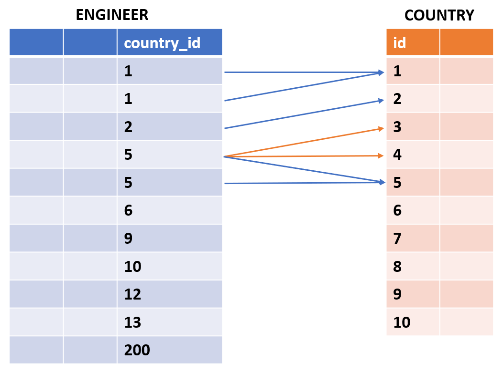
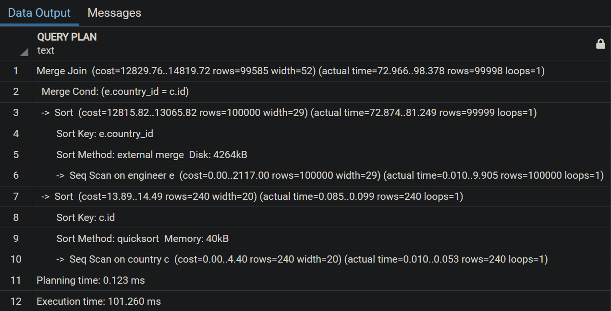

## Sort Merge Join

Merge join còn được biết với tên gọi khác là Sort-merge join. Nghe đến sort là đã biết chắc chắn phải sort table rồi. Ý tưởng cơ bản của merge join là:

-   Sắp xếp cả 2 table theo FK.
-   Tận dụng lợi thế của việc sắp xếp table để giảm số lượng row sequence scan trên join table.

Lợi thế đó là gì, hơi khó hình dung… Đọc tiếp thôi.


Sau khi sắp xếp 2 tables EMPLOYEE và COUNTRY với FK là country\_id, chúng ta có như sau:



Bắt đầu join 2 tables với các bước sau:

> -   Seq scan trên drive table ENGINEER, record thứ nhất có FK = 1, so sánh với join table COUNTRY. Record thứ nhất của ENGINEER FK = 1 trùng với record thứ nhất của COUNTRY.
> -   Tiếp tục record thứ hai của ENGINEER có FK = 1, giống với record thứ nhất. Do đó, việc look up trên join table sẽ bắt đầu từ record đầu tiên trùng với record trước đó của drive table. Hơi khó hiểu nhỉ, đọc tiếp đã nhé.
> -   Đến record thứ ba của ENGINEER có FK = 2, lúc này đã khác với record trước đó có FK = 1. Do vậy, việc look up trên join table sẽ bắt đầu từ sau record cuối cùng trùng với record trước đó của drive table. Tức là lúc này sẽ look up từ record thứ hai của COUNTRY, bỏ qua luôn record đầu tiên.
> -   Tiếp theo là record thứ tư của ENGINEER có FK = 5. Tương tự cách thức trên, sẽ look up từ record thứ ba của COUNTRY có FK = 3. Không thỏa mãn điều kiện, tiếp tục look up đến record tiếp theo có FK = 4, vẫn chưa thỏa mãn. Cứ tiếp tục như vậy cho đến khi tìm được record đúng với yêu cầu có FK = 5.
> -   Record thứ năm của ENGINEER có FK = 5. Vì trùng với record trước đó nên việc look up trên join table sẽ bắt đầu luôn từ record đầu tiên trùng với record trước đó của drive table. Như vậy sẽ start luôn từ FK = 5 bên join table mà không cần duyệt lại từ đầu.

Về bản chất khá giống nested loop join, tuy nhiên việc sắp xếp table giúp chúng ta hạn chế scan join table từ record đầu tiên. Dẫn tới giảm số lượng record phải scan trên join table.

Idea của merge join khá hay, cùng điểm qua một vài tính chất của nó nhé:

> -   Giống hash join, nó chỉ phù hợp khi join với điều kiện so sánh bằng (=).
> -   Độ phức tạp và thời gian thực thi dựa trên độ lớn của 2 tables vì nó cần tốn công cho việc sắp xếp.
> -   Phù hợp join với các table cực kì lớn, không thể load toàn bộ table vào memory.

Ok, thực hành thôi:

```
SET enable_nestloop = false;
SET enable_hashjoin = false;
set enable_mergejoin = true;

EXPLAIN ANALYZE SELECT e.id, e.first_name || ' ' || e.last_name, c.country_name
FROM ENGINEER e JOIN COUNTRY c ON e.country_id = c.id;
```



Computation cost và execution time khá lớn, thậm chí lớn hơn cả nested loop join vì lý do phải sắp xếp các tables. Trên thực tế, merge join chỉ phù hợp khi join các table có lượng data rất lớn.

Về cơ bản, PostgreSQL khá thông minh để quyết định xem nên sử dụng loại join nào cho phù hợp. Tuy nhiên trong một vài trường hợp ta thấy các table nhỏ dùng merge join trong khi table lớn hơn lại dùng nested loop join. Có thể có một vài vấn đề, lúc này ta cần một vài cách thức khác để kiểm tra kĩ hơn, mình sẽ giới thiệu trong bài tiếp theo nhé.