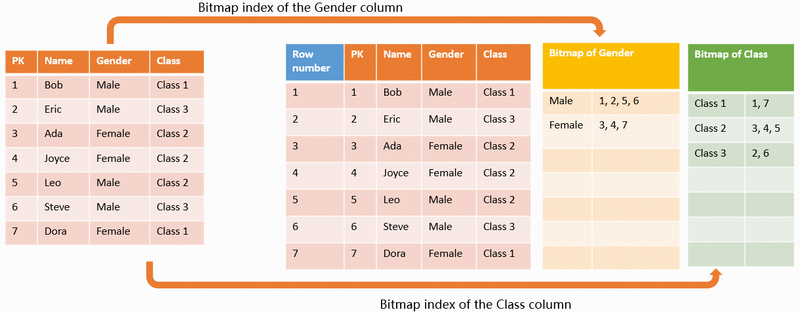
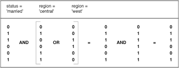

## References
- [7 Bad Practices to Avoid When Writing SQL Queries for Better Performance 🚀](https://dev.to/abdelrahmanallam/7-bad-practices-to-avoid-when-writing-sql-queries-for-better-performance-c87)

## Can use bitmap index for OR operator

Bitmap indexing is used for columns with few unique values. Each bitmap represents a unique value. A bitmap indicates the presence or absence of a value in a dataset, using 1’s & 0’s. For existing values, the position of the 1 in the bitmap shows the location of the row in the table. Bitmap indexes are very effective in handling complex queries where multiple columns are used.






## [Why queries using OR cannot directly benefit from the single index scan.](https://www.postgresql.org/docs/9.6/indexes-bitmap-scans.html)

Queries using `OR` conditions typically cannot directly benefit from a single index scan due to the way indexing and index scans are structured in relational databases. Here's a deeper dive into the reasons:

1. **Nature of Indexes**: An index in a database is essentially a sorted data structure (like a B-tree, for example) that provides quick lookups for specific values. When you have an index on a column, the database can efficiently locate rows that match a specific value in that column because it knows exactly where in the index to find that value.

2. **AND Conditions and Indexes**: In the case of an `AND` condition, like `WHERE a = 5 AND b = 6` with an index on `(a, b)`, the database can use the index to quickly find rows where `a = 5`. Since the index is also on `b`, it can continue scanning this narrowed-down dataset to find where `b = 6`. Both conditions refine the search further, making it more efficient.

3. **OR Conditions and Single Indexes**: When it comes to `OR` conditions, such as `WHERE a = 5 OR b = 6`, the situation is different. Here's why:
    - **Different Search Areas**: Each condition in an `OR` query refers to a different set of rows. For example, `a = 5` might point to one set of rows, and `b = 6` might point to a completely different set. There's no straightforward way to "merge" these two sets using a single index scan because they potentially span different parts of the index.
    - **Lack of Sequentiality**: Indexes are most efficient when they can read data sequentially. With `OR`, you're essentially asking the database to jump to different parts of the index (or even different indexes) for each condition, which is not sequential and thus not efficient.
    - **Index Scan Overhead**: If a single index scan tried to accommodate an `OR` condition, it would have to scan through a much larger portion of the index or table to satisfy each part of the `OR` condition, which could end up being less efficient than scanning the full table (a full table scan).

4. **Bitmap Index Scans for OR Conditions**: To optimize queries with `OR` conditions, databases like PostgreSQL use bitmap index scans. This approach involves scanning each relevant index separately for each part of the `OR` condition and then combining the results. This method is more efficient for `OR` conditions as it leverages the strengths of each individual index scan and then intelligently merges the results.

In summary, the inability of single index scans to directly benefit queries with `OR` conditions stems from the inherent structure and operation of indexes, which are optimized for sequential access and narrowing down search results, something that `OR` conditions do not inherently facilitate.

---
---

##  Show example with data

Sure, let's consider a simple example to illustrate how `OR` conditions interact with compound indexes. Imagine we have a database table named `Orders` with the following structure:

- `order_id` (integer)
- `customer_id` (integer)
- `product_id` (integer)
- `order_date` (date)
- `amount` (decimal)

Now, suppose we create a compound index on `customer_id` and `order_date`. The SQL command for this might look like:

```sql
CREATE INDEX idx_customer_date ON Orders (customer_id, order_date);
```

This index is optimized for queries that use these two columns in conjunction, especially in the order they are indexed (`customer_id` first, then `order_date`).

### Example of Efficient Use of Compound Index

A query that can efficiently use this compound index might be:

```sql
SELECT * FROM Orders WHERE customer_id = 123 AND order_date = '2024-01-15';
```

In this query, the database can use the compound index to quickly locate all orders for `customer_id` 123 and then narrow that down to those that specifically have an `order_date` of '2024-01-15'.

### Example of Inefficient Use with OR Condition

Now, consider a query with an `OR` condition:

```sql
SELECT * FROM Orders WHERE customer_id = 123 OR order_date = '2024-01-15';
```

This query is asking for all orders where either the `customer_id` is 123 or the `order_date` is '2024-01-15'. The compound index is less efficient here because:

- For `customer_id = 123`, the index works well, locating all orders for this customer.
- However, for `order_date = '2024-01-15'`, the index isn't as helpful. The database cannot just jump to all entries for this date, as `order_date` is the second part of the index and is only sorted within each `customer_id`.

### How a Database Might Handle the OR Query

In handling the `OR` condition, the database might:

1. Use the compound index to find all orders for `customer_id = 123`.
2. Perform a separate scan (either a full table scan or using another index, if available) to find all orders with `order_date = '2024-01-15'`.
3. Merge these two sets of results.

### Conclusion

This example illustrates that while compound indexes are highly efficient for certain query patterns, their usefulness diminishes with `OR` conditions, particularly when the conditions involve columns in a different order or only partially covered by the index. The database has to work around these limitations, often resulting in less efficient query processing.

----
----

## Show me compound index (visualize with data)

To visualize a compound index with data, let's consider a simplified example. Suppose we have a table with a compound index on two columns: `customer_id` and `order_date`. The table and the corresponding compound index might look like this:

### Sample Data Table `Orders`

| order_id | customer_id | order_date  | product_id | amount |
|----------|-------------|-------------|------------|--------|
| 1        | 101         | 2024-01-10  | 5          | 100.00 |
| 2        | 102         | 2024-01-11  | 3          | 150.00 |
| 3        | 101         | 2024-01-12  | 8          | 200.00 |
| 4        | 103         | 2024-01-10  | 1          | 50.00  |
| 5        | 102         | 2024-01-15  | 2          | 300.00 |
| 6        | 101         | 2024-01-15  | 4          | 250.00 |
| ...      | ...         | ...         | ...        | ...    |

### Visualization of Compound Index on (`customer_id`, `order_date`)

Imagine the index as a sorted list that points to the rows in the table. It would be sorted first by `customer_id` and then, within each customer, by `order_date`:

| customer_id | order_date  | Pointer to Table Row |
|-------------|-------------|----------------------|
| 101         | 2024-01-10  | Row 1                |
| 101         | 2024-01-12  | Row 3                |
| 101         | 2024-01-15  | Row 6                |
| 102         | 2024-01-11  | Row 2                |
| 102         | 2024-01-15  | Row 5                |
| 103         | 2024-01-10  | Row 4                |
| ...         | ...         | ...                  |

In this index:

- Entries are first grouped by `customer_id`.
- Within each `customer_id`, they are further sorted by `order_date`.
- Each entry in the index points to the corresponding row in the data table (not shown here for simplicity).

This structure allows efficient queries like `SELECT * FROM Orders WHERE customer_id = 101 AND order_date = '2024-01-12'`, as the index can quickly navigate to `customer_id = 101` and then to the specific `order_date`.

However, for an `OR` condition like `customer_id = 102 OR order_date = '2024-01-10'`, the index can help find `customer_id = 102` efficiently but has to scan more broadly for `order_date = '2024-01-10'` because this date could appear under any `customer_id`.

This example provides a basic visualization of how compound indexes are structured and how they facilitate certain queries while being less optimal for others, like those with `OR` conditions.
