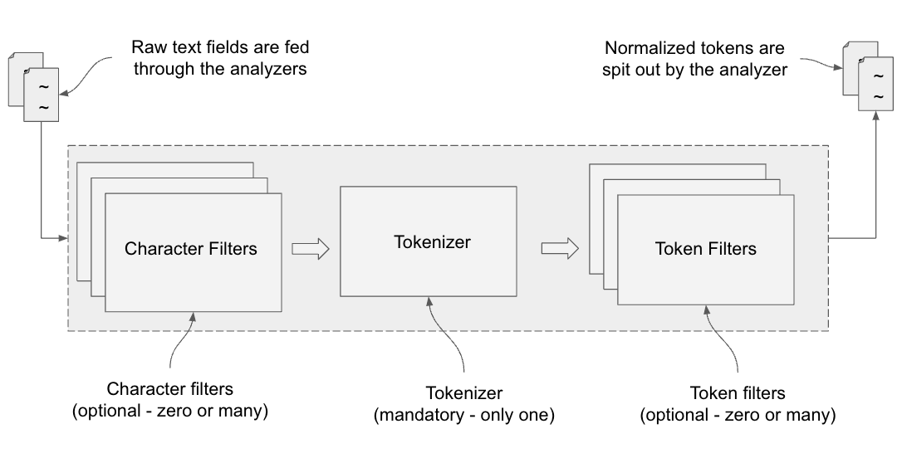
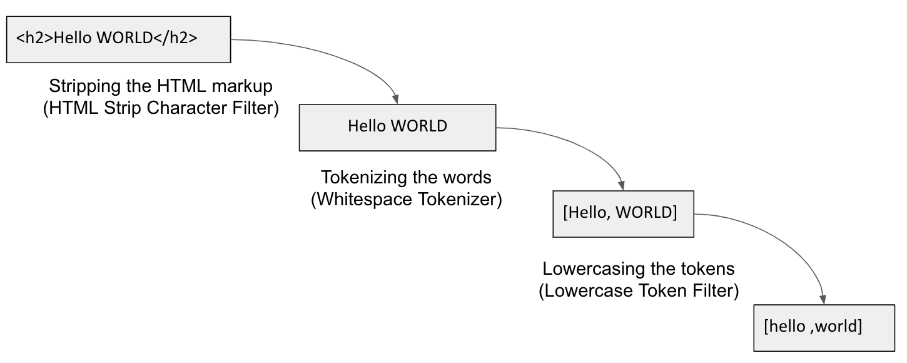
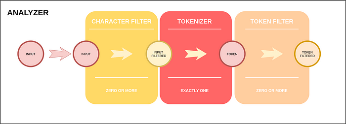
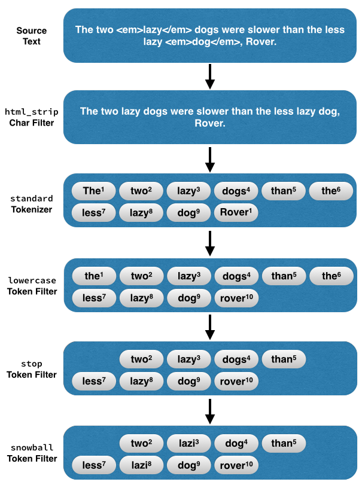

## References
- [Elasticsearch In Action - Chapter 5](https://livebook.manning.com/book/elasticsearch-in-action/chapter-5/17)
- [What is tokenizer, analyzer and filter in Elasticsearch ?](https://mallikarjuna91.medium.com/what-is-tokenizer-analyzer-and-filter-in-elasticsearch-317d4ec69ecc)
- [All About Analyzers, Part One](https://www.elastic.co/blog/found-text-analysis-part-1)
- [All About Analyzers, Part Two](https://www.elastic.co/blog/found-text-analysis-part-2)

----
----

## Analysis (ElasticSearch in Action)

> Text analysis is the process of converting unstructured text, like the body of an email or a product description, into a structured format that’s optimized for search. — Elasticsearch documentation




All text fields go through this pipe: the raw text is cleaned by the character filters, and the resulting text is passed on to the tokenizer. The tokenizer then splits the text into tokens (aka individual words). The tokens then pass through the token filters where they get modified, enriched, and enhanced. Finally, the finalized tokens are then stored in the appropriate inverted indices. The search query gets analyzed too, in the same manner as the indexing of the text.
Figure 7.2 shows an example that explains the analysis process. We already looked at this figure in chapter 3, but it is presented here for completeness.



The analyzer is composed of three low-level building blocks. These are
- **Character Filters**: Applied on the character level, where every character of the text goes through these filters. The filter’s job is to remove unwanted characters from the text string. This process could, for example, purge HTML tags like `<h1>`, `<href>`, `<src>` from the input text. It also helps replace some text with other text (e.g., Greek letters with the equivalent English words) or match some text in a regular expression (regex) and replace it with its equivalent (e.g., match an email based on a regex and extract the domain of the organization). These character filters are optional; analyzers can exist without a character filter. Elasticsearch provides three character filters out of the box: `html_strip`, `mapping` and `pattern_replace`.

- **Tokenizers**: Split the text fields into words by using a delimiter such as whitespace, punctuation, or some form of word boundaries.
Every analyzer must have one and only one tokenizer. Elasticsearch provides a handful of these tokenizers to help split the incoming text into individual tokens. The words can then be fed through the token filters for further normalization. A standard tokenizer is used by Elasticsearch by default, which breaks the words based on grammar and punctuation.

- **Token Filters**: Work on tokens produced by the tokenizers for further processing. For example, the token can change the case, create synonyms, provide the root word (stemming), or produce n-grams and shingles, and so on.
Token filters are optional. They can either be zero or many, associated with an analyzer module. There is a long list of token filters provided by Elasticsearch out of the box.
Note that both the character and token filters are optional but we must have one tokenizer. We will look at these components in detail a bit later in the chapter, but let’s first find an API that will help test the analyzers before we put the analyzers into production

### Testing

```
GET _analyze
{
    "text": "James Bond 007"
}
```

---
---

## [Elasticsearch: Software Engineer, You’ve Got to Master Analysis.](https://akintola-lonlon.medium.com/elasticsearch-software-engineer-youve-got-to-master-analysis-2a1c9412d62d)

Let’s be honest. Few people have the guts to talk in-depth about Elasticsearch analysis especially the way it works under the hood. I’ve been procrastinating for a while in writing this tutorial. But do you know what: **_Choosing or building the right analyzers can make a huge difference when it comes to building a good search engine. Hold on._**

In this tutorial, we’ll try to understand without getting bored 🌞 what an analyzer is from an Elasticsearch perspective and how we can take advantage of it. I hope you’re ready for a deep dive. Let’s dive right in.

## 1- What the hell is an analyzer?

Let’s start from the beginning. **_According to you how does Elasticsearch process full-text searches?_** It doesn’t need Einstein's mind to guess it — you guessed it right — **by analyzing contents**.

But behind that trivial response lurks a well-thought and profound concept. First of all, for any search, there are two kinds of content to consider:

-   the data stored in the index and
-   the input searched _(the content the user is looking for in the index and that is contained in the request)_.

As you can imagine, Elasticsearch needs to analyze them both before finding the most relevant documents for us. This information leads us to the first lesson of our journey:

> There are two stages of analysis in Elasticsearch: the first occurs when the document is being indexed and stored in an index and the second when we are making a search and here Elasticsearch analyzes the phrase/word we’re looking for or we’re requesting.

Before going further, I want to be sure we’re on the same line about the meaning of **Elasticsearch Text Analysis**.

> _Text analysis_ is the process of converting unstructured text, like the body of an email or a product description, into a structured format that’s optimized for search. — Elasticsearch documentation

It turns out that analysis is one of the most important processes in Elasticsearch. I’m quite sure you’ve been asking yourself: _If it’s so important why so few people care about it when there are using Elasticsearch?_

> Here is the truth: By default, Elasticsearch analyzes **text (not keyword)** contents with its **standard** analyzer, easy-peasy.

And yes, I didn’t tell you, Elasticsearch has got its own built-in analyzers you can choose to analyze and index your document fields. Before going through that list, let’s have together a quick look at how they are built.

## 2- How does an Elasticsearch analyzer work?

As an old saying goes **_“A picture is worth a thousand words”_**.



Figure1: Elasticserach Analyzer Schema

First of all, analyzers contain three main pieces: one or many **character filter(s)**, a **tokenizer**, and one or many **token filter(s)**. Let me meditate on how many questions you’re currently asking yourself. Don’t get worried, breaking down those concepts is our next step in this journey.

## Character filter

The character filter is the first stage of an Elasticsearch analyzer. The main aim of a character filter is to prepare the input to be split at the next stage. By changing, adding, removing characters, _character filters_ transform the provided content into a format that is easy to process by the next step of the stairs. **The tricky thing here is that an analyzer can contain zero or many character filter(s)**. That said, Elasticsearch offers basically three built-in character filters:

-   **HTML Strip Character Filter**: this filter strips out HTML elements like `<b>` and decodes HTML entities like `&amp;`.
-   **Mapping Character Filter**: If you want to replace any occurrences of a particular string with a specified one, the mapping character filter is your man.
-   **Pattern Replace Character Filter**: As its name implies, the _pattern replace character filter_ replaces any characters matching a regular expression with the specified replacement.

## Tokenizer

The next stage of our analyzers is the mandatory one: the _tokenizer_. I’m totally sure, as the name suggests, you already suspected it’s the part of an analyzer that **splits** the input coming from either the _Character filter_ or directly from the user into **small pieces** called **tokens —** you’re absolutely right. _But actually,_ _how does it break the input into tokens? That’s a great question mate. Let’s flesh out the way tokenizers actually work._

Well, a tokenizer is built to produce a stream of tokens. To obtain the tokens, it’ll map the given input. While mapping the input, every time it encounters whitespace, a special character, or a string that matches a given pattern _(depending on the type of tokenizer)_, it’ll produce a token.

The tokenizer is the cornerstone of an analyzer. For that reason, an analyzer contains exactly one tokenizer. I’ve got to tell you that I reserved the interesting news for the end:

_Either you want to analyze a stream of email addresses or a special pattern, Elasticsearch has got the ideal tokenizer you’ll need. There are three main categories of tokenizers_:

-   **Word Oriented Tokenizers**: there are mostly used to token full text into individual words _(Eg:_ [_Standard Tokenizer_](https://www.elastic.co/guide/en/elasticsearch/reference/current/analysis-standard-tokenizer.html)_,_ [_Letter Tokenizer_](https://www.elastic.co/guide/en/elasticsearch/reference/current/analysis-letter-tokenizer.html)_,_ [_Lowercase Tokenizer_](https://www.elastic.co/guide/en/elasticsearch/reference/current/analysis-lowercase-tokenizer.html)_,_ [_Whitespace Tokenizer_](https://www.elastic.co/guide/en/elasticsearch/reference/current/analysis-whitespace-tokenizer.html)_)_.
-   **Partial Word Tokenizers**: These tokenizers break up text or words into small fragments (fragments of one, two, three characters, and so on) for partial word matching _(Eg:_ [_N-Gram Tokenizer_](https://www.elastic.co/guide/en/elasticsearch/reference/current/analysis-ngram-tokenizer.html)_,_ [_Edge N-Gram Tokenizer_](https://www.elastic.co/guide/en/elasticsearch/reference/current/analysis-edgengram-tokenizer.html)_)._
-   **Structured Text Tokenizers**: They are the specialized tokenizers of Elasticsearch. They are used with structured text like identifiers, email addresses, zip codes, and paths _(Eg:_ [_Keyword Tokenizer_](https://www.elastic.co/guide/en/elasticsearch/reference/current/analysis-keyword-tokenizer.html)_,_ [_Pattern Tokenizer_](https://www.elastic.co/guide/en/elasticsearch/reference/current/analysis-pattern-tokenizer.html)_,_ [_Path Tokenizer_](https://www.elastic.co/guide/en/elasticsearch/reference/current/analysis-pathhierarchy-tokenizer.html)_)._

## Token filter

Here I should let you explain what would happen at this stage ✋ . Obviously, after splitting our input into tokens, the time comes to remove tokens _(the undesirable or rebel_ 😎 _tokens)_, add or transform some of the tokens. As the character filter, a tokenizer contains zero or many token filter(s). Now it’s time to take a look at the token filters list. _You know what, it won’t be possible_. Elasticsearch has got about 50 token filters — yes, you got it right — about 50 token filters. But the gobsmacked thing about it’s the fact that almost all of them are useful. Let me give you some of my favorites:

-   **Synonym token filter**: The synonym token filter allows to easily handle synonyms during the analysis process. All you've got to do is to provide a configuration file containing the synonyms.
-   **Trim token filter**: Does it ring a bell for you? I’m seeing you nodding your head. As you imagine, it removes leading and trailing whitespace from each token in a stream. The snag here is the trim filter does not change a token’s offsets even if it can change the length of a token.
-   **Conditional token filter**: This token filter is just great. It allows you to applies a set of token filters to tokens that match conditions in a provided predicate **_script_**.

I think it’s worth taking a look at the complete list of Elasticsearch’s built-in token filters. For that, check out [https://www.elastic.co/guide/en/elasticsearch/reference/current/analysis-tokenfilters.html](https://www.elastic.co/guide/en/elasticsearch/reference/current/analysis-tokenfilters.html).

As an old adage states, yes I like adages and old sayings, _a promise made is a debt unpaid_. Let’s explore the list of Elasticsearch built-in analyzers: _Standard Analyzer, Simple Analyzer, Whitespace Analyzer, Stop Analyzer, Keyword Analyzer, Pattern Analyzer, Language Analyzers, and Fingerprint Analyzer._

## Bonus

Since software engineers are the most curious people and proud people in the world, we’d like to be certain that Elasticsearch respects exactly what it describes for its built-in analyzers. For that our hands-on will be done on the **_Standard Analyzer_**.

Here is the description of **_Standard Analyzer_** Elasticsearch gives:

**Tokenizer**

-   Standard Tokenizer

**Token Filters**

-   Lower Case Token Filter
-   Stop Token Filter (disabled by default)

Elasticsearch’s API has got a wonderful endpoint to analyze content on the fly. Let’s give it a go. In this hands-on, we’ll be analyzing the sentence _“Google, Can You Give Me The Phone Number Of the Girl I Met Yesterday?”_ 😎. Before running this command, find the right stream of tokens **_Standard Analyzer_** will produce. Then run it.

```
curl -XGET -H "Content-Type: application/json" "127.0.0.1:9200/_analyze"
{
  "analyzer" : "standard",
  "text" : "Google, Can You Give Me The Phone Number Of the Girl I Met Yesterday ?"
}
```

Let me know in the comments if Elasticsearch is right.

I must confess I don’t want to end this tutorial because I got the taste to continue with you through this journey and to explore more but unfortunately we’ve got to end it 😊. In the next tutorial, we’ll build our own analyzer.

## Conclusion

Here are the keys things I want you to keep in mind at the end of our journey in the Elasticsearch analyzers world:

-   Analysis happens at **two levels of a searching process**: the indexing moment and the searching one.
-   Analyzers can contain **three types of components** and only one is mandatory: character filter(s), tokenizer (compulsory), token filter(s).
-   Elasticsearch gives you the possibility to build your own analyzers.

----
----

## [All About Analyzers, Part One](https://www.elastic.co/blog/found-text-analysis-part-1)

