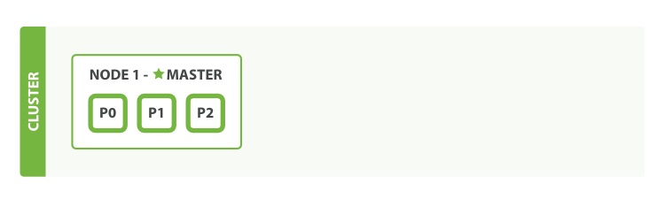
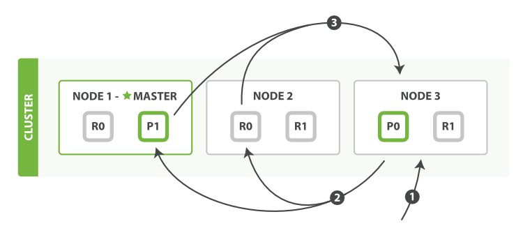

## References
- [Elasticsearch - The Definitive Guide](https://www.elastic.co/guide/en/elasticsearch/guide/master/document.html)
- [Elasticsearch: How Reads, Writes and Search work in the Cluster](https://medium.com/wix-engineering/elasticsearch-how-reads-writes-and-search-work-in-the-cluster-5e011aaa7de9)
- [Elasticsearch Collection](https://github.com/exajobs/elasticsearch-collection/blob/main/README.md)
- [Shards and Replicas in Elasticsearch ](https://www.baeldung.com/java-shards-replicas-elasticsearch)

----
----

## [[ElasticSearch] Có gì ở bên trong một cluster (Life inside a cluster)](https://minhphong306.wordpress.com/2021/03/24/elasticsearch-co-gi-o-ben-trong-mot-cluster-life-inside-a-cluster/)

> Cái tiêu đề “Life inside a cluster” quá hay. Mình xin phép giữ nguyên.
>
> ES The Definitive guide

Làm việc với ES nhiều nhưng tớ vẫn bị mông lung giữa các khái niệm: cluster, node, shard. Nhân dịp làm con tính năng sort, tìm hiểu kĩ hơn về các khái niệm này.

Dưới đây là 1 số note của tớ về ba khái niệm này.

Recommend anh em tìm cuốn ES The Definitive guide của nhà sách O’Reilly để đọc. The best!

### TL; DR

-   Cluster chỉ 1 cụm các instance của ES. 1 cluster chứa 1 hoặc nhiều node.
-   Node chỉ 1 instance của ES. Anh em download ES về, chạy file bin lên là đang start 1 node lên đó. 1 node chứa 1 hoặc nhiều shard. Node có 2 loại là master và node thường (bất cứ node nào cũng có thể trở thành node master được nhé anh em):

    -   Node thường: đảm nhiệm việc thêm/sửa/xóa document.

    -   Node master: Node master cũng làm việc thêm/sửa/xóa như node thường. Ngoài ra còn đảm nhiệm việc tạo index, điều phối các node trong cluster

-   Shard chỉ 1 instance của Lucene. ES sử dụng Apache Luence để lưu trữ và tìm kiếm. Shard có 2 loại: primary và replica:
    -   Primary shard: shard lưu trữ dữ liệu chính
    -   Replica shard: shard copy dữ liệu của primary shard. Copy ra nhằm 2 mục đích:
        -   Đề phòng rủi do phần cứng: VD ổ cứng bị lỗi. Node chứa data nằm đúng chỗ lỗi này => mất dữ liệu. Nếu có replica shard thì có thể khôi phục lại được
        -   Đề phòng rủi do người dùng: bố nào lỡ tay xóa mẹ node thì mất chứ sao => có replica shard thì khôi phục lại được.
        -   Tăng khả năng tải: các node chứa replica shard có thể phục vụ các request đọc được, tránh gây nặng tải cho 1 node. Nhớ là chỉ đọc thôi. Ghi thì thằng primary shard sẽ chịu trách nhiệm ghi, sau đó sync sang các replica shard (sẽ note chi tiết hơn vào 1 bài khác)
-   Khi 1 node bị xóa thì sao?
    -   Nếu node bị xóa là master => ES tự động chọn 1 node khác làm node master.
    -   Nếu node bị xóa là node thường => kệ cụ mài.
-   Nếu trong node bị xóa có chứa primary shard thì sao?
    -   ES chọn 1 replica shard trong 1 node khác bất kì và promote thành primary shard

### Chém

Phần này sẽ quay lại update vào 2 tháng tới. Đợt này bận quá. Tiện đọc thì note lại ko quên. Hihi

Cảm ơn bạn, vì đã đọc bài ^^

----
----

## [[TIL – ElasticSearch] Distributed Search Excution hoạt động thế nào? Bouncing result problem là gì?](https://minhphong306.wordpress.com/2021/04/01/til-elasticsearch-distributed-search-excution-hoat-dong-the-nao-bouncing-result-problem-la-gi/)

### Kiến thức cơ bản

-   Dữ liệu được lưu rải rác ở các shard trong các node => khi search cần search trên tất cả các node.
-   Request vào các node được ES tự động chia đều ra để cân bằng tải theo thuật toán xoay vòng (hay còn gọi là round robin)
    -   VD: có 4 request, có 3 node
        -   **node 1**: nhận req 1
        -   **node 2**: nhận req 2
        -   **node 3**: nhận req 3
        -   **node 1**: nhận req 4

-   Node được request vào gọi là node định vị (coordinating node). Node này có nhiệm vụ gửi request đến các node khác, tổng hợp kết quả rồi trả về. => node nào cũng có thể trở thành coordinating node hết.
-   Request đến các shard cũng được round robin tương tự đến primary và replica shard.
-   Khi search chia làm 2 phase:
    -   **Query phase**:
        -   Node định vị gửi search request đến các node con.
        -   Các node con search dữ liệu, lấy các bản ghi match,rồi trả về cho node định vị (chỉ trả về ID và \_score thôi).
    -   **Fetch phase**:
        -   Node định vị nhận được kết quả, sort lại theo \_score.
        -   Lấy top kết quả theo search request => danh sách ID của document
        -   Node định vị gửi document ID tới các node tương ứng để lấy full document về. Tổng hợp lại rồi gửi trả cho client.
-   VD: request search `{ "from": 90, "size": 10 }`
    -   Mỗi node cần query 100 bản ghi, trả về cho node định vị.
    -   Node định vị tổng hợp kết quả lại. VD có 4 node => tổng số bản ghi= 400 => sort 400 thằng này lại, bỏ qua 90 thằng và lấy 10 thằng, rồi trả về cho client => **rõ ràng rất tốn tài nguyên. Lấy 10 thằng thôi mà cần tổng hợp tới 400 thằng lận**
-   Công thức tính số bản ghi cần lấy ra để tổng hợp:
    -   `số_primary_shard * (from + size)`
    
----

### Bouncing results problem

Vì tất cả các node đều có thể là node định vị => thứ tự sắp xếp các bản ghi **có điểm bằng nhau** có thể khác nhau.

Ví dụ bạn đang sắp xếp theo timestampt đi. Có 2 timestamp bằng nhau. Mà request sẽ round robin giữa các shard

\=> có thể primary shard và replica shard sẽ sắp xếp thứ tự khác nhau

\=> xảy ra hiện tượng người dùng đứng ở màn hình F5 lại thì lại ra kết quả khác nhau :v

\=> Giải quyết bằng cách dùng cùng 1 shard với cùng 1 session id (Cách dùng xem bên dưới)

### Search option

Cách dùng các option này đều đơn giản, anh em thêm vào parameter của url là được nha.

### Preference

Cách dùng đơn giản, thêm vào parameter là xong.

VD:
> GET /_search?preference={option}

Có nhiều option, cho phép anh em điều khiển ES sẽ search ở node nào, shard nào. Anh em có thể đọc thêm [tại đây](https://www.elastic.co/guide/en/elasticsearch/reference/6.8/search-request-preference.html#search-request-preference)

Đối với trường hợp bouncing result như bên trên, xử lý bằng cách truyền session\_id vào option.

> GET /_search?preference=session_id_123

### Timeout

Mặc định ES sẽ đợi các shard response thì mới trả kết quả về. Anh em có thể custom lại, cho timeout nhỏ đi hoặc lớn hơn tuỳ bài toán

### Routing

Một số trường hợp, anh em chế lại cách routing document vào các shard => biết chắc chắn document sẽ nằm ở shard nào

> => không cần search all shard
>
>=> truyền routing param vào để ES hiểu

Cái này nói thật tớ cũng chưa hiểu lắm. Đang đọc thêm. Hiểu sẽ note thành 1 bài riêng và reference vào đây.

// search\_type, scan and scroll, mai gõ thêm. Nửa đêm gõ phím cơ sợ phụ huynh mất ngủ :v

Cảm ơn anh em đã đọc bài ^^