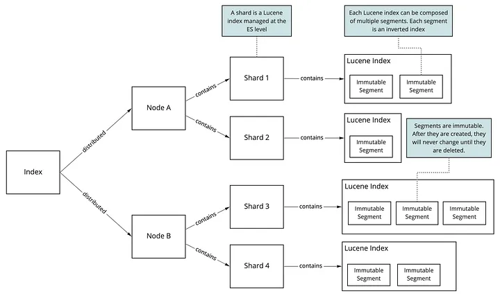
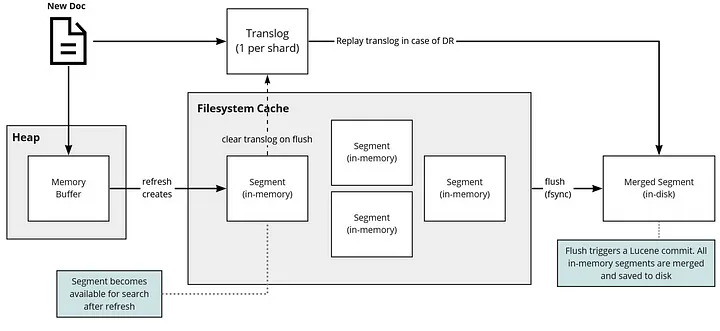
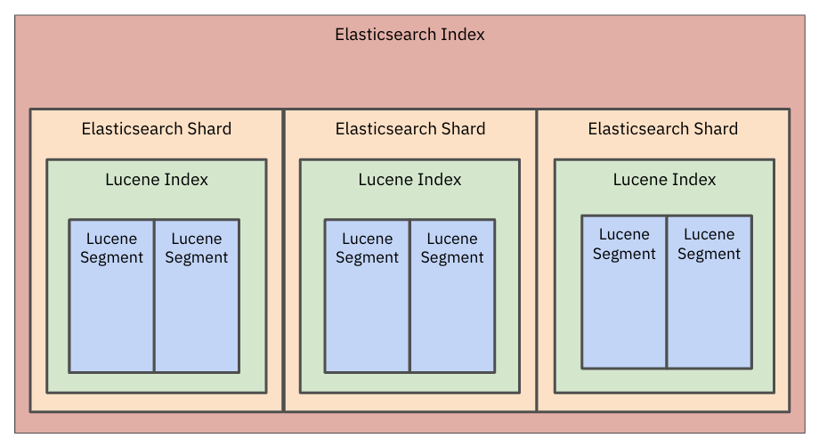
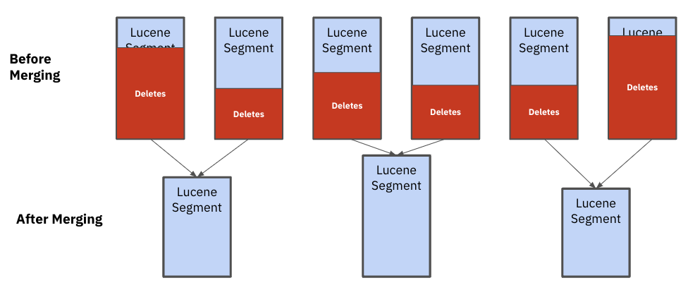

## References
- [The Complete Guide to Increasing Your Elasticsearch Write Throughput and Speed](https://luis-sena.medium.com/the-complete-guide-to-increase-your-elasticsearch-write-throughput-e3da4c1f9e92)
- [Updates, Inserts, Deletes: Challenges to avoid when indexing mutable data in Elasticsearch](https://rockset.com/blog/updates-inserts-deletes-elasticsearch-rockset/)
- [Understand Lucene To Understand ElasticSearch](https://blog.devgenius.io/understand-lucene-to-understand-elasticsearch-85037d5b7577)

----
----

> [Each time you update a single field in your document, a new segment will be created and the information in the previous segment is marked as deleted.](https://luis-sena.medium.com/the-complete-guide-to-increase-your-elasticsearch-write-throughput-e3da4c1f9e92)

### Updates, Inserts and Deletes in Elasticsearch

Elasticsearch has an Update API that can be used to process updates and deletes. The Update API reduces the number of network trips and potential for version conflicts. The Update API retrieves the existing document from the index, processes the change and then indexes the data again. That said, Elasticsearch does not offer in-place updates or deletes. So, the entire document still must be reindexed, a CPU intensive operation.

Under the hood, **Elasticsearch data is stored in a Lucene index and that index is broken down into smaller segments. Each segment is immutable so documents cannot be changed. `When an update is made, the old document is marked for deletion and a new document is merged to form a new segment`. In order to use the updated document, all of the analyzers need to be run which can also increase CPU usage**. It’s common for customers with constantly changing data to see index merges `eat up` a considerable amount of their overall Elasticsearch compute bill.

_Image 1: Elasticsearch data is stored in a Lucene index and that index is broken down into smaller segments._

Given the amount of resources required, Elastic recommends limiting the number of updates into Elasticsearch. A reference customer of Elasticsearch, [Bol.com](https://www.elastic.co/blog/finding-a-scalable-data-model-for-search-at-bol-com), used Elasticsearch for site search as part of their e-commerce platform. Bol.com had roughly 700K updates per day made to their offerings including content, pricing and availability changes. They originally wanted a solution that stayed in sync with any changes as they occurred. But, given the impact of updates on Elasticsearch system performance, they opted to allow for 15-20 minute delays. The batching of documents into Elasticsearch ensured consistent query performance.

### Deletions and Segment Merge Challenges in Elasticsearch

In Elasticsearch, there can be challenges related to the deletion of old documents and the reclaiming of space.

Elasticsearch completes a [segment merge](https://www.elastic.co/blog/found-keeping-elasticsearch-in-sync) in the background when there are a large number of segments in an index or there are a lot of documents in a segment that are marked for deletion. A segment merge is when documents are copied from existing segments into a newly formed segment and the remaining segments are deleted. Unfortunately, Lucene is not good at sizing the segments that need to be merged, potentially creating uneven segments that impact performance and stability.

_Image 2: After merging, you can see that the Lucene segments are all different sizes. These uneven segments impact performance and stability_

That’s because Elasticsearch assumes all documents are [uniformly sized](https://blog.mikemccandless.com/2011/02/visualizing-lucenes-segment-merges.html) and makes merge decisions based on the number of documents deleted. When dealing with heterogeneous document sizes, as is often the case in multi-tenant applications, some segments will grow faster in size than others, slowing down performance for the largest customers on the application. In these cases, the only remedy is to reindex a large amount of data.

----
----

## Why lucene segment is important?

Lucene, the core search library used by Elasticsearch and many other search systems, employs the concept of segments as a fundamental part of its architecture. Segments in Lucene are important for several reasons, each contributing to the efficiency, performance, and reliability of the search engine:

1. **Incremental Indexing**: Segments allow Lucene to index documents incrementally. Instead of re-indexing the entire document collection every time a new document is added or an existing one is updated or deleted, Lucene writes new documents to a new segment. This approach significantly reduces indexing time and resources, as only a small portion of the index (the new segment) needs to be written at any given time.

2. **Search Efficiency**: Each segment is a fully functional, independent inverted index, which means searches can run concurrently across multiple segments. This parallelism improves search efficiency, especially on multi-core systems. Lucene can quickly merge the results from each segment to produce the final query result.

3. **Optimizing Disk Usage**: Since segments are immutable, Lucene can optimize how they are stored on disk. It can compress data at the segment level, reducing the overall disk space required for the index. Additionally, immutability means that once a segment is written to disk, it can be cached effectively by the operating system, improving read performance for search queries.

4. **Background Merging**: Lucene periodically merges smaller segments into larger ones in the background, a process that optimizes the index structure, improves search performance, and reduces disk space usage over time. This merging process is crucial for maintaining the long-term efficiency of the index, as it ensures that the number of segments doesn't grow indefinitely, which could degrade performance.

5. **Fault Tolerance**: The use of segments enhances Lucene's fault tolerance. Since segments are immutable, in the event of a crash or failure, any segments that were being written can be safely discarded, and the index can revert to its previous state without losing consistency or integrity. This makes recovery simpler and faster, as there's no need to repair or reconcile partially written data.

6. **Simplifies Concurrency and Locking**: Managing concurrency and locking in a system that supports multiple readers and writers can be complex. However, the immutable nature of segments means that read operations (search queries) can proceed without being blocked by write operations (indexing), since new writes do not modify existing segments. This significantly simplifies the implementation of concurrency control in Lucene.

7. **Versioning and Updates**: When documents are updated or deleted, Lucene can efficiently manage these changes by simply marking documents as deleted in the segment where they reside and indexing new versions of documents in new segments. This avoids the need for in-place updates and allows Lucene to defer the physical deletion of documents until segments are merged.

Lucene's segment-based architecture is a key factor in its ability to provide fast, scalable, and reliable search functionality. It allows for efficient indexing and searching, effective use of system resources, and robust fault tolerance mechanisms.
