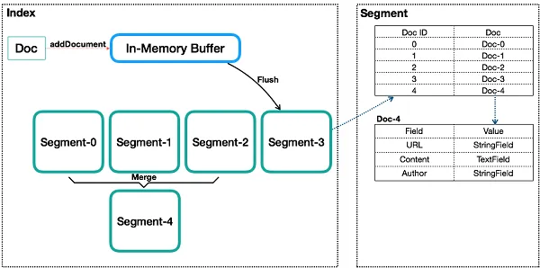
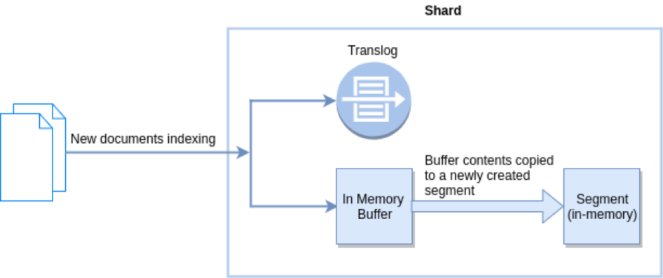
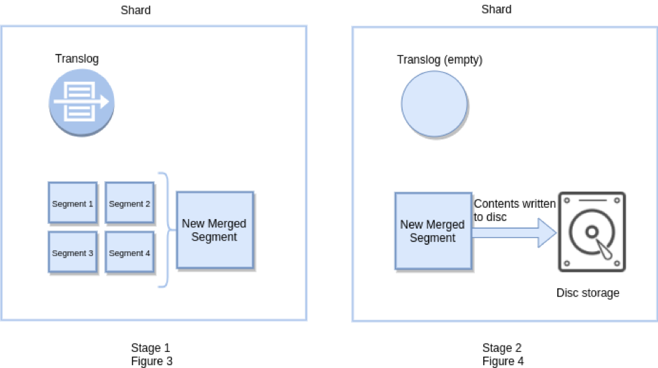
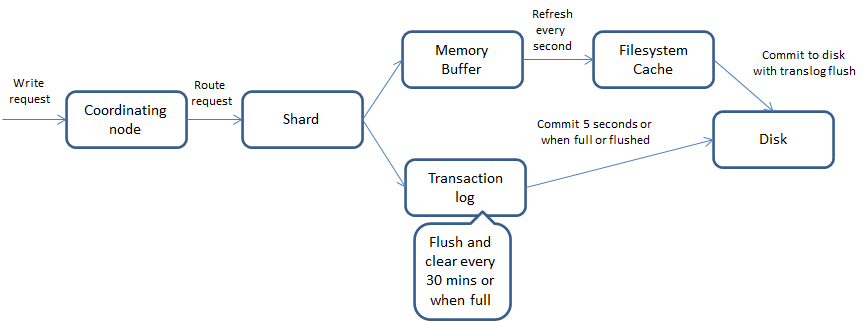

## References
- [Analysis of Lucene — Basic Concepts](https://alibaba-cloud.medium.com/analysis-of-lucene-basic-concepts-5ff5d8b90a53)
- [Managing Relations Inside Elasticsearch](https://www.elastic.co/blog/managing-relations-inside-elasticsearch)
- [ELASTICSEARCH INTERNALS](https://www.javaadvent.com/2022/12/elasticsearch-internals.html)
---
---

## [Refresh vs Flush](https://stackoverflow.com/questions/19963406/refresh-vs-flush)

> **refresh**: transform in-memory buffer to in-memory segment which can be searched.

> **flush**: (a) merge small segments to be a big segment (b) fsync the big segment to disk (c) empty translog.

---
---

## Translog vs Memory Buffer

In Elasticsearch, both the "translog" (transaction log) and "memory buffer" serve crucial roles in the process of indexing and persisting data, but they have different purposes and characteristics.

### Translog

The translog, or transaction log, is a durability mechanism in Elasticsearch that ensures data is not lost in the event of a crash. Here's how it works:

- **Purpose**: The translog records all the operations (such as index, update, delete) that occur after a document is indexed and before it is committed to the segment files on disk. Its primary purpose is to provide a way to recover data that was in the process of being indexed but not yet fully persisted due to a crash or restart.

- **Operation**: When a document is indexed in Elasticsearch, it first goes to an in-memory buffer and then is written to the translog. Periodically, the data in the memory buffer is flushed to a new segment file on disk, and the translog is used to ensure that any operations not yet committed to disk can be replayed and thus not lost.

- **Durability**: The translog plays a critical role in Elasticsearch's durability guarantee, enabling the system to recover from crashes by replaying operations from the translog.

### Memory Buffer

The memory buffer in Elasticsearch is a temporary holding area for newly indexed documents before they are written to disk. It functions as follows:

- **Purpose**: The memory buffer collects and holds documents that are awaiting to be written to a segment file on disk. This process is part of Elasticsearch's mechanism to efficiently index and store data.

- **Operation**: Documents are collected in the memory buffer and, once a certain size or time threshold is reached, the buffer is flushed to disk as a new segment file. This process is known as a "refresh," making the data in the newly created segment available for search.

- **Performance**: The memory buffer is key to managing indexing performance and search freshness in Elasticsearch. By buffering documents in memory, Elasticsearch can optimize disk I/O and manage the trade-off between indexing speed and search freshness.

### Comparison

While both components are essential for Elasticsearch's operation, they serve different stages in the data lifecycle:

- **Translog** is focused on data durability and recovery, ensuring that no data is lost in the event of a crash by keeping a log of operations that have not yet been committed to disk.

- **Memory Buffer** is concerned with the performance and efficiency of indexing operations, temporarily holding documents in memory before they are written to disk, optimizing the indexing process, and managing search freshness.

In summary, the translog and memory buffer in Elasticsearch complement each other by ensuring both the durability of data and efficient indexing performance.

---
---

## How insertion works with lucene segment in elasticsearch

In Elasticsearch, which is built on top of Lucene, the process of inserting (indexing) documents into segments is a critical part of how it manages and searches data efficiently. Here's a step-by-step overview of how insertion works within the context of Lucene segments in Elasticsearch:

### 1. Document Indexing Request
- When a document is indexed in Elasticsearch, it's first processed by the relevant index's mapping to determine how the fields within the document should be stored and indexed. This includes analyzing text fields, converting data types, and applying any configured indexing strategies.

### 2. Buffering Documents
- The newly indexed document is initially stored in an in-memory buffer. Elasticsearch uses this buffer to collect and batch documents together to improve the efficiency of the indexing process. This buffer is part of the Indexing Buffer, which is shared among all shards on a node.

### 3. Creating a New Segment
- Once the in-memory buffer reaches a certain size or after a specific interval of time, Elasticsearch flushes its contents to disk. This flushing process involves creating a new Lucene segment. Each segment is a self-contained index, and the document is written to this new segment. This process includes creating the inverted index for the document, which enables efficient text searches.

### 4. Segment Immutability
- Once a segment is written to disk, it becomes immutable, meaning it cannot be changed. Any updates or deletions to documents within that segment are handled by marking the original document as deleted and, if updating, indexing a new version of the document in a subsequent segment flush. The document marked as deleted will still exist in the segment until a merge operation occurs.

### 5. Segment Merging
- Over time, as more documents are indexed and more segments are created, Elasticsearch periodically merges smaller segments into larger ones. This merge process is managed in the background and helps optimize the index by reducing the number of segments that must be searched for each query and by permanently removing deleted documents from the filesystem. Merging segments also helps in reclaiming disk space and ensuring that the search performance remains efficient.

### 6. Refresh and Commit Operations
- Elasticsearch performs periodic "refresh" operations (by default, every second) to make the newly indexed documents available for search. A refresh operation creates a new searcher on the index, which includes any newly created segments since the last refresh.
- A "commit" operation, on the other hand, is a more durable operation that updates the index metadata on disk to reflect the latest changes, including new segment creation. This ensures that changes are persisted and recoverable after a restart.

### 7. Translog for Durability
- Alongside segment creation, each indexing operation is also written to a transaction log (translog) before it's even added to the in-memory buffer. The translog ensures that any changes not yet flushed to a segment can be recovered in case of a crash. After a commit operation, the translog is trimmed since the data it contains has been safely written to segments and persisted on disk.

This process showcases how Elasticsearch, leveraging Lucene's capabilities, manages to efficiently index, update, and search vast amounts of data with high performance and reliability. The use of segments and the strategies around them are central to achieving this efficiency.
