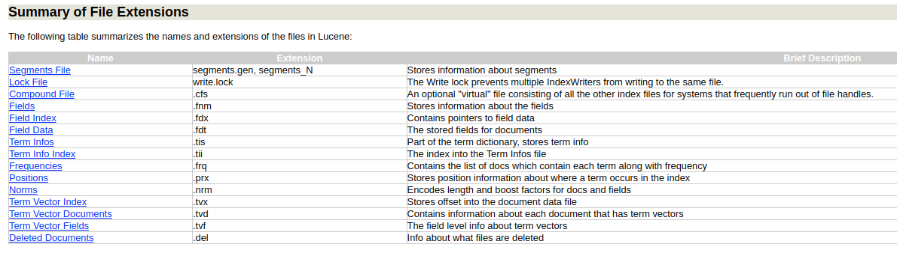
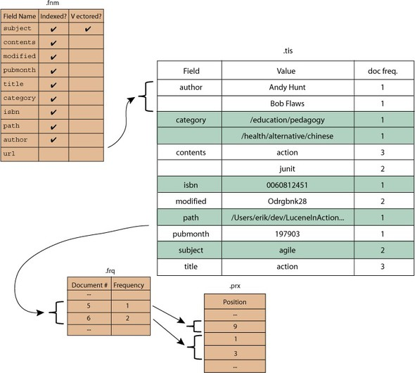

## References
- [This is mavenised Luke: Lucene Toolbox Project](https://github.com/DmitryKey/luke?tab=readme-ov-file)
- [Apache Lucene - Index File Formats](https://lucene.apache.org/core/8_6_0/core/org/apache/lucene/codecs/lucene86/package-summary.html#package.description)

----
----

## Lucene Index Viewer


----
----

## Structure

Summary of File Extensions in Lucene

| Name | Extension | Brief Description |
|---|---|---|
| Segments File | segments_N | Stores information about a commit point |
| Lock File | write.lock | Prevents multiple IndexWriters from writing to the same file |
| Segment Info | .si | Stores metadata about a segment |
| Compound File | .cfs, .cfe | Optional "virtual" file for systems with limited file handles |
| Fields | .fnm | Stores information about the fields |
| Field Index | .fdx | Contains pointers to field data |
| Field Data | .fdt | The stored fields for documents |
| Term Dictionary | .tim | Stores term information |
| Term Index | .tip | The index into the Term Dictionary |
| Frequencies | .doc | List of documents with each term and their frequency |
| Positions | .pos | Position information about term occurrences in the index |
| Payloads | .pay | Additional per-position metadata |
| Norms | .nvd, .nvm | Encodes length and boost factors for documents and fields |
| Per-Document Values | .dvd, .dvm | Additional scoring factors or other per-document information |
| Term Vector Index | .tvx | Stores offset into the document data file |
| Term Vector Data | .tvd | Contains term vector data |
| Live Documents | .liv | Information about live documents |
| Point values | .dii, .dim | Holds indexed points (if any) |

----
----

## Example

Creating a comprehensive example that spans all of Lucene's file types with detailed content for our hypothetical documents is a complex task due to the intricacy and binary nature of these files. However, I can extend the previous examples to cover a broader range of files, providing a conceptual overview of how Lucene might store our two documents across its various file types. This overview will maintain a focus on simplicity and conceptual understanding.

### Documents:
1. **Document 1**: "Lucene Introduction"
2. **Document 2**: "Advanced Lucene"

### Files Overview:

#### Segments File (`segments_N`)
```
Version: 1
SegmentCount: 1
SegmentName: _1
```

#### Segment Info (`.si`)
```
SegmentName: _1
DocCount: 2
IsCompoundFile: true
```

#### Compound File (`.cfs`, `.cfe`)
Acts as a container for multiple index files for the segment `_1`, potentially including `.si`, `.fnm`, `.fdx`, `.fdt`, `.tim`, `.doc`, `.pos`, `.nvd`, `.nvm`, `.dvd`, `.dvm`, `.tvx`, and `.tvd` files for efficiency and to reduce the number of file handles used.

#### Fields File (`.fnm`)
```
Fields:
- ID
- Title
- Content
- Tags
```

#### Field Data (`.fdt`) and Field Index (`.fdx`)
```
DocID: 1
- Title: Lucene Introduction
- Content: Lucene provides a rich set of features for text indexing and search.
- Tags: search, indexing

DocID: 2
- Title: Advanced Lucene
- Content: Deep dive into advanced features of Lucene like scoring and query optimization.
- Tags: advanced, scoring
```

#### Term Dictionary (`.tim`)
```
Terms:
- Lucene, DocFreq: 2
- Introduction, DocFreq: 1
- provides, DocFreq: 1
- features, DocFreq: 1
- advanced, DocFreq: 1
- scoring, DocFreq: 1
...
```

#### Frequencies (`.doc`)
```
Term: Lucene, DocID: 1, Freq: 1
Term: Lucene, DocID: 2, Freq: 2
Term: Introduction, DocID: 1, Freq: 1
...
```

#### Positions (`.pos`)
```
Term: Lucene, DocID: 1, Positions: [0]
Term: Lucene, DocID: 2, Positions: [0, 4]
...
```

#### Norms (`.nvd`, `.nvm`)
Stores normalization factors for each document and field, affecting scoring based on field length, etc.

#### Per-Document Values (`.dvd`, `.dvm`)
Could store document-specific values like timestamps, ratings, or other metadata not directly related to text content.

#### Term Vectors (`.tvx`, `.tvd`)
Store term vector information for documents, detailing term occurrences within specific fields for fast retrieval and analysis.

### Simplified Conceptual Data Representation:
This is a high-level and simplified representation of how Lucene might organize and store information about the two example documents. Actual Lucene files are stored in a binary format optimized for performance and not directly human-readable. Each file type serves a specific purpose in the indexing and retrieval process, from storing metadata about the index (`segments_N`, `.si`), to detailing document contents and their associated terms (`.fdt`, `.fdx`, `.tim`, `.doc`, `.pos`), to supporting search optimizations and functionalities (`.nvd`, `.nvm`, `.dvd`, `.dvm`, `.tvx`, `.tvd`).

----
----

## Old extension



The image you've uploaded appears to be a screenshot of a table that summarizes the names and extensions of files in a Lucene index. It lists various file types such as Segments File, Lock File, Compound File, Fields, and so on, along with their extensions and a brief description of their purpose.

The content in the image is essentially the same as what I've previously described in text form. However, there are a couple of notable differences in the naming of files:

1. **Term Infos vs. Term Dictionary**: The `.tis` extension is mentioned as "Term Infos" in the image, which corresponds to the Term Dictionary I described earlier. The Term Infos file in Lucene traditionally holds the term dictionary, storing term info.

2. **Term Info Index vs. Term Index**: The `.tii` extension is mentioned as "Term Info Index" in the image, which serves a similar purpose to the Term Index. It provides an index into the Term Infos file, helping locate terms quickly.

3. **Frequencies**: The image lists `.frq` for Frequencies, which stores the list of documents that contain each term along with the term's frequency. This corresponds to the `.doc` files I described, which in newer versions of Lucene store term frequencies and document IDs.

4. **Positions**: The image shows `.prx` for Positions, which stores position information about where a term occurs in the index. This is similar to the `.pos` files in newer versions of Lucene.

5. **Norms**: The image uses `.nrm` for Norms, which encodes length and boost factors for documents and fields. This is consistent with the `.nvd` and `.nvm` files I mentioned, which serve the same purpose.

6. **Deleted Documents**: The `.del` file extension is mentioned for storing information about deleted documents, which is a part of Lucene's functionality for managing the lifecycle of documents in the index.

The differences between the names and extensions might be due to changes in Lucene's file format between versions, or they could simply be alternative names for the same concept. The underlying purpose of these files remains to manage various aspects of the indexing and search process in Lucene.

