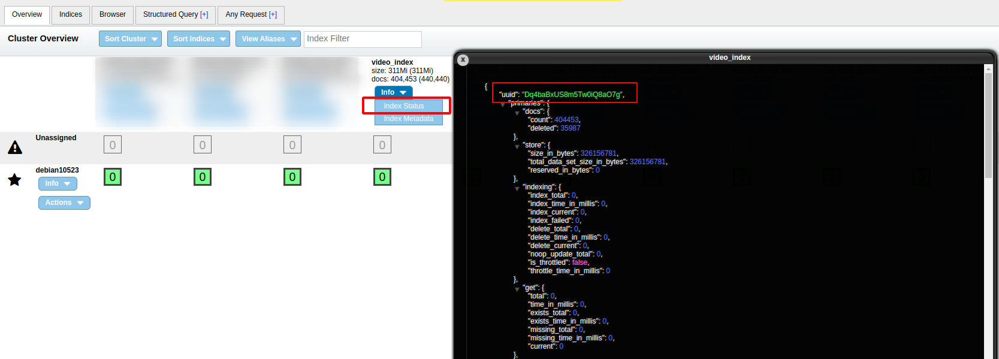
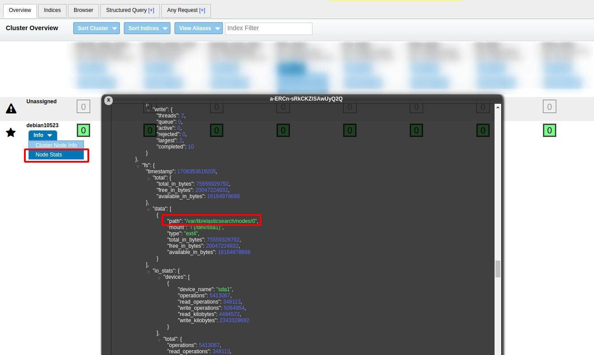

## References
- [Analysis of Lucene — Basic Concepts](https://alibaba-cloud.medium.com/analysis-of-lucene-basic-concepts-5ff5d8b90a53)
- [Max_Num_Segments in Elasticsearch](https://opster.com/guides/elasticsearch/operations/elasticsearch-max-num-segments/)
- [cat Segments API](https://www.elastic.co/guide/en/elasticsearch/reference/current/cat-segments.html#cat-segments)

----
----

## Lucene Segment vs LSM Tree

Lucene, a highly performant, full-featured text search engine library written in Java, incorporates a design that resembles Log-Structured Merge-trees (LSM) in certain aspects, particularly in how it handles data writing and indexing. The use of segments in Lucene indeed draws from the LSM approach to manage write-intensive operations efficiently, yet there are distinct characteristics and operational nuances that differentiate the two. Understanding both the similarities and differences helps in appreciating Lucene's approach to handling search and indexing tasks.

### Similarities to LSM

1. **Write Optimization**: Like LSM trees, Lucene's segments are optimized for write operations. Data is initially written to an in-memory index, and upon reaching a certain threshold, this index is flushed to disk as a new segment. This process is analogous to LSM's handling of writes in memory before flushing to disk-based structures.
2. **Compaction/Merging**: Lucene periodically merges smaller segments into larger ones to maintain query efficiency and manage disk space, similar to the compaction process in LSM trees. This merging process helps in optimizing the read operations by reducing the number of segments that need to be searched.

### Differences from LSM

1. **Near Real-Time (NRT) vs. Real-Time Queries**: Lucene is designed to support near real-time (NRT) search, which means there can be a slight delay between when documents are indexed and when they become searchable. This is due to the time it takes to flush in-memory indexes to disk and optionally merge segments. In contrast, systems based purely on LSM might offer closer to real-time visibility of data, depending on how they manage the memory-to-disk flushing and merging processes.
2. **Segment Immutability**: Once a segment in Lucene is written to disk, it becomes immutable. This immutability simplifies concurrency control and crash recovery but means that updates and deletes are handled by writing new segments and marking old data as deleted (to be cleaned up during merges). LSM trees also leverage immutability in disk-based structures, but the approach to handling updates and deletes can vary more significantly between implementations.
3. **Query Performance**: While both Lucene and LSM-based systems are designed to handle write-heavy workloads efficiently, Lucene's architecture is specifically optimized for high-performance text search. This involves not just managing the write load efficiently but also optimizing for complex query operations, which can involve ranking, full-text search capabilities, and more sophisticated text analysis than what might be typical in a generic LSM implementation.

### Operational Considerations

- **Index Size and Merge Policies**: Lucene allows for detailed configuration of merge policies, which can significantly impact both the performance and the storage requirements of the system. Efficiently managing the balance between segment size, the number of segments, and the frequency of merges is crucial for optimizing Lucene's performance.
- **Search Latency**: The NRT capabilities of Lucene mean that while it is highly efficient, there is still a short delay between indexing and when data becomes searchable. This is typically acceptable for most applications but is a key consideration when designing systems that require the absolute latest data to be immediately queryable.

In summary, while Lucene shares some foundational principles with LSM, particularly regarding write optimization and the use of merging to manage disk-based data, its focus on text search and the specific requirements around query performance and NRT capabilities lead to unique design considerations. Lucene's segments offer an effective way to handle the complexities of text indexing and search, balancing write efficiency with powerful search capabilities.

----
----

## Segment Info

```
curl -X GET "localhost:9200/_cat/segments?format=json"
```

```json
index     shard  prirep       ip        segment   generation  docs.count    docs.deleted        size    size.memory   committed   searchable     version     compound
articles    0      p      172.23.0.3      _0          0           1              0              4.3kb      1652         true         true         8.7.0        true
articles    0      r      172.23.0.2      _0          0           1              0              4.3kb      1652         true         true         8.7.0        true
articles    1      p      172.23.0.2      _0          0           3              0              4.7kb      1652         true         true         8.7.0        true
articles    1      r      172.23.0.4      _0          0           3              0              4.7kb      1652         true         true         8.7.0        true
articles    2      r      172.23.0.3      _0          0           2              0              4.5kb      1652         true         true         8.7.0        true
articles    2      p      172.23.0.4      _0          0           2              0              4.5kb      1652         true         true         8.7.0        true
```

### Multi segments

```
curl -X GET "http://192.168.5.23:9200/_cat/segments/video_index?format=json"
```

```json
video_index 0 p 192.168.5.23 _6z 251   8354     0   5.8mb  7052 true true 8.8.2 true
video_index 0 p 192.168.5.23 _7h 269 116757     1    82mb 12892 true true 8.8.2 false
video_index 0 p 192.168.5.23 _7l 273  10348     1   7.7mb  9268 true true 8.8.2 true
video_index 0 p 192.168.5.23 _7m 274 243048 35953 195.6mb 14428 true true 8.8.2 false
video_index 0 p 192.168.5.23 _7n 275   9000     1   6.6mb  9332 true true 8.8.2 true
video_index 0 p 192.168.5.23 _7o 276  12663     4   9.2mb  9316 true true 8.8.2 true
video_index 0 p 192.168.5.23 _7p 277   4232     7   3.5mb  9228 true true 8.8.2 true
video_index 0 p 192.168.5.23 _8b 299      7     4  43.8kb  9404 true true 8.8.2 true
video_index 0 p 192.168.5.23 _8t 317     17     5  55.7kb 11244 true true 8.8.2 true
video_index 0 p 192.168.5.23 _97 331      1     0    19kb  8516 true true 8.8.2 true
video_index 0 p 192.168.5.23 _9w 356      8     2  44.6kb 10292 true true 8.8.2 true
video_index 0 p 192.168.5.23 _bf 411     10     0    33kb 10244 true true 8.8.2 true
video_index 0 p 192.168.5.23 _bg 412      1     3  27.3kb  8452 true true 8.8.2 true
video_index 0 p 192.168.5.23 _bh 413      1     0  13.2kb  7220 true true 8.8.2 true
video_index 0 p 192.168.5.23 _bi 414      1     1  21.1kb  7076 true true 8.8.2 true
video_index 0 p 192.168.5.23 _bm 418      1     2  21.7kb  7124 true true 8.8.2 true
video_index 0 p 192.168.5.23 _bo 420      1     0  14.3kb  6708 true true 8.8.2 true
video_index 0 p 192.168.5.23 _br 423      1     0  12.9kb  6484 true true 8.8.2 true
video_index 0 p 192.168.5.23 _bu 426      1     1    20kb  7076 true true 8.8.2 true
video_index 0 p 192.168.5.23 _bv 427      1     2  18.4kb  6860 true true 8.8.2 true
```
Ở đây tại dòng 2 và 4 thì 2 segment có giá trị compound = false. Nghĩa là data không nằm ở trên 1 file mà chia nhỏ thành nhiều files. Chi tiết hãy đi xem tiếp.

----
----

## Segment location





### View data

```shell
cd /var/lib/elasticsearch/nodes/0/indices/Dq4baBxUS8m5Tw0iQ8aO7g/0/index

root@debian10523: ../Dq4baBxUS8m5Tw0iQ8aO7g/0/index# ls -lahS *.cfs
-rw-r--r-- 1 elasticsearch elasticsearch 9.3M Oct  5 05:44 _7o.cfs
-rw-r--r-- 1 elasticsearch elasticsearch 7.8M Oct  5 05:43 _7l.cfs
-rw-r--r-- 1 elasticsearch elasticsearch 6.7M Oct  5 05:43 _7n.cfs
-rw-r--r-- 1 elasticsearch elasticsearch 5.9M Oct  5 05:35 _6z.cfs
-rw-r--r-- 1 elasticsearch elasticsearch 3.5M Oct  5 05:49 _7p.cfs
-rw-r--r-- 1 elasticsearch elasticsearch  48K Oct 12 09:49 _8t.cfs
-rw-r--r-- 1 elasticsearch elasticsearch  38K Oct 11 09:51 _8b.cfs
-rw-r--r-- 1 elasticsearch elasticsearch  38K Nov  3 08:48 _9w.cfs
-rw-r--r-- 1 elasticsearch elasticsearch  33K Nov 30 10:42 _bf.cfs
-rw-r--r-- 1 elasticsearch elasticsearch  22K Dec  1 03:09 _bg.cfs
-rw-r--r-- 1 elasticsearch elasticsearch  19K Oct 13 03:15 _97.cfs
-rw-r--r-- 1 elasticsearch elasticsearch  17K Dec 13 04:27 _bm.cfs
-rw-r--r-- 1 elasticsearch elasticsearch  16K Dec  6 01:37 _bi.cfs
-rw-r--r-- 1 elasticsearch elasticsearch  15K Jan 23 11:35 _bu.cfs
-rw-r--r-- 1 elasticsearch elasticsearch  14K Jan 23 09:36 _bo.cfs
-rw-r--r-- 1 elasticsearch elasticsearch  14K Jan 24 10:30 _bv.cfs
-rw-r--r-- 1 elasticsearch elasticsearch  13K Dec  1 07:26 _bh.cfs
-rw-r--r-- 1 elasticsearch elasticsearch  13K Jan 23 09:57 _br.cfs
```

> .cfs (Compound File Segment): This file, as part of the compound file format, contains the inverted index among other structures. When you perform a search, Elasticsearch uses the information in the inverted index to quickly find which documents contain the search terms.
> 

Ở đây cat Segment API phía trên chúng ta thấy thiếu 2 segments có giá trị compound = false sau.

```shell
video_index 0 p 192.168.5.23 _7h 269 116757     1    82mb 12892 true true 8.8.2 false
video_index 0 p 192.168.5.23 _7m 274 243048 35953 195.6mb 14428 true true 8.8.2 false
```

```shell
root@debian10523: ../Dq4baBxUS8m5Tw0iQ8aO7g/0/index# ls -lahS _7m*
-rw-r--r-- 1 elasticsearch elasticsearch  83M Oct  5 05:43 _7m.fdt
-rw-r--r-- 1 elasticsearch elasticsearch  40M Oct  5 05:43 _7m_Lucene84_0.tim
-rw-r--r-- 1 elasticsearch elasticsearch  31M Oct  5 05:43 _7m_Lucene80_0.dvd
-rw-r--r-- 1 elasticsearch elasticsearch  23M Oct  5 05:43 _7m_Lucene84_0.doc
-rw-r--r-- 1 elasticsearch elasticsearch  14M Oct  5 05:43 _7m_Lucene84_0.pos
-rw-r--r-- 1 elasticsearch elasticsearch 5.2M Oct  5 05:43 _7m.kdd
-rw-r--r-- 1 elasticsearch elasticsearch 1.4M Oct  5 05:43 _7m.nvd
-rw-r--r-- 1 elasticsearch elasticsearch 768K Oct  5 05:43 _7m_Lucene84_0.tip
-rw-r--r-- 1 elasticsearch elasticsearch  24K Jan 24 10:30 _7m_e_Lucene80_0.dvd
-rw-r--r-- 1 elasticsearch elasticsearch  19K Oct  5 05:43 _7m.kdi
-rw-r--r-- 1 elasticsearch elasticsearch 8.0K Jan 24 10:30 _7m_e.fnm
-rw-r--r-- 1 elasticsearch elasticsearch 8.0K Oct  5 05:43 _7m.fnm
-rw-r--r-- 1 elasticsearch elasticsearch 5.8K Oct  5 05:43 _7m_Lucene80_0.dvm
-rw-r--r-- 1 elasticsearch elasticsearch 3.5K Oct  5 05:43 _7m_Lucene84_0.tmd
-rw-r--r-- 1 elasticsearch elasticsearch 1.9K Oct  5 05:43 _7m.fdx
-rw-r--r-- 1 elasticsearch elasticsearch  859 Oct  5 05:43 _7m.nvm
-rw-r--r-- 1 elasticsearch elasticsearch  810 Oct  5 05:43 _7m.kdm
-rw-r--r-- 1 elasticsearch elasticsearch  586 Oct  5 05:43 _7m.si
-rw-r--r-- 1 elasticsearch elasticsearch  160 Jan 24 10:30 _7m_e_Lucene80_0.dvm
-rw-r--r-- 1 elasticsearch elasticsearch  158 Oct  5 05:43 _7m.fdm
```

```
root@debian10523:../Dq4baBxUS8m5Tw0iQ8aO7g/0/index# ls -lahS _7h*
-rw-r--r-- 1 elasticsearch elasticsearch  35M Oct  5 05:42 _7h.fdt
-rw-r--r-- 1 elasticsearch elasticsearch  18M Oct  5 05:42 _7h_Lucene84_0.tim
-rw-r--r-- 1 elasticsearch elasticsearch  13M Oct  5 05:42 _7h_Lucene80_0.dvd
-rw-r--r-- 1 elasticsearch elasticsearch 9.4M Oct  5 05:42 _7h_Lucene84_0.doc
-rw-r--r-- 1 elasticsearch elasticsearch 6.2M Oct  5 05:42 _7h_Lucene84_0.pos
-rw-r--r-- 1 elasticsearch elasticsearch 2.2M Oct  5 05:42 _7h.kdd
-rw-r--r-- 1 elasticsearch elasticsearch 579K Oct  5 05:42 _7h.nvd
-rw-r--r-- 1 elasticsearch elasticsearch 337K Oct  5 05:42 _7h_Lucene84_0.tip
-rw-r--r-- 1 elasticsearch elasticsearch 7.9K Oct  5 05:42 _7h.kdi
-rw-r--r-- 1 elasticsearch elasticsearch 6.7K Oct 11 09:13 _7h_1.fnm
-rw-r--r-- 1 elasticsearch elasticsearch 6.6K Oct  5 05:42 _7h.fnm
-rw-r--r-- 1 elasticsearch elasticsearch 5.5K Oct  5 05:42 _7h_Lucene80_0.dvm
-rw-r--r-- 1 elasticsearch elasticsearch 3.1K Oct  5 05:42 _7h_Lucene84_0.tmd
-rw-r--r-- 1 elasticsearch elasticsearch  854 Oct  5 05:42 _7h.fdx
-rw-r--r-- 1 elasticsearch elasticsearch  749 Oct  5 05:42 _7h.kdm
-rw-r--r-- 1 elasticsearch elasticsearch  715 Oct  5 05:42 _7h.nvm
-rw-r--r-- 1 elasticsearch elasticsearch  586 Oct  5 05:42 _7h.si
-rw-r--r-- 1 elasticsearch elasticsearch  160 Oct 11 09:13 _7h_1_Lucene80_0.dvm
-rw-r--r-- 1 elasticsearch elasticsearch  158 Oct  5 05:42 _7h.fdm
-rw-r--r-- 1 elasticsearch elasticsearch   87 Oct 11 09:13 _7h_1_Lucene80_0.dvd
```