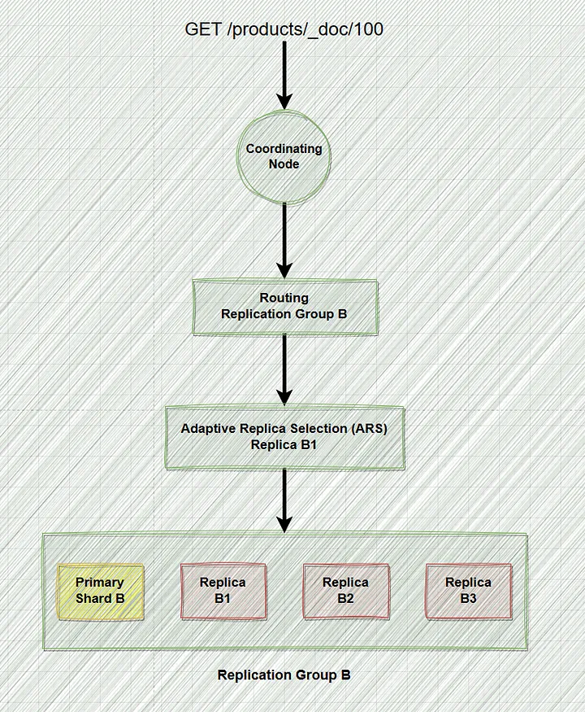

## References
- [Elasticsearch Architecture VII: How Elasticsearch reads data?](https://blog.devgenius.io/elasticsearch-architecture-vii-how-elasticsearch-reads-data-979097a9a72c)
- [Improving Response Latency in Elasticsearch with Adaptive Replica Selection](https://www.elastic.co/blog/improving-response-latency-in-elasticsearch-with-adaptive-replica-selection)

----
----

