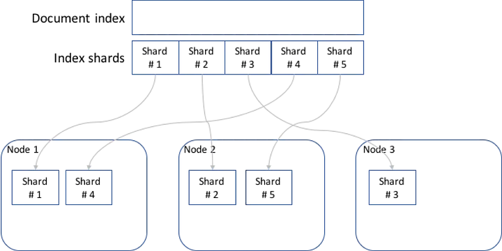
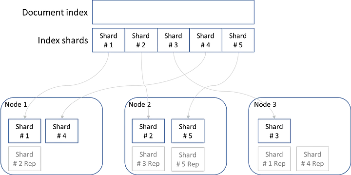
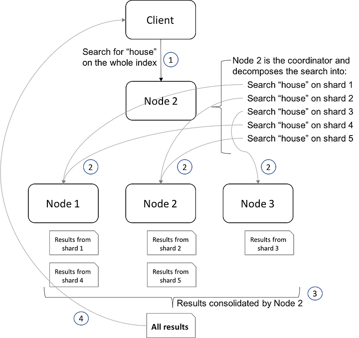

## References
- [Distributed Search Execution](https://www.elastic.co/guide/en/elasticsearch/guide/master/distributed-search.html)
- [Scaling Elasticsearch](https://medium.com/hipages-engineering/scaling-elasticsearch-b63fa400ee9e)

----
----

## Scaling Elasticsearch
[Elasticsearch](https://www.elastic.co/products/elasticsearch) is an awesome product. It’s a great search engine that sits on top of the great [Apache Lucene](http://lucene.apache.org/core/) project and makes index management a breeze.

Its very simple initial setup can mislead you into thinking that operations will be simple as well, but in reality they can be quite challenging. The biggest challenge is understanding how to scale it, how it will behave under load, how it will behave when there’s an issue and a node is down. The _non-happy_ case.

The TL;DR of this article would be that as long as you’re operating under the capacity of your cluster Elasticsearch will scale almost linearly with the size of your data and throughput; but as soon as you hit the capacity of your cluster it will degrade exponentially. Understanding why this happens will help you do proper capacity planning.

There are a couple of basic concepts you need to grasp to properly understand how to scale Elasticsearch:

## Index Sharding

One of the great features of Elasticsearch is that it’s designed from the ground up to be _horizontally scalable_, meaning that by adding more nodes to the cluster you’re capable to grow the capacity of the cluster (as opposed to _vertical scalability_ that requires you to have bigger machines to be able to grow your capacity). We’ll see later what capacity actually means.

Elasticsearch achieves horizontal scalability by sharding its index and assigning each shard to a node in the cluster. The index is the internal structure that Elasticsearch utilises to store and locate documents in an efficient way (think of a book’s index)



Figure 1: Sharding of the document index and assignment to nodes: 5 shards

This allows each node to have to deal with only part of the full document index. Furthermore, Elasticsearch also has the concept of _replicas_, which are copies of shards. This allows fault tolerance and redundancy, as well as an increased throughput.



Figure 2: Shards and replicas — 5 shards, 1 replica

For example, Figure 2 shows a cluster that can handle the loss of any one node as another node will have a replica of any of its primary shards.

## Distributed Search

Now that we know how the index is managed, we need to understand how searches are handled.

In this distributed environment, searches are done in two phases:

-   [Query Phase](https://www.elastic.co/guide/en/elasticsearch/guide/current/_query_phase.html): A new search is received, and it’s transformed into a set of searches (one on each shard). Each shard returns its matching documents, the lists are merged, rank, and sorted  
    → The result of this phase is the list of documents ids that will be returned to the user
-   [Fetch Phase](https://www.elastic.co/guide/en/elasticsearch/guide/current/_fetch_phase.html): Get the documents by id from their owning shards and return to the client

Important to know also is that in Elasticsearch any node can receive a search request. That node acts as the coordinator for that search and sends instructions to the other nodes on what they need to do to be able to fulfill it.



Figure 3: How Distributed search works

In Figure 3 we see how distributed search works and how each node managed the search on the shards it has and reported back to the coordinator with the results.

Each of these searches is performed by a Thread in the “Search” thread pool of each node. How many threads are available in each node is configured in Elasticsearch on the _thread\_pool.search_ setting (see more info [here](https://www.elastic.co/guide/en/elasticsearch/reference/current/modules-threadpool.html)), and can be monitored with a call to the _/\_cat/thread\_pool_ endpoint (as described in [the docs](https://www.elastic.co/guide/en/elasticsearch/reference/current/cat-thread-pool.html))

Now that we have a good understanding of how document index is managed, and how a distributed search is done, we can learn about how to scale Elasticsearch

----
----


## Explain life cycle of a search request inside Elasticsearch Cluster

Certainly! Let's delve into more detail about each step in the life cycle of a search request in an Elasticsearch cluster:

### 1. Client Sends a Search Request
- **Request Initiation**: A client (like a web application) sends a search request to Elasticsearch. This request can be directed to any node in the cluster, known as the entry point.

### 2. Coordinating Node Analysis
- **Node Selection**: The node receiving the request becomes the coordinating node for this query. Its role is to orchestrate the search process across various data nodes.
- **Query Understanding**: The coordinating node analyzes the search query, understanding its structure and the required search criteria.
- **Shard Identification**: It determines which shards of the index contain the data that needs to be searched. This could involve all shards in an index or a subset, depending on the query.

### 3. Data Nodes Process the Query
- **Query Distribution**: The coordinating node distributes the search request to all nodes that hold relevant shards (both primary and replica shards).
- **Local Search Execution**: Each node executes the query on its local shards. This involves scanning the inverted index, a data structure that Elasticsearch uses for efficient text searching.
- **Local Result Compilation**: Every node compiles a list of document IDs and their corresponding scores based on the query's relevance criteria.

### 4. Results Aggregation - Query Phase
- **Intermediate Results Gathering**: The coordinating node collects these partial results from all the nodes.
- **Scoring and Ranking**: It then combines these results, sorting them by their relevance scores. This step might involve recalculating scores or applying tie-breaking rules.

### 5. Fetch Phase
- **Document ID Selection**: The coordinating node identifies the top document IDs from the aggregated list, based on the requested number of results (`size` parameter).
- **Fetching Full Documents**: It sends requests to the respective nodes to fetch the full documents corresponding to these IDs.
- **Result Compilation**: As nodes return the full documents, the coordinating node compiles them into the final response.

### 6. Response to Client
- **Final Response Formation**: The coordinating node wraps the fetched documents into a response format, typically JSON, including additional information like total hits, aggregations, etc.
- **Response Delivery**: This final result set is sent back to the client, completing the search request cycle.

### Additional Considerations
- **Efficiency Mechanisms**: Elasticsearch employs various efficiency mechanisms like caching (query cache, request cache), reducing the workload for frequent queries.
- **Load Distribution**: By using primary and replica shards, Elasticsearch distributes the query load, ensuring no single node becomes a bottleneck.
- **Failover Handling**: In case of node failure, replica shards ensure that the search can still be completed, providing high availability.
- **Query Optimization**: Elasticsearch optimizes query execution by rewriting queries, executing them in parallel across nodes, and reducing inter-node communication.
- **Scalability and Performance**: Elasticsearch's distributed nature allows for scalability. As data and query volume grow, more nodes can be added to the cluster to distribute the load.
- **Customizability**: Elasticsearch offers various ways to tune searches, like setting timeouts, using routing to limit the search to specific shards, and applying filters for more efficient querying.

By managing these complex processes behind the scenes, Elasticsearch provides a robust, scalable, and efficient search mechanism suitable for a wide range of applications, from simple text searches to complex data analytics.

----
----

## How does Elasticsearch query data in relevant shards? Show example with data

To illustrate how Elasticsearch queries data across multiple shards, let's consider a simplified example. Imagine you have an Elasticsearch cluster with an index named `articles`, which stores documents about various topics. This index is divided into multiple shards distributed across different nodes in the cluster.

### Setup Example:

1. **Index "articles"**: Contains documents. Each document represents an article with fields like `title`, `content`, and `date`.

2. **Sharding**: Assume the index is split into 3 primary shards (Shard 1, Shard 2, Shard 3) for the purpose of distribution and parallel processing.

3. **Cluster Nodes**: These shards are distributed across different nodes in the cluster. Let's say Node A holds Shard 1, Node B holds Shard 2, and Node C holds Shard 3.

4. **Replica Shards**: Each primary shard has one replica shard for fault tolerance and load balancing. These replica shards are also distributed across the cluster.

### Sample Data:
- **Shard 1** (Node A):
    ```json
    {
      "Document 1": {
        "title": "Elasticsearch Basics",
        "content": "...",
        "date": "2022-01-01"
      },
      "Document 2": {
        "title": "Distributed Systems",
        "content": "...",
        "date": "2022-01-05"
      }
    }
    ```

- **Shard 2** (Node B):
    ```json
    {
      "Document 3": {
        "title": "Introduction to Lucene",
        "content": "...",
        "date": "2022-01-10"
      },
      "Document 4": {
        "title": "Elasticsearch vs Solr",
        "content": "...",
        "date": "2022-01-15"
      }
    }
    ```

- **Shard 3** (Node C):
    ```json
    {
      "Document 5": {
        "title": "Advanced Elasticsearch",
        "content": "...",
        "date": "2022-01-20"
      },
      "Document 6": {
        "title": "Scalability in Elasticsearch",
        "content": "...",
        "date": "2022-01-25"
      }
    }
    ```

### Search Request Example:
Let's say a client sends a search request to find articles containing the word "Elasticsearch".

1. **Search Query**:
   ```
   GET /articles/_search
   {
     "query": {
       "match": {
         "title": "Elasticsearch"
       }
     }
   }
   ```

2. **Coordinating Node**: The request hits Node A, which becomes the coordinating node.

3. **Distributing the Query**: Node A analyzes the query and forwards it to all shards of the `articles` index.

4. **Shard-Level Processing**:
    - **Shard 1** (Node A): Finds Document 1.
    - **Shard 2** (Node B): Finds no matching documents.
    - **Shard 3** (Node C): Finds Document 5.

5. **Results Aggregation**: Node A collects results from all shards.

6. **Final Response**: Node A sends back the search results to the client:
   ```json
   {
     "hits": {
       "total": 2,
       "hits": [
         {
           "_id": "1",
           "_source": {
             "title": "Elasticsearch Basics",
             "date": "2022-01-01"
           }
         },
         {
           "_id": "5",
           "_source": {
             "title": "Advanced Elasticsearch",
             "date": "2022-01-20"
           }
         }
       ]
     }
   }
   ```

This example demonstrates the distributed nature of Elasticsearch in handling search queries. Each shard independently processes the query and the coordinating node aggregates these results. This setup allows Elasticsearch to efficiently handle large datasets and queries by distributing the load across multiple nodes and shards.

---
---


