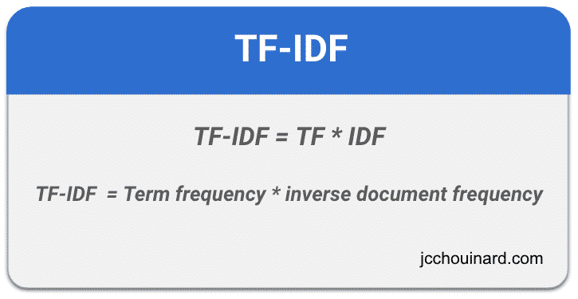
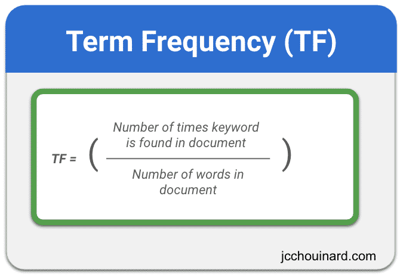
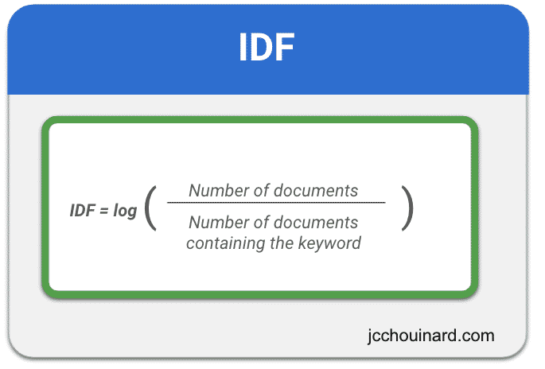
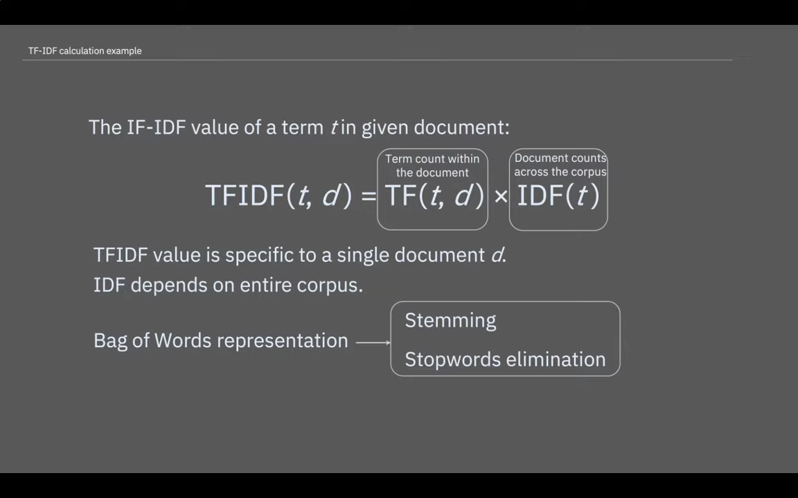
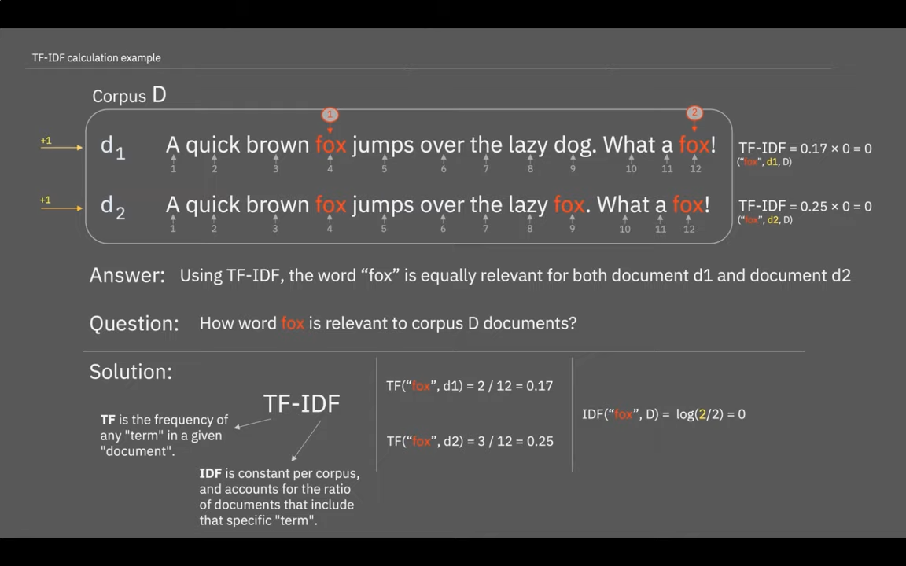
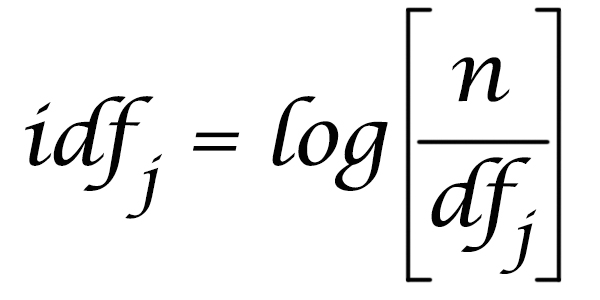
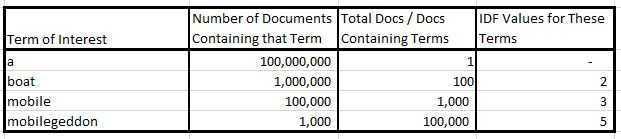

## References
- [TF-IDF in Python (Scikit-learn Example) – Term frequency-inverse document frequency](https://www.jcchouinard.com/tf-idf/)
- [Calculate TF-IDF in NLP (Simple Example)](https://www.youtube.com/watch?app=desktop&v=vZAXpvHhQow)

---
---

## Term

> TF-IDF provides a **rarity** measure.

----
----

## Example

----
----

## Formula
> Document frequency measures commonness, and we prefer to measure rareness. The classic way that this is done is with a formula that looks like this:

For each term we are looking at, we take the total number of documents in the document set and divide it by the number of documents containing our term. This gives us more of a measure of rareness. However, we don't want the resulting calculation to say that the word "mobilegeddon" is 1,000 times more important in distinguishing a document than the word "boat," as that is too big of a scaling factor.

This is the reason we take the Log Base 10 of the result, to dampen that calculation. For those of you who are not mathematicians, you can loosely think of the Log Base 10 of a number as being a count of the number of zeros - i.e., the Log Base 10 of 1,000,000 is 6, and the log base 10 of 1,000 is 3. So instead of saying that the word "mobilegeddon" is 1,000 times more important, this type of calculation suggests it's three times more important, which is more in line with what makes sense from a search engine perspective.

With this in mind, here are the IDF values for the terms we looked at before:

> **Now you can see that we are providing the highest score to the term that is the rarest.**

