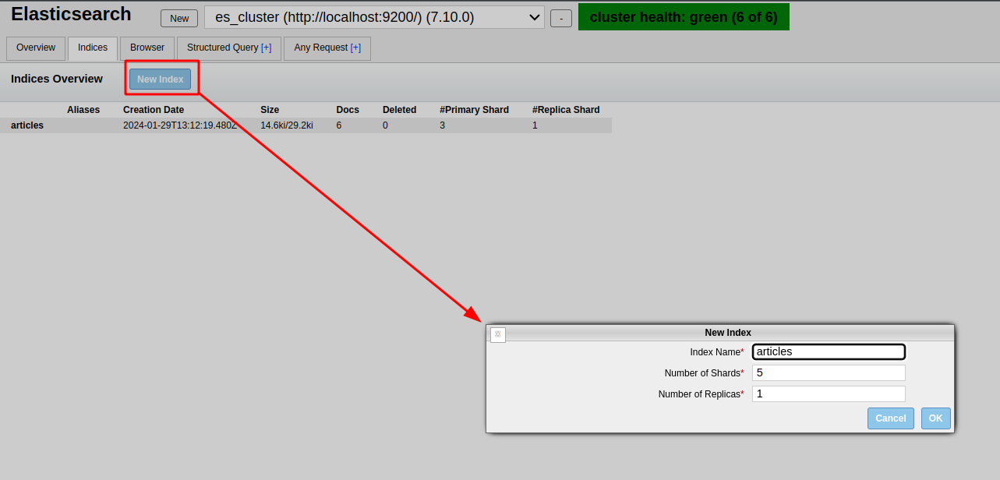

## Create Index



## Insert data

```
curl -X POST "http://localhost:9200/articles/_doc/1" -H 'Content-Type: application/json' -d'
{
  "title": "Elasticsearch Basics",
  "content": "...",
  "date": "2022-01-01"
}'

curl -X POST "http://localhost:9200/articles/_doc/2" -H 'Content-Type: application/json' -d'
{
  "title": "Distributed Systems",
  "content": "...",
  "date": "2022-01-05"
}'


curl -X POST "http://localhost:9200/articles/_doc/3" -H 'Content-Type: application/json' -d'
{
  "title": "Introduction to Lucene",
  "content": "...",
  "date": "2022-01-10"
}'

curl -X POST "http://localhost:9200/articles/_doc/4" -H 'Content-Type: application/json' -d'
{
  "title": "Elasticsearch vs Solr",
  "content": "...",
  "date": "2022-01-15"
}'

curl -X POST "http://localhost:9200/articles/_doc/5" -H 'Content-Type: application/json' -d'
{
  "title": "Advanced Elasticsearch",
  "content": "...",
  "date": "2022-01-20"
}'

curl -X POST "http://localhost:9200/articles/_doc/6" -H 'Content-Type: application/json' -d'
{
  "title": "Scalability in Elasticsearch",
  "content": "...",
  "date": "2022-01-25"
}'
```