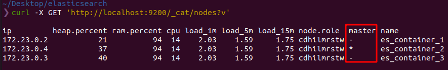
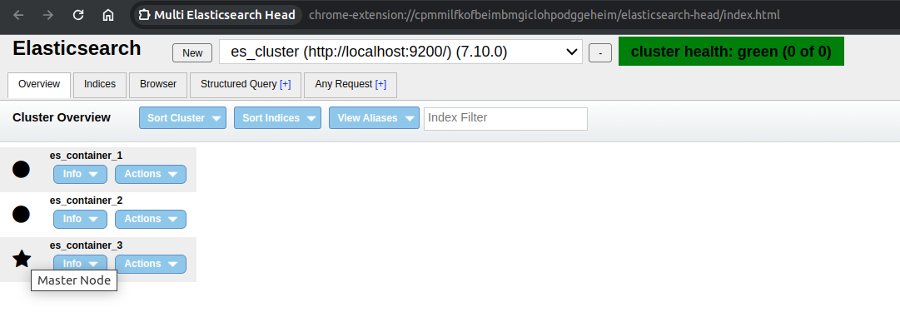
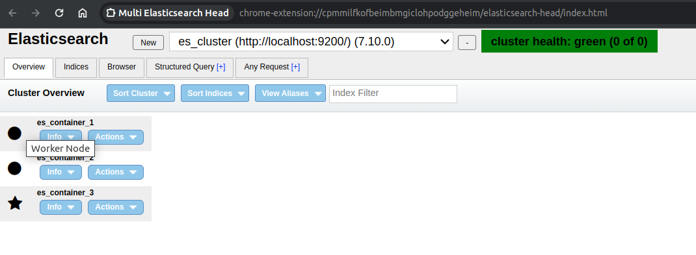

## Node roles
- [How to configure all Elasticsearch node roles (master, data, coordinating..)](https://opster.com/guides/elasticsearch/data-architecture/how-to-configure-all-elasticsearch-node-roles/#Master-node)

## What is worker node(data node) vs master node in elasticsearch

In Elasticsearch, the architecture is designed to be distributed and scalable, often involving multiple nodes. Understanding the difference between a worker node and a master node is crucial for effective management and utilization of Elasticsearch clusters.

1. **Master Node:**

   

   - **Primary Role:** The master node in Elasticsearch is responsible for managing the cluster's overall operations. It doesn't typically handle client requests or store data. Instead, its main tasks include creating or deleting indices, keeping track of which nodes are part of the cluster, and managing other cluster-wide settings and operations.
   - **Cluster State Management:** The master node maintains the cluster state, which includes information about all the indices, shards, and which nodes hold which shards.
   - **Election Process:** In a cluster, there can be multiple nodes with the potential to become a master, but only one is elected to be the active master at any given time. This election process is crucial for cluster resilience.
   - **Minimal Resource Utilization:** Since the master node has critical responsibilities for cluster stability, it's often configured to use minimal resources for data processing or querying, ensuring it can efficiently handle cluster management tasks.

2. **Worker Node:**

   

   - **Primary Role:** Worker nodes are the workhorses of an Elasticsearch cluster. They are responsible for storing data and executing data-related operations like indexing, search queries, and aggregations.
   - **Data Handling:** Each worker node holds shards of data. These shards can either be primary (original copy) or replica shards (backup copies). This distribution of data enhances performance and fault tolerance.
   - **Scalability:** Adding more worker nodes to a cluster can increase its capacity for data storage and processing power, improving overall performance and scalability.
   - **Load Balancing:** In large clusters, worker nodes help in distributing the load, ensuring no single node becomes a bottleneck.

> In summary, the **master node** in Elasticsearch is like the 'manager' of the cluster, **responsible for administrative tasks and cluster health**, while **worker nodes** are the 'employees', h**andling the actual data and query processing**. This separation of concerns allows Elasticsearch clusters to be both efficient and resilient.

----
----

## What is watermark

In the context of Elasticsearch, a "watermark" refers to specific thresholds related to disk usage on nodes within an Elasticsearch cluster. These watermarks are used to prevent nodes from running out of disk space, which can lead to performance issues or even data loss. There are three main types of watermarks in Elasticsearch:

1. **Low Watermark**:
    - **Purpose**: This is the initial threshold for disk usage. When the disk usage on a node crosses this level, Elasticsearch will stop allocating new shards to that node. However, the node will continue to function normally otherwise, and new indices can still be created.
    - **Default Threshold**: Typically set at 85% of disk usage. This means that if a node uses more than 85% of its disk space, it will not receive new shards.

2. **High Watermark**:
    - **Purpose**: This is a more critical threshold. When a node's disk usage crosses this level, Elasticsearch takes more aggressive actions. It not only stops allocating new shards to that node but also tries to relocate existing shards to other nodes with more available disk space.
    - **Default Threshold**: Usually around 90% of disk usage. Beyond this point, Elasticsearch actively tries to reduce the disk space used on the affected node.

3. **Flood Stage Watermark**:
    - **Purpose**: This is the critical threshold. When the disk usage crosses this point, Elasticsearch takes emergency actions to prevent any further data growth that could lead to data loss or a node crash.
    - **Default Threshold**: Commonly set at 95% of disk usage. When this level is reached, Elasticsearch will turn all indices with shards on the affected node to a read-only state, preventing any further data writing.

These watermarks are configurable, allowing administrators to tailor them according to the specific needs and capacities of their clusters. Proper configuration and monitoring of these thresholds are crucial for maintaining the health and stability of an Elasticsearch cluster. It helps ensure that nodes have enough disk space to operate efficiently and safeguards against potential issues related to disk space exhaustion.