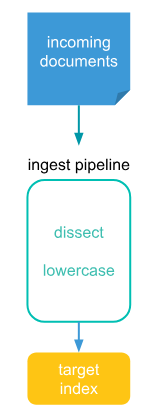
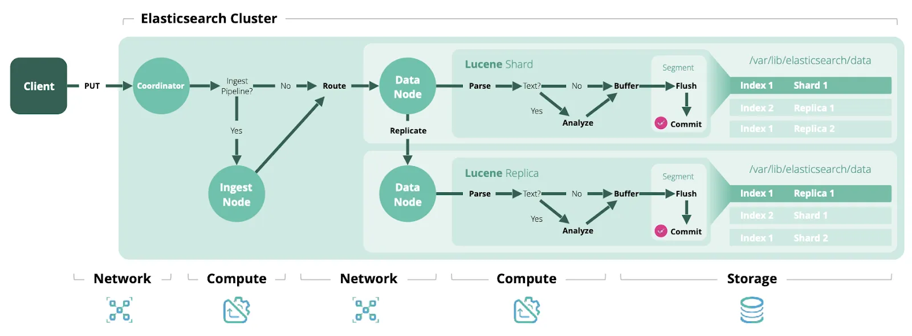

## References
- [Ingest pipelines](https://www.elastic.co/guide/en/elasticsearch/reference/current/ingest.html#test-pipeline)
- [From scratch to search: playing with your data (Elasticsearch Ingest Pipelines)](https://towardsdatascience.com/from-scratch-to-search-playing-with-your-data-elasticsearch-ingest-pipelines-6d054bf5d866)
- [Elasticsearch Data Ingestion: Advanced Techniques and Best Practices](https://opster.com/guides/elasticsearch/operations/elasticsearch-data-ingestion/)

----
----





## What is Ingest Node in elasticsearch

In Elasticsearch, an **ingest node** is a specialized type of node within the cluster that focuses on **pre-processing data before it gets indexed**. Unlike data nodes, which store and serve indexed data, ingest nodes handle data transformation and enrichment using **ingest pipelines**.

Here's what you need to know about ingest nodes:

**What they do:**

* Apply ingest pipelines to incoming documents.
* These pipelines consist of a series of configurable tasks called **processors**.
* Each processor performs specific transformations on the data, like:
    * Removing unwanted fields.
    * Extracting values from text.
    * Converting data formats.
    * Enriching data with information from external sources.
    * And more!

**Benefits of using ingest nodes:**

* **Improved data quality:** Ensures data is consistently formatted and meets your needs before indexing.
* **Reduced workload on data nodes:** Offloads pre-processing tasks, allowing data nodes to focus on indexing and search.
* **Increased flexibility:** Easily customize data transformations using pre-built processors or create your own.
* **Scalability:** Add more ingest nodes to handle growing data volumes.

**When to use them:**

* When preprocessing is complex or resource-intensive.
* When dealing with large datasets and high ingest rates.
* When data enrichment is required from external sources.

**Additional notes:**

* Not all nodes require the ingest role. You can dedicate specific nodes to this task for optimal performance.
* Ingest pipelines are defined and managed separately from the ingest nodes themselves.
* Several plugins are available for specific tasks like converting files or geo-locating IP addresses.

I hope this explanation clarifies the role of ingest nodes in Elasticsearch. If you have any further questions or specific use cases in mind, feel free to ask!

----
----

## Example of Ingest Node in Elasticsearch

Imagine you're ingesting log data from your web application into Elasticsearch. This data might be raw and contain some noisy fields, like timestamps or user IDs. You want to enrich it with information like user geolocation and log level before indexing.

Here's how an ingest node with a pipeline can help:

**1. Ingest Pipeline:**

```json
{
  "description": "Process web application logs",
  "processors": [
    {
      "grok": {
        "match": { "message": "%{COMBINEDAPACHELOG}" }
      }
    },
    {
      "convert": {
        "field": "@timestamp",
        "type": "date"
      }
    },
    {
      "geoip": {
        "field": "source_ip",
        "target_field": "geo_location"
      }
    },
    {
      "condition": {
        "script": {
          "source": "doc['http_status_code'] >= 500"
        }
      },
      "set": {
        "field": "log_level",
        "value": "error"
      }
    }
  ]
}
```

**Explanation:**

* This pipeline has four processors:
    * `grok`: Parses the message field using a predefined pattern for Apache logs.
    * `convert`: Converts the timestamp field to a date format.
    * `geoip`: Enriches the document with geolocation information based on the source IP.
    * `condition`: Adds a "log_level" field as "error" only if the HTTP status code is 500 or higher.

**2. Ingest Node:**

* You configure a node in your cluster with the `ingest` role.
* This node runs the defined pipeline on incoming log documents before sending them to the data node for indexing.

**Results:**

* Your indexed logs are clean, formatted, and enriched with geolocation and log level information.
* Searching and analyzing logs becomes easier and more meaningful.

**Benefits:**

* Improved data quality and consistency.
* Faster queries and more efficient analysis.
* Reduced load on data nodes for better performance.

This is just a basic example. You can create complex pipelines with many processors and plugins for various data types and needs. Remember, the power of ingest nodes lies in their ability to transform and enrich your data before it reaches the heart of your Elasticsearch cluster.