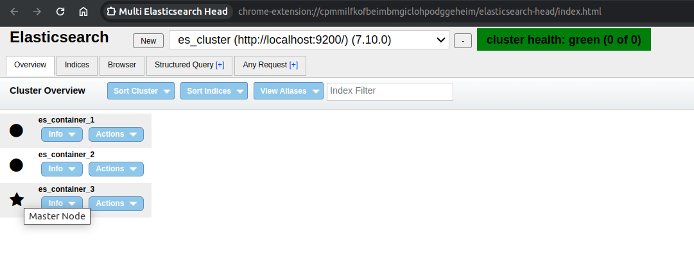
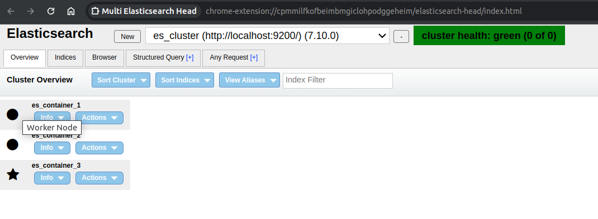

## References
- [How To Install an Elasticsearch Cluster on Ubuntu 18.04](https://devconnected.com/how-to-install-an-elasticsearch-cluster-on-ubuntu-18-04/)
- [Elastic search multi node cluster with docker-compose](https://jndrbr7.hashnode.dev/elastic-search-multi-node-cluster-with-docker-compose2)
- [Setup a Multi-Node Elasticsearch Cluster](https://medium.com/avmconsulting-blog/how-to-deploy-and-configure-a-multi-node-elastic-search-cluster-c13990881ba0)

## Setup multi node cluster with docker

```yaml
version: '3.1'
services:
  es_service_1:
    image: docker.elastic.co/elasticsearch/elasticsearch:7.10.0
    container_name: es_container_1
    environment:
      - cluster.name=es_cluster
      - node.name=es_container_1
      - discovery.seed_hosts=es_container_1,es_container_2,es_container_3
      - cluster.initial_master_nodes=es_container_1,es_container_2,es_container_3
      - node.max_local_storage_nodes=3
      - "ES_JAVA_OPTS=-Xms512m -Xmx512m"
      - xpack.security.enabled=false
    ulimits:
      memlock:
        soft: -1
        hard: -1
    volumes:
      - ./es_data_1:/usr/share/elasticsearch/data
    ports:
      - 9200:9200
    networks:
      - elastic_network

  es_service_2:
    image: docker.elastic.co/elasticsearch/elasticsearch:7.10.0
    container_name: es_container_2
    environment:
      - cluster.name=es_cluster
      - node.max_local_storage_nodes=3
      - node.name=es_container_2
      - "ES_JAVA_OPTS=-Xms512m -Xmx512m"
      - xpack.security.enabled=false
      - discovery.zen.ping.unicast.hosts=es_container_1
    ulimits:
      memlock:
        soft: -1
        hard: -1
    volumes:
      - ./es_data_2:/usr/share/elasticsearch/data
    networks:
      - elastic_network

  es_service_3:
    image: docker.elastic.co/elasticsearch/elasticsearch:7.10.0
    container_name: es_container_3
    environment:
      - cluster.name=es_cluster
      - node.max_local_storage_nodes=3
      - node.name=es_container_3
      - "ES_JAVA_OPTS=-Xms512m -Xmx512m"
      - xpack.security.enabled=false
      - discovery.zen.ping.unicast.hosts=es_container_1
    ulimits:
      memlock:
        soft: -1
        hard: -1
    volumes:
      - ./es_data_3:/usr/share/elasticsearch/data
    networks:
      - elastic_network

networks:
  elastic_network:
    driver: bridge
```

Check

> curl -X GET localhost:9200/_cat/nodes





---
---

## How to reduce costs by optimize node roles? explain by example

Let's consider another example, focusing on a media streaming service that uses Elasticsearch for logging and analyzing user interaction data, content recommendations, and search functionalities. The service experiences fluctuating volumes of data and query loads depending on new content releases and promotional events.

### Initial Scenario

The media streaming service initially deployed a homogeneous Elasticsearch cluster configuration:

- **15 General-Purpose Nodes**: Each node was capable of handling master, data, and ingest roles. This configuration was chosen for its simplicity but led to inefficient resource utilization.
- **Challenges**:
    - High operational costs due to uniform use of high-specification hardware across all nodes, regardless of their actual workload.
    - Performance bottlenecks during peak event times due to inadequate resource allocation for different types of data and operations.

### Optimization Strategy

To optimize costs and improve performance, the service adopted a role-based optimization strategy for their Elasticsearch cluster.

#### Step 1: Role-Based Node Configuration

- **Action**: They reconfigured their cluster based on the specific roles required for their operations.
    - **3 Dedicated Master Nodes**: Chosen for their critical role in managing the cluster's state and not involved in heavy data processing, these nodes were set up on moderate-spec machines.
    - **Data Nodes Split into Hot and Cold Tiers**:
        - **Hot Nodes**: 4 high-performance nodes were designated for handling recent, frequently accessed data and real-time user interaction logs.
        - **Cold Nodes**: 6 nodes with larger storage and moderate computing power were used for older logs and data not frequently accessed.

#### Step 2: Dedicated Ingest Nodes for Log Data

- **Action**: To efficiently handle the high volume of incoming log data, 2 nodes were designated as ingest nodes, equipped with sufficient CPU and memory to preprocess and enrich log data before indexing.
- **Outcome**: This helped in managing the ingestion workload more effectively, ensuring that the data nodes were not overwhelmed by both search queries and data processing tasks.

#### Step 3: Fine-Tuning and Monitoring

- **Action**: The service implemented a monitoring system to track the performance and resource utilization of each node, adjusting their roles and resources as necessary to match the workload.
- **Outcome**: This dynamic approach allowed them to scale resources up or down for specific nodes, aligning operational costs more closely with actual needs.

### Results

- **Performance Improvement**: The role-based configuration and tiered data node strategy improved query performance and data processing speeds, particularly during peak times.
- **Cost Efficiency**: By tailoring the hardware specifications to the role of each node, the service significantly reduced their hardware and operational costs. Cold nodes, for example, used less expensive storage to hold less frequently accessed data, while dedicated master nodes operated on cost-effective hardware.
- **Enhanced Scalability**: The service was able to scale different parts of the cluster independently, adding hot nodes during promotional events for new content releases, and scaling back during off-peak periods, further optimizing costs.

### Conclusion

This example underscores the importance of a role-based node configuration in Elasticsearch clusters, especially for businesses with variable data and workload patterns. By strategically assigning node roles and adjusting resources based on real-time demands, organizations can achieve both operational efficiency and cost savings, ensuring their infrastructure can scale flexibly with their needs.