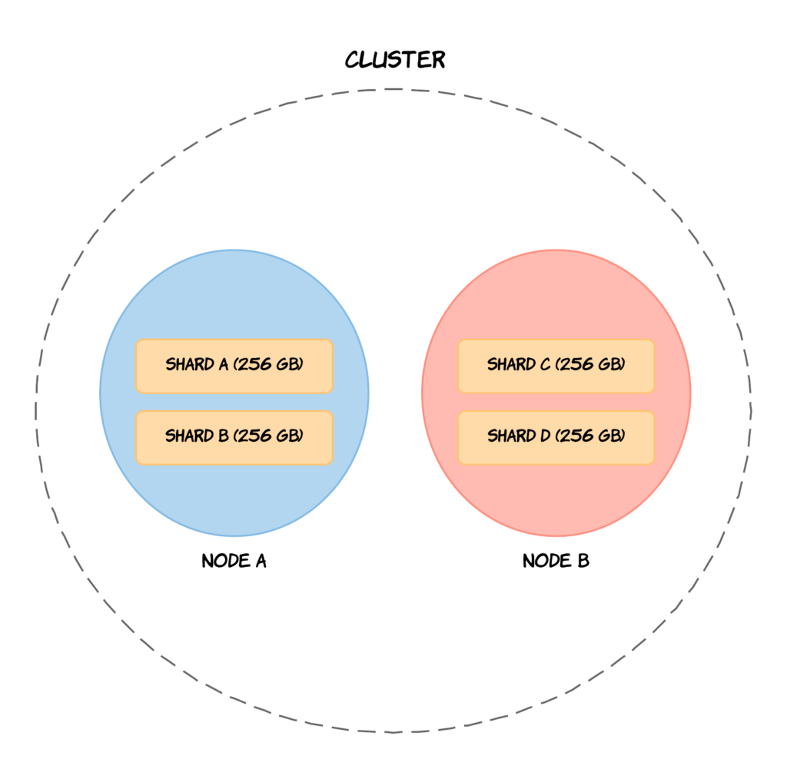
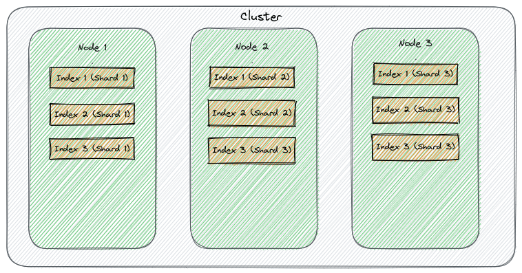
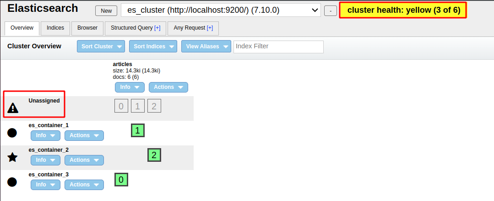
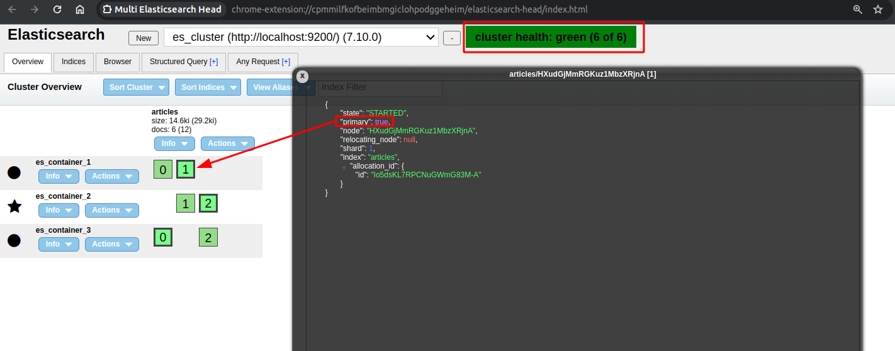

## References
- [Why is my shard unassigned](https://writequit.org/org/es/#why-is-my-shard-unassigned)
- [Elasticsearch Pro-Tips Part I - Sharding](https://www.linkedin.com/pulse/elasticsearch-pro-tips-part-i-sharding-prakhar-nigam/)
- [Understanding Sharding in Elasticsearch](https://codingexplained.com/coding/elasticsearch/understanding-sharding-in-elasticsearch)
----
----

## Def


> There are two main reasons why sharding is important, with the **first one being that it allows you to split and thereby scale volumes of data**. So if you have growing amounts of data, you will not face a bottleneck because you can always tweak the number of shards for a particular index. I will get back to how to specify the number of shards in just a moment. **The other reason why sharding is important, is that operations can be distributed across multiple nodes and thereby parallelized**. This results in increased performance, because multiple machines can potentially work on the same query. This is completely transparent to you as a user of Elasticsearch.






> Each index in Elasticsearch is divided into shards. For each shard, there are primary shards and replica shards.

A key aspect that allows Elasticsearch to be a fault-tolerance and scalable tool is the ability to distribute data across multiple nodes. **[Shards are building blocks representing a subset of the data stored in the index.](https://www.baeldung.com/java-shards-replicas-elasticsearch)** Not just that, a shard is a Lucene index defined and stored within a node, while the collection of one or more shards represents an Elacticsearch index. **Shards are used as a way to distribute data horizontally across the cluster nodes/members.**

Elacticsearch indexes represent a set of data distributed across the Elasticsearch cluster. A cluster is a group of machines running Elasticsearch that can communicate with each other. This means one cluster can contain multiple indexes and, therefore, various shards. **Such shards improve fault tolerance by removing the single point of failure caused by the possibility of storing all the data in a single node.**

The distribution of the shards across the nodes guarantees in case of loss, or when the node goes down, only a sub-part of the data becomes unavailable, but the cluster can continue serving the other part. **Another benefit is stability, as each shard will try to handle the request concurrently, which may optimize the use of the cluster’s resources and result in better performance.** Of course, this depends on several factors, like index size, instance size, and node load.

Sharding also reduces the amount of data Elasticsearch needs to scan to fulfill each request by distributing each across different instances and therefore parallelizing the execution of the query. However, this has its price, and when sharding an index, we add some extra costs like coordination and communication between nodes.

----
----

## Shard allocation

### Allocators vs Deciders
> Basicly, allocators finds the best nodes to allocate the shard and deciders looks at these nodes and decide whether that node can allocate that shard

### Cannot allocate because allocation is not permitted to any of the nodes



Endpoint:
```
curl --location --request GET 'localhost:9200/_cluster/allocation/explain' \
--header 'Content-Type: application/json'
```
Response
> not enough disk space

```json
{
    "index": "articles",
    "shard": 1,
    "primary": false,
    "current_state": "unassigned",
    "unassigned_info": {
        "reason": "INDEX_CREATED",
        "at": "2024-01-29T13:12:19.485Z",
        "last_allocation_status": "no_attempt"
    },
    "can_allocate": "no",
    "allocate_explanation": "cannot allocate because allocation is not permitted to any of the nodes",
    "node_allocation_decisions": [
        {
            "node_id": "-0UWzFheQc2tTWUz_KCvKQ",
            "node_name": "es_container_3",
            "transport_address": "172.23.0.3:9300",
            "node_attributes": {
                "ml.machine_memory": "49941602304",
                "ml.max_open_jobs": "20",
                "xpack.installed": "true",
                "transform.node": "true"
            },
            "node_decision": "no",
            "weight_ranking": 1,
            "deciders": [
                {
                    "decider": "disk_threshold",
                    "decision": "NO",
                    "explanation": "the node is above the low watermark cluster setting [cluster.routing.allocation.disk.watermark.low=85%], using more disk space than the maximum allowed [85.0%], actual free: [14.086243658277443%]"
                }
            ]
        },
        {
            "node_id": "HXudGjMmRGKuz1MbzXRjnA",
            "node_name": "es_container_1",
            "transport_address": "172.23.0.2:9300",
            "node_attributes": {
                "ml.machine_memory": "49941602304",
                "ml.max_open_jobs": "20",
                "xpack.installed": "true",
                "transform.node": "true"
            },
            "node_decision": "no",
            "weight_ranking": 2,
            "deciders": [
                {
                    "decider": "same_shard",
                    "decision": "NO",
                    "explanation": "a copy of this shard is already allocated to this node [[articles][1], node[HXudGjMmRGKuz1MbzXRjnA], [P], s[STARTED], a[id=Io5dsKL7RPCNuGWmG83M-A]]"
                },
                {
                    "decider": "disk_threshold",
                    "decision": "NO",
                    "explanation": "the node is above the low watermark cluster setting [cluster.routing.allocation.disk.watermark.low=85%], using more disk space than the maximum allowed [85.0%], actual free: [14.086243658277443%]"
                }
            ]
        },
        {
            "node_id": "3O4XVNqHTL2PkAVzof3Azw",
            "node_name": "es_container_2",
            "transport_address": "172.23.0.4:9300",
            "node_attributes": {
                "ml.machine_memory": "49941602304",
                "ml.max_open_jobs": "20",
                "xpack.installed": "true",
                "transform.node": "true"
            },
            "node_decision": "no",
            "weight_ranking": 3,
            "deciders": [
                {
                    "decider": "disk_threshold",
                    "decision": "NO",
                    "explanation": "the node is above the low watermark cluster setting [cluster.routing.allocation.disk.watermark.low=85%], using more disk space than the maximum allowed [85.0%], actual free: [14.086243658277443%]"
                }
            ]
        }
    ]
}
```

### Allocation successfully



In the context of Elasticsearch, the numbers you're referring to, like `1 0 2`, likely represent the count of different types of shards on a particular node within the Elasticsearch cluster. Here's what each number typically stands for:

- The first number (`1`) usually indicates the number of primary shards. Primary shards are the main holders of the data in your index.
- The second number (`0`) generally represents the number of replica shards that are currently initializing. Initializing shards are replicas that are in the process of being created but are not yet ready to serve data.
- The third number (`2`) typically indicates the number of active replica shards. Replica shards are copies of the primary shards and provide data redundancy and capacity for read requests.

So, for `es_container 1` with the sequence `0 1`, it would mean there are no primary shards and one initializing replica shard on that node.

For `es_container 2` with `1 2`, there's one primary shard and two active replica shards on that node.

Lastly, `es_container 3` with `0 2`, it means there are no primary shards but two active replica shards on that node.

The cluster health is green, which means all primary and replica shards are allocated correctly and the cluster is fully operational.

> curl -X GET "localhost:9200/_cat/shards?format=json&pretty"

```json
[
  {
    "index" : "articles",
    "shard" : "2",
    "prirep" : "r",
    "state" : "STARTED",
    "docs" : "2",
    "store" : "4.8kb",
    "ip" : "172.23.0.3",
    "node" : "es_container_3"
  },
  {
    "index" : "articles",
    "shard" : "2",
    "prirep" : "p",
    "state" : "STARTED",
    "docs" : "2",
    "store" : "4.8kb",
    "ip" : "172.23.0.4",
    "node" : "es_container_2"
  },
  {
    "index" : "articles",
    "shard" : "1",
    "prirep" : "p",
    "state" : "STARTED",
    "docs" : "3",
    "store" : "5kb",
    "ip" : "172.23.0.2",
    "node" : "es_container_1"
  },
  {
    "index" : "articles",
    "shard" : "1",
    "prirep" : "r",
    "state" : "STARTED",
    "docs" : "3",
    "store" : "5kb",
    "ip" : "172.23.0.4",
    "node" : "es_container_2"
  },
  {
    "index" : "articles",
    "shard" : "0",
    "prirep" : "p",
    "state" : "STARTED",
    "docs" : "1",
    "store" : "4.6kb",
    "ip" : "172.23.0.3",
    "node" : "es_container_3"
  },
  {
    "index" : "articles",
    "shard" : "0",
    "prirep" : "r",
    "state" : "STARTED",
    "docs" : "1",
    "store" : "4.6kb",
    "ip" : "172.23.0.2",
    "node" : "es_container_1"
  }
]
```
> **prirep**: primary or replica
> 
> node **es_container_1** có 2 shard là 0 và 1. shard 0 là **r**(replica) và shard 1 là **p**(primary).

Elasticsearch ensures that replica shards are not allocated on the same node as their corresponding primary shards. This design decision enhances fault tolerance by protecting against node-level failures. If both the primary and its replicas were on the same node, a node failure would result in the loss of both copies of the data.

> Ví dụ ở trên trong trường hợp shard 2 thì primary shard nằm ở node **es_container_2**
> và replica shard nằm ở node **es_container_3**.

For indexing operations, each document must be written to both the primary shard and its replicas. This ensures that all copies of the data are up-to-date and consistent.

More: [**Elasticsearch Pro-Tips Part I - Sharding**](https://www.linkedin.com/pulse/elasticsearch-pro-tips-part-i-sharding-prakhar-nigam/)


----
----

## explain how index data allocate to shard with data example
To explain how index data is allocated to shards in Elasticsearch, let's consider a practical example. Imagine we have an Elasticsearch cluster and we want to index a dataset of customer information. Each record in the dataset represents a customer and contains fields like `customer_id`, `name`, `email`, `location`, and `join_date`.

### Step 1: Creating an Index with Shards

First, we create an index in Elasticsearch. Let's call it `customers`. When creating the index, we can specify the number of primary shards. For this example, assume we set it to 3 primary shards. Elasticsearch also creates replica shards for each primary shard to ensure data redundancy.

```shell
PUT /customers
{
  "settings": {
    "number_of_shards": 3,
    "number_of_replicas": 1
  }
}
```

### Step 2: Indexing Data

Now, let's index some customer data. For instance:

```shekk
POST /customers/_doc
{
  "customer_id": "123",
  "name": "John Doe",
  "email": "johndoe@example.com",
  "location": "New York",
  "join_date": "2024-01-01"
}
```

When this document is indexed, Elasticsearch needs to decide which of the three primary shards to place it in.

### Step 3: Shard Allocation

The process of determining which shard a document will be stored in is based on the document's unique identifier, often the `_id` field. Elasticsearch uses a hash function on the `_id` field to uniformly distribute documents across the available shards. This process is as follows:

1. **Hashing**: Elasticsearch applies a hash function to the `_id` field of the document. In our case, it's the autogenerated `_id` since we didn’t specify one.

2. **Shard Selection**: The resulting hash value is then used to determine the shard. This is done using a simple formula:

   ```
   shard = hash(_id) % number_of_primary_shards
   ```

   For instance, if the hash of `_id` for our document is 456789, and we have 3 primary shards, the calculation would be `456789 % 3`. Let's say this equals 1, so the document will be stored in primary shard 1.

3. **Replica Shards**: After the document is stored in the primary shard, it is also replicated to the corresponding replica shard(s) to ensure redundancy. This happens automatically and is managed by Elasticsearch.

4. **Balancing and Rebalancing**: Elasticsearch continuously balances shards across the cluster to ensure even distribution of data and workload. If new nodes are added to the cluster or if there are changes in the cluster, Elasticsearch may rebalance the shards.

5. **Routing**: When querying data, Elasticsearch determines which shard(s) to search in using the same hashing logic. This ensures efficient retrieval of data.

In summary, the allocation of data to shards in Elasticsearch is a process that ensures even distribution and efficient storage and retrieval of data. It uses a hashing mechanism to allocate documents to shards and automatically handles replication and rebalancing to maintain optimal performance and reliability of the Elasticsearch cluster.

----
----

## What is primary shard vs replica shard

In Elasticsearch, data in an index is divided into shards, which are essentially containers for subsets of your data. Shards help in distributing the data across the cluster to provide scalability and high availability. There are two types of shards in Elasticsearch: primary shards and replica shards.

### Primary Shards
- **Purpose**: Primary shards are the main components that hold the original chunks of the data in your index.
- **Creation**: When you create an index, you define the number of primary shards. This number can only be set at index creation and cannot be changed later without reindexing.
- **Function**: Each document in your index belongs to a single primary shard. This is determined by a hash of the document's ID, which allocates the document to a shard. The primary shard is responsible for indexing (writing) and retrieving documents (reading).

### Replica Shards
- **Purpose**: Replica shards are copies of the primary shards. They serve two main purposes: to provide high availability and to increase read throughput.
- **High Availability**: If a node containing a primary shard fails, one of the replica shards can be promoted to a primary shard, ensuring that no data is lost and the index remains available for both reads and writes.
- **Read Scalability**: Replica shards can serve read requests (searches), which means you can scale out search volume by adding more replicas => distribute the search load.
- **Dynamic**: Unlike primary shards, the number of replica shards can be adjusted dynamically on a live index to change the redundancy and capacity of the system.

Each primary shard can have one or more replica shards, and by default, Elasticsearch creates one replica for each primary shard.

### Notes on Shards:
- **Distribution**: Both primary and replica shards are distributed across the cluster to even out the load and to provide redundancy in case of failure.
- **Location**: A primary shard and its replicas will never be on the same node. This ensures that if a node fails, only either the primary or a replica is affected, but not both.
- **Writes**: All write operations (indexing, updating, deleting) first go to the primary shard and are then replicated to the associated replicas.
- **Reads**: Read operations (searching) can be served by either primary or replica shards.

The primary and replica shard mechanism is central to the distributed nature of Elasticsearch, allowing it to provide reliable, scalable, and fast search capabilities.

----
----

## Does each primary shard need to have one replica shard

In Elasticsearch, each primary shard does not necessarily need to have exactly one replica shard; the number of replica shards is configurable and can be set based on your specific requirements for redundancy, availability, and read throughput. When you create an index in Elasticsearch, you can specify the number of replicas for each primary shard using the `number_of_replicas` setting. This setting can be adjusted at any time on a live cluster, allowing you to increase or decrease the number of replica shards as needed.

### Key Points:
- **Default Setting**: By default, Elasticsearch sets the `number_of_replicas` to 1, meaning each primary shard will have one replica shard. This default configuration provides a basic level of redundancy and improved read capacity.
- **Configurability**: You can configure the number of replicas per primary shard to be zero (no replicas), one, or more, depending on your requirements:
   - **Zero replicas** mean that no additional copies of the primary shard's data are stored. **This might be suitable for `development` or `testing environments` where high availability is not a concern**.
   - **One or more replicas** increase fault tolerance and read capacity. The more replica shards you have, the better your cluster can handle read requests, as they can be distributed across more shards. However, each additional replica requires more storage space and resources.
- **Adjustments**: The number of replica shards can be adjusted dynamically without downtime, allowing you to respond to changes in your data storage and access needs. For instance, you might start with a lower number of replicas and increase them as your read load grows.

### Example: Setting Replica Count

When creating an index, you can specify the number of replicas like so:

```shell
PUT /my_index
{
  "settings": {
    "index": {
      "number_of_shards": 3, // Number of primary shards
      "number_of_replicas": 2 // Number of replicas for each primary shard
    }
  }
}
```

This example creates an index with 3 primary shards and 2 replicas for each primary shard, resulting in a total of 6 replica shards.

### Adjusting Replicas Dynamically

You can adjust the number of replicas dynamically using the Update Index Settings API:

```shell
PUT /my_index/_settings
{
  "index": {
    "number_of_replicas": 1
  }
}
```

This command changes the number of replicas to 1 for each primary shard of the index `my_index`.

### Conclusion

The decision on how many replicas to configure for each primary shard should consider factors such as the criticality of the data (for redundancy), the expected read and write workload, and the resources available in your Elasticsearch cluster. There is no strict requirement to have exactly one replica per primary shard; the optimal configuration depends on your specific use case and operational requirements.

----
----
## why the number of primary shard cannot change but replica shard can change

There are two key reasons why the number of primary shards cannot be changed after an index is created in systems like Elasticsearch, while the number of replica shards can be adjusted dynamically:

**1. Routing Algorithm:**

* **Primary Shards:** The number of primary shards defines the initial distribution of data across the cluster. A routing algorithm uses this number to determine which shard a new document belongs to. Changing the number of primary shards after data has been indexed would disrupt this routing logic and potentially lead to data loss or inconsistencies.

* **Replica Shards:** Replicas are copies of the primary shards and don't participate directly in the routing process. Adding or removing replicas doesn't affect how documents are initially distributed but only impacts redundancy and read performance.

**2. Reindexing vs. Replication:**

* **Changing Primary Shards:** Modifying the number of primary shards would require re-indexing the data into a new index with the desired shard configuration. This is a complex and resource-intensive operation, especially for large datasets.

* **Changing Replica Shards:** Adding or removing replicas involves copying data between nodes or deleting existing copies. This process is generally much faster and less disruptive than reindexing the entire dataset.

Here's an analogy to further illustrate the difference:

Imagine dividing a library book into chapters (primary shards) and making photocopies of specific chapters (replica shards). Changing the number of chapters would require rewriting the entire book, while creating or removing photocopies is a simpler operation.

**Additional points to consider:**

* While increasing the number of replicas improves read performance and fault tolerance, it also consumes additional storage space and resources.
* There are limitations to the number of replicas based on the available nodes in the cluster.

In summary, the immutability of primary shards ensures data consistency and simplifies the routing logic, while the flexibility of replica shards allows for dynamic adjustments to redundancy and read performance without compromising data integrity.

----
----

## If replica shard don't participate in routing, why it can handle read request?

You're absolutely right. Replica shards indeed don't participate directly in the routing process that determines which shard holds a specific document. However, they can still handle read requests because of the way search operations are handled in systems like Elasticsearch.

Here's how it works:

1. **Search Request:** When a search request is submitted, it's sent to a coordinating node in the cluster.
2. **Routing and Shard Selection:** The coordinating node uses the routing algorithm to identify the relevant primary shards based on the search criteria.
3. **Shard Execution:** The search request is then forwarded to each of the identified primary shards.
4. **Optional Replica Involvement:** In some systems, like Elasticsearch with Adaptive Replica Selection enabled, the coordinating node can also choose to involve replica shards alongside primary shards for the search operation. This decision is based on factors like:
   * **Load balancing:** Replicas can be used to offload search requests from overloaded primary shards, improving overall search performance.
   * **Data locality:** If a replica is located closer to the requesting client, it can potentially reduce network latency and improve response times.

However, it's important to note that not all systems automatically involve replicas in search queries. Some might require specific configuration or settings to enable this behavior.

Here are some additional points to consider:

* Even when replicas are not involved in the initial search execution, they are kept up-to-date with the latest data from the corresponding primary shard. This ensures that they can serve read requests if the primary shard becomes unavailable due to failure.
* Involving replicas in read operations can increase overall read throughput, especially for high-traffic scenarios. However, it also adds overhead to the search process and might not always be the most efficient approach.

Therefore, while replicas don't directly participate in routing, they can still play a crucial role in handling read requests by contributing to load balancing, improving data locality, and ensuring high availability. Their involvement in specific searches depends on the system configuration and search execution strategies employed.

----
----

## How to increase the number of primary shard in elasticsearch

Increasing the number of shards in Elasticsearch is a critical operation for scaling and managing the storage and performance of your indices. The approach to increasing shards depends on whether you're dealing with an existing index or planning for a new one, as Elasticsearch does not support changing the number of primary shards for an index directly after it has been created. Here are some strategies for both scenarios:

### For New Indices

1. **Set the Number of Shards at Index Creation:** When creating a new index, you can specify the number of primary shards in the index settings. This is the best time to set your shard count based on your anticipated data volume and query load.

   ```shell
   PUT /my-index
   {
     "settings": {
       "index": {
         "number_of_shards": 5,
         "number_of_replicas": 1
       }
     }
   }
   ```

2. **Index Templates:** If you have indices that are regularly created (e.g., time-based indices), using an index template with predefined shard settings can automate this process.

   ```shell
   PUT /_template/my_template
   {
     "template": "log-*",
     "settings": {
       "number_of_shards": 5
     }
   }
   ```

### For Existing Indices

1. **Reindexing:** To change the number of shards for an existing index, you'll need to create a new index with the desired number of shards and then reindex your data from the old index to the new one.

    - Create a new index with the desired shard count.
    - Use the `_reindex` API to copy documents from the old index to the new one.

   ```shell
   POST /_reindex
   {
     "source": {
       "index": "old-index"
     },
     "dest": {
       "index": "new-index"
     }
   }
   ```

2. **Split Index:** Elasticsearch allows you to increase the number of primary shards of an index by splitting it. The number of primary shards in the new index must be a multiple of the number of primary shards in the original index.

    - The index must be read-only during the split.
    - The original index will have its primary shards split into more shards in the new index.

   ```shell
   POST /old-index/_split/new-index
   {
     "settings": {
       "index.number_of_shards": 10 // Must be a multiple of the original shard count
     }
   }
   ```

3. **Shrink Index:** Although not directly related to increasing shards, shrinking an index can be useful for reducing the number of shards. This is often used in conjunction with splitting indexes for managing shard counts effectively.

### Considerations

- **Performance and Cost:** Increasing shards can improve performance by distributing data and load across more nodes; however, having too many shards can also lead to increased overhead and reduced performance. It's important to find the right balance based on your data volume and query load.
- **Shard Sizing:** Aim for shard sizes between 10GB and 50GB for optimal performance, though this can vary based on use case.
- **Testing:** Always test shard adjustments in a development or staging environment to gauge their impact on performance and stability.

Increasing shards is a powerful way to scale Elasticsearch, but it requires careful planning and consideration of your data growth and query patterns.

----
----

## if the number of primary shard cannot change, what is the point of adding more node?

Adding more nodes to an Elasticsearch cluster, even when the number of shards for an existing index cannot be directly changed, offers several benefits related to scalability, reliability, and performance. Here's why adding more nodes is beneficial:

### 1. Improved Load Distribution

- **Horizontal Scaling:** More nodes allow Elasticsearch to distribute the existing shards across a wider set of resources. This distribution can lead to improved query performance because multiple nodes can process queries in parallel, reducing the load on individual nodes.
- **Balanced Cluster:** Elasticsearch automatically balances shards across the nodes in a cluster. When new nodes are added, Elasticsearch can redistribute shards to ensure that the data and query load are evenly distributed, preventing hotspots and improving overall cluster performance.

### 2. Increased Fault Tolerance

- **Replica Shards:** Adding more nodes allows for the allocation of additional replica shards. While the number of primary shards remains fixed, you can increase the number of replicas for an index, enhancing data redundancy and fault tolerance. This means that if a node fails, the data is still available from replica shards on other nodes, ensuring high availability.
- **Improved Recovery Times:** In the event of a node failure, recovery times can be significantly faster with more nodes in the cluster. Elasticsearch can redistribute the load and reassign replica shards to other nodes more quickly, minimizing downtime and maintaining performance.

### 3. Enhanced Performance for Read and Write Operations

- **Concurrent Read Operations:** More nodes mean that read requests can be serviced by multiple nodes concurrently. This is particularly true for replica shards, as read operations can be performed on any replica. This improves the read throughput and response times.
- **Parallel Write Operations:** While the primary shard is responsible for writes, having replicas across more nodes allows for parallel replication to replica shards. This can improve the write throughput and ensure data is replicated faster across the cluster.

### 4. Better Resource Utilization

- **Dedicated Roles:** In larger clusters, nodes can be specialized for different roles (e.g., master, data, ingest, or coordinating roles), optimizing the use of resources and improving cluster management and performance.
- **Isolation of Workloads:** Adding more nodes can help isolate different workloads or indices. For example, critical indices can be allocated to specific nodes to ensure they have dedicated resources, improving their performance and reliability.

### Conclusion

While the number of primary shards for an index is fixed at the time of its creation, adding more nodes to an Elasticsearch cluster enhances its scalability, reliability, and performance. It allows for better distribution of data and workload, improves fault tolerance through increased redundancy, and enables the cluster to handle higher volumes of read and write operations more efficiently.


----
----

## Is more than one shard in single node is allowed?

Yes, it is allowed and quite common to have more than one shard (including both primary and replica shards) on a single node in an Elasticsearch cluster.

----
----

## Does adding more node redistribute shards?

Adding more nodes to an Elasticsearch cluster triggers the cluster to automatically rebalance the shards across the available nodes, under most configurations. This rebalancing is part of Elasticsearch's goal to ensure optimal performance, availability, and efficient resource utilization across the cluster. 

----
----

## Is primary shard read only

No, primary shards in Elasticsearch are not read-only; they are actively involved in both read and write operations. Here’s how they function:

### Write Operations
- **Write Requests**: All write requests (such as indexing new documents or updating and deleting existing documents) first go to the primary shard. The primary shard is responsible for executing these write operations.
- **Replication Process**: After a write operation is successfully executed on the primary shard, the change is then replicated to all associated replica shards. This ensures that all copies of the data are consistent and up-to-date.
- **Consistency and Durability**: The use of primary shards for initial write operations ensures consistency and durability. Elasticsearch waits for confirmation that the operation has been successfully applied to the primary and a configurable number of replica shards (as defined by the write consistency settings) before acknowledging the write operation as successful to the client.

### Read Operations
- **Serving Read Requests**: Both primary and replica shards can serve read requests, such as searches or document retrieval. This capability is used to balance the read load across the cluster.
- **Load Balancing**: By allowing both primary and replica shards to handle reads, Elasticsearch effectively distributes the read load, enhancing the overall performance and responsiveness of the system.

### Balancing Roles
While primary shards are crucial for processing writes and ensuring data consistency across replicas, their ability to also handle read operations helps in evenly distributing the workload in the cluster, making efficient use of all available resources.

Therefore, primary shards play a dual role, handling both writes and reads, which is central to the distributed nature of Elasticsearch and its performance optimization strategies.

----
----

## why we need separate primary shard and replica shard, why not all shard is replica?

The distinction between primary and replica shards in Elasticsearch serves several key purposes related to data integrity, system resilience, and scalability. Here’s why Elasticsearch distinguishes between them:

### 1. **Data Integrity and Write Consistency**

- **Single Point of Write Operations**: Each write operation (index, update, delete) is first applied to the primary shard. This approach ensures that write operations are processed in a consistent order. The primary shard acts as a single source of truth for the current state of the data.
- **Controlled Replication Process**: After the primary shard successfully processes a write operation, the change is propagated to all the replica shards. This controlled replication process ensures that all replicas are consistent with the primary, maintaining data integrity across the cluster.

### 2. **Fault Tolerance and High Availability**

- **Redundancy**: Replica shards provide redundancy. In the event of a primary shard’s node failing, one of the replica shards can be promoted to a primary shard, ensuring that the index remains fully operational without data loss.
- **Preventing Data Loss**: By having separate primary and replica shards, Elasticsearch ensures that data is not stored on a single node. This separation protects against data loss if a node or even multiple nodes become unavailable.

### 3. **Load Distribution**

- **Balancing Read Load**: Both primary and replica shards can serve read requests (searches and retrievals). This capability allows Elasticsearch to distribute the read load evenly across all nodes holding replicas, enhancing the cluster's performance under read-heavy workloads.
- **Write Load Management**: While the primary shard handles all write requests first, distributing replicas across different nodes allows for the dispersal of the I/O load associated with replicating data after writes.

### 4. **Scalability**

- **Scalable Reads**: As the number of replica shards increases, the capacity to handle more read requests concurrently also increases. This scalability is crucial for applications with high read demands.
- **Elastic Scaling**: Adding more nodes and reallocating replicas can be done with minimal impact on the cluster's ongoing operations, allowing Elasticsearch to scale out efficiently as demand grows.

### 5. **Recovery and Replication Control**

- **Simplified Recovery Process**: In case of node failure, only the shards on that node need to be recovered or replicated to other nodes. If all shards were replicas without any designated primary, managing the consistency and recovery process would be more complex and prone to errors.
- **Configurable Replication Factor**: Administrators can decide the number of replica shards based on their redundancy needs and performance goals. This configurability allows balancing between resource usage and performance requirements.

### Conclusion

The architecture that differentiates between primary and replica shards provides Elasticsearch with robust data integrity, fault tolerance, scalability, and performance optimization capabilities. It allows Elasticsearch to manage large datasets across distributed environments efficiently, making it suitable for enterprise-level applications and high-availability systems.


=====
=====

## Why not write to all shards

Writing directly to all shards in an Elasticsearch cluster, rather than writing to the primary shard and then replicating to the replicas, might initially seem like a way to speed up the replication process. However, this approach is not used due to several critical reasons related to consistency, performance, and system complexity:

### 1. **Consistency and Coordination**

- **Single Point of Control**: Having a single primary shard handle all writes ensures that there is a single authoritative source for the current state of the data. This setup simplifies the management of data consistency, as there is only one point where data modifications occur before being replicated.
- **Ordered Execution**: Writes need to be applied in a consistent order. If writes were allowed directly on all shards, coordinating the order of operations across multiple nodes and ensuring that all replicas are consistent at any given time would be challenging and error-prone.

### 2. **Conflict Resolution**

- **Handling Conflicts**: Elasticsearch uses versioning to handle concurrent updates. The primary shard manages these versions. If updates were written directly to replicas, resolving conflicts across different nodes would complicate ensuring that all nodes reflect the latest and correct version.
- **Simplified Conflict Management**: By having all write operations go through the primary shard, Elasticsearch centralizes conflict detection and resolution, ensuring that all replicas are eventually consistent with the primary.

### 3. **Performance and Resource Efficiency**

- **Reduced Network Traffic**: Writing only to the primary shard and then replicating reduces the initial write load and network traffic. If every node had to coordinate writes simultaneously, it would significantly increase the network traffic and reduce overall system performance.
- **Optimized Resource Use**: Direct writes to all shards would require each shard to handle both read and write loads simultaneously, which could lead to performance bottlenecks and inefficient resource utilization.

### 4. **System Complexity and Reliability**

- **Increased Complexity**: Managing writes across multiple shards simultaneously would increase the complexity of the system. This complexity involves synchronization, error handling, and recovery mechanisms to maintain data integrity across a distributed environment.
- **Reliability and Robustness**: Centralized writes through the primary shard simplify the system architecture, making it more robust and easier to maintain and troubleshoot.

### 5. **Scalability**

- **Scaling Writes**: If writes were made to all shards directly, scaling the system by adding more replicas would linearly increase the write load, potentially leading to scalability issues. By centralizing writes to the primary shard and then replicating them, Elasticsearch can more effectively manage scaling.

### Conclusion

Elasticsearch’s design, where writes are managed through a primary shard before being replicated, is a deliberate choice to balance consistency, performance, and simplicity in managing a distributed system. This architecture allows for efficient, reliable, and scalable operations across large and complex deployments.

====
====

## what happen when a cluster lose a node?

When an Elasticsearch cluster loses a node, several mechanisms kick in to ensure the continuity and integrity of the data and operations within the cluster. Here’s a detailed breakdown of what happens:

### 1. **Detection of Node Failure**
- **Node Failure Detection**: Elasticsearch uses a heartbeat mechanism to monitor the health and connectivity of nodes within the cluster. If a node stops responding, it is considered as having failed after a configurable timeout.

### 2. **Promotion of Replica Shards**
- **Promoting Replicas to Primaries**: Each primary shard in Elasticsearch has one or more replica shards. If a node hosting primary shards fails, Elasticsearch automatically promotes the corresponding replica shards on other nodes to primary status to ensure data availability and write capability.

### 3. **Reallocation of Unassigned Shards**
- **Replica Allocation**: After promoting replicas to primaries, there will be fewer replicas than configured for high availability. Elasticsearch then begins the process of reallocating replicas to other nodes in the cluster to restore the configured level of redundancy.

### 4. **Cluster Health Check**
- **Cluster Health Status**: The cluster health may temporarily change to yellow or red:
   - **Red**: Indicates that some data is not available at all—i.e., both the primary and all replicas for a shard are unavailable.
   - **Yellow**: Indicates that the cluster does not have the desired number of replicas for some shards but all data is available (all primaries are assigned).
   - **Green**: Indicates that all primary and replica shards are allocated correctly.
- The cluster’s status will remain in a non-green state until the missing replicas are reallocated and the data on them is fully replicated.

### 5. **Data Recovery and Resynchronization**
- **Recovering Missing Shards**: Elasticsearch automatically recovers any missing shard data by copying the necessary shard data from existing primaries or replicas to the newly allocated replicas.
- **Resynchronization**: Once the new replicas are allocated and data recovery is complete, these shards are resynchronized with the current state of their corresponding primaries. This ensures that all nodes in the cluster hold consistent and up-to-date data.

### 6. **Load Rebalancing**
- **Load Redistribution**: Depending on the cluster configuration and the load, Elasticsearch might redistribute other shards across the remaining nodes to balance the load more evenly and optimize performance.

### 7. **Handling Persistent Node Failures**
- If the node failure is permanent, administrative actions may be required to either replace the failed node or adjust the cluster settings to optimize the configuration for the new number of nodes.

### Conclusion
Elasticsearch is designed to handle node failures gracefully to maintain data availability and ensure cluster operations can continue with minimal disruption. The system’s resilience is enhanced through the use of primary and replica shards, which provide redundancy and allow for the recovery and reallocation of data automatically.
