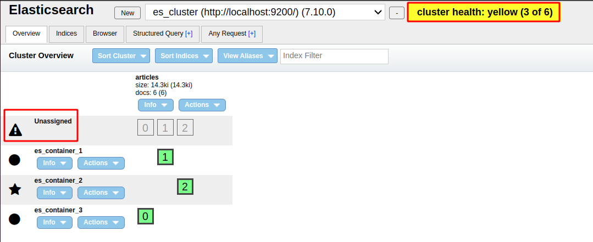
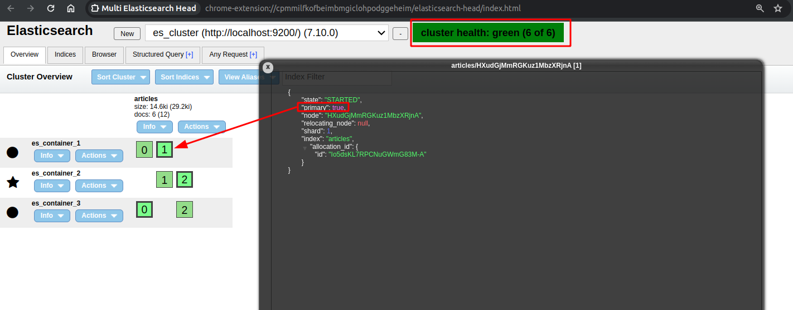

## References
- [Why is my shard unassigned](https://writequit.org/org/es/#why-is-my-shard-unassigned)

----
----
## Def
> Each index in Elasticsearch is divided into shards. For each shard, there are primary shards and replica shards.

----
----

## Shard allocation

### Allocators vs Deciders
> Basicly, allocators finds the best nodes to allocate the shard and deciders looks at these nodes and decide whether that node can allocate that shard

### Cannot allocate because allocation is not permitted to any of the nodes



Endpoint:
```
curl --location --request GET 'localhost:9200/_cluster/allocation/explain' \
--header 'Content-Type: application/json'
```
Response
> not enough disk space

```json
{
    "index": "articles",
    "shard": 1,
    "primary": false,
    "current_state": "unassigned",
    "unassigned_info": {
        "reason": "INDEX_CREATED",
        "at": "2024-01-29T13:12:19.485Z",
        "last_allocation_status": "no_attempt"
    },
    "can_allocate": "no",
    "allocate_explanation": "cannot allocate because allocation is not permitted to any of the nodes",
    "node_allocation_decisions": [
        {
            "node_id": "-0UWzFheQc2tTWUz_KCvKQ",
            "node_name": "es_container_3",
            "transport_address": "172.23.0.3:9300",
            "node_attributes": {
                "ml.machine_memory": "49941602304",
                "ml.max_open_jobs": "20",
                "xpack.installed": "true",
                "transform.node": "true"
            },
            "node_decision": "no",
            "weight_ranking": 1,
            "deciders": [
                {
                    "decider": "disk_threshold",
                    "decision": "NO",
                    "explanation": "the node is above the low watermark cluster setting [cluster.routing.allocation.disk.watermark.low=85%], using more disk space than the maximum allowed [85.0%], actual free: [14.086243658277443%]"
                }
            ]
        },
        {
            "node_id": "HXudGjMmRGKuz1MbzXRjnA",
            "node_name": "es_container_1",
            "transport_address": "172.23.0.2:9300",
            "node_attributes": {
                "ml.machine_memory": "49941602304",
                "ml.max_open_jobs": "20",
                "xpack.installed": "true",
                "transform.node": "true"
            },
            "node_decision": "no",
            "weight_ranking": 2,
            "deciders": [
                {
                    "decider": "same_shard",
                    "decision": "NO",
                    "explanation": "a copy of this shard is already allocated to this node [[articles][1], node[HXudGjMmRGKuz1MbzXRjnA], [P], s[STARTED], a[id=Io5dsKL7RPCNuGWmG83M-A]]"
                },
                {
                    "decider": "disk_threshold",
                    "decision": "NO",
                    "explanation": "the node is above the low watermark cluster setting [cluster.routing.allocation.disk.watermark.low=85%], using more disk space than the maximum allowed [85.0%], actual free: [14.086243658277443%]"
                }
            ]
        },
        {
            "node_id": "3O4XVNqHTL2PkAVzof3Azw",
            "node_name": "es_container_2",
            "transport_address": "172.23.0.4:9300",
            "node_attributes": {
                "ml.machine_memory": "49941602304",
                "ml.max_open_jobs": "20",
                "xpack.installed": "true",
                "transform.node": "true"
            },
            "node_decision": "no",
            "weight_ranking": 3,
            "deciders": [
                {
                    "decider": "disk_threshold",
                    "decision": "NO",
                    "explanation": "the node is above the low watermark cluster setting [cluster.routing.allocation.disk.watermark.low=85%], using more disk space than the maximum allowed [85.0%], actual free: [14.086243658277443%]"
                }
            ]
        }
    ]
}
```

### Allocation successfully



In the context of Elasticsearch, the numbers you're referring to, like `1 0 2`, likely represent the count of different types of shards on a particular node within the Elasticsearch cluster. Here's what each number typically stands for:

- The first number (`1`) usually indicates the number of primary shards. Primary shards are the main holders of the data in your index.
- The second number (`0`) generally represents the number of replica shards that are currently initializing. Initializing shards are replicas that are in the process of being created but are not yet ready to serve data.
- The third number (`2`) typically indicates the number of active replica shards. Replica shards are copies of the primary shards and provide data redundancy and capacity for read requests.

So, for `es_container 1` with the sequence `0 1`, it would mean there are no primary shards and one initializing replica shard on that node.

For `es_container 2` with `1 2`, there's one primary shard and two active replica shards on that node.

Lastly, `es_container 3` with `0 2`, it means there are no primary shards but two active replica shards on that node.

The cluster health is green, which means all primary and replica shards are allocated correctly and the cluster is fully operational.

> curl -X GET "localhost:9200/_cat/shards?format=json&pretty"

```json
[
  {
    "index" : "articles",
    "shard" : "2",
    "prirep" : "r",
    "state" : "STARTED",
    "docs" : "2",
    "store" : "4.8kb",
    "ip" : "172.23.0.3",
    "node" : "es_container_3"
  },
  {
    "index" : "articles",
    "shard" : "2",
    "prirep" : "p",
    "state" : "STARTED",
    "docs" : "2",
    "store" : "4.8kb",
    "ip" : "172.23.0.4",
    "node" : "es_container_2"
  },
  {
    "index" : "articles",
    "shard" : "1",
    "prirep" : "p",
    "state" : "STARTED",
    "docs" : "3",
    "store" : "5kb",
    "ip" : "172.23.0.2",
    "node" : "es_container_1"
  },
  {
    "index" : "articles",
    "shard" : "1",
    "prirep" : "r",
    "state" : "STARTED",
    "docs" : "3",
    "store" : "5kb",
    "ip" : "172.23.0.4",
    "node" : "es_container_2"
  },
  {
    "index" : "articles",
    "shard" : "0",
    "prirep" : "p",
    "state" : "STARTED",
    "docs" : "1",
    "store" : "4.6kb",
    "ip" : "172.23.0.3",
    "node" : "es_container_3"
  },
  {
    "index" : "articles",
    "shard" : "0",
    "prirep" : "r",
    "state" : "STARTED",
    "docs" : "1",
    "store" : "4.6kb",
    "ip" : "172.23.0.2",
    "node" : "es_container_1"
  }
]
```
> **prirep**: primary or replica
> 
> node **es_container_1** có 2 shard là 0 và 1. shard 0 là **r**(replica) và shard 1 là **p**(primary).

----
----
## explain how index data allocate to shard with data example
To explain how index data is allocated to shards in Elasticsearch, let's consider a practical example. Imagine we have an Elasticsearch cluster and we want to index a dataset of customer information. Each record in the dataset represents a customer and contains fields like `customer_id`, `name`, `email`, `location`, and `join_date`.

### Step 1: Creating an Index with Shards

First, we create an index in Elasticsearch. Let's call it `customers`. When creating the index, we can specify the number of primary shards. For this example, assume we set it to 3 primary shards. Elasticsearch also creates replica shards for each primary shard to ensure data redundancy.

```json
PUT /customers
{
  "settings": {
    "number_of_shards": 3,
    "number_of_replicas": 1
  }
}
```

### Step 2: Indexing Data

Now, let's index some customer data. For instance:

```json
POST /customers/_doc
{
  "customer_id": "123",
  "name": "John Doe",
  "email": "johndoe@example.com",
  "location": "New York",
  "join_date": "2024-01-01"
}
```

When this document is indexed, Elasticsearch needs to decide which of the three primary shards to place it in.

### Step 3: Shard Allocation

The process of determining which shard a document will be stored in is based on the document's unique identifier, often the `_id` field. Elasticsearch uses a hash function on the `_id` field to uniformly distribute documents across the available shards. This process is as follows:

1. **Hashing**: Elasticsearch applies a hash function to the `_id` field of the document. In our case, it's the autogenerated `_id` since we didn’t specify one.

2. **Shard Selection**: The resulting hash value is then used to determine the shard. This is done using a simple formula:

   ```
   shard = hash(_id) % number_of_primary_shards
   ```

   For instance, if the hash of `_id` for our document is 456789, and we have 3 primary shards, the calculation would be `456789 % 3`. Let's say this equals 1, so the document will be stored in primary shard 1.

3. **Replica Shards**: After the document is stored in the primary shard, it is also replicated to the corresponding replica shard(s) to ensure redundancy. This happens automatically and is managed by Elasticsearch.

4. **Balancing and Rebalancing**: Elasticsearch continuously balances shards across the cluster to ensure even distribution of data and workload. If new nodes are added to the cluster or if there are changes in the cluster, Elasticsearch may rebalance the shards.

5. **Routing**: When querying data, Elasticsearch determines which shard(s) to search in using the same hashing logic. This ensures efficient retrieval of data.

In summary, the allocation of data to shards in Elasticsearch is a process that ensures even distribution and efficient storage and retrieval of data. It uses a hashing mechanism to allocate documents to shards and automatically handles replication and rebalancing to maintain optimal performance and reliability of the Elasticsearch cluster.

----
----

## What is primary shard vs replica shard

In Elasticsearch, data in an index is divided into shards, which are essentially containers for subsets of your data. Shards help in distributing the data across the cluster to provide scalability and high availability. There are two types of shards in Elasticsearch: primary shards and replica shards.

### Primary Shards
- **Purpose**: Primary shards are the main components that hold the original chunks of the data in your index.
- **Creation**: When you create an index, you define the number of primary shards. This number can only be set at index creation and cannot be changed later without reindexing.
- **Function**: Each document in your index belongs to a single primary shard. This is determined by a hash of the document's ID, which allocates the document to a shard. The primary shard is responsible for indexing (writing) and retrieving documents (reading).

### Replica Shards
- **Purpose**: Replica shards are copies of the primary shards. They serve two main purposes: to provide high availability and to increase read throughput.
- **High Availability**: If a node containing a primary shard fails, one of the replica shards can be promoted to a primary shard, ensuring that no data is lost and the index remains available for both reads and writes.
- **Read Scalability**: Replica shards can serve read requests (searches), which means you can scale out search volume by adding more replicas.
- **Dynamic**: Unlike primary shards, the number of replica shards can be adjusted dynamically on a live index to change the redundancy and capacity of the system.

Each primary shard can have one or more replica shards, and by default, Elasticsearch creates one replica for each primary shard.

### Notes on Shards:
- **Distribution**: Both primary and replica shards are distributed across the cluster to even out the load and to provide redundancy in case of failure.
- **Location**: A primary shard and its replicas will never be on the same node. This ensures that if a node fails, only either the primary or a replica is affected, but not both.
- **Writes**: All write operations (indexing, updating, deleting) first go to the primary shard and are then replicated to the associated replicas.
- **Reads**: Read operations (searching) can be served by either primary or replica shards.

The primary and replica shard mechanism is central to the distributed nature of Elasticsearch, allowing it to provide reliable, scalable, and fast search capabilities.

----
----

