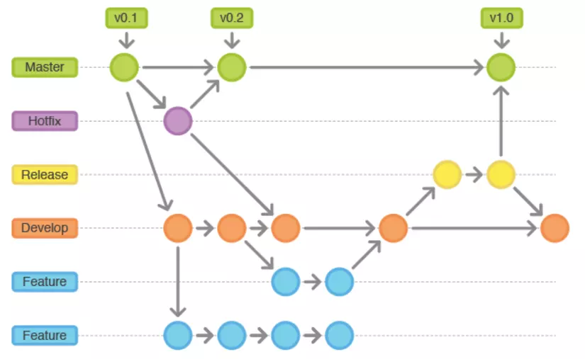
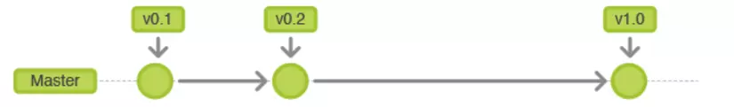
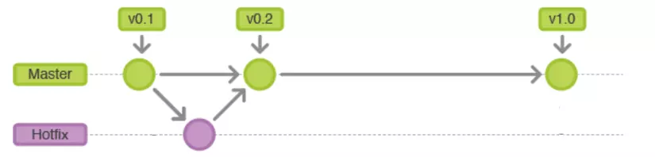
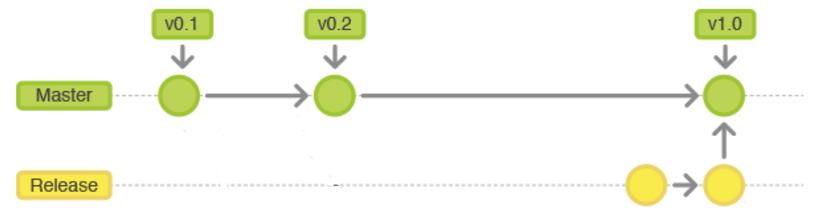
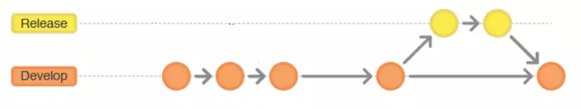
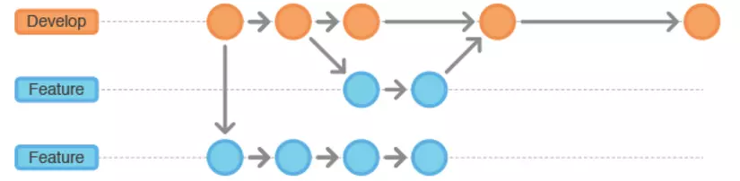

# [Cơ bản về Gitflow Workflow](https://viblo.asia/p/co-ban-ve-gitflow-workflow-4dbZNn6yZYM)

## Giới thiệu

Gitflow Workflow là một thiết kế quy trình làm việc được sử dụng lần đầu tiên và làm cho phổ biến bởi [Vincent Driessen at nvie](http://nvie.com/posts/a-successful-git-branching-model/). Gitflow Workflow định nghĩa một cấu trúc phân nhánh nghiêm ngặt xung quanh bản release của dự án. Điều này cung cấp thêm một framework mạnh mẽ để quản lý các dự án lớn.

Gitflow Workflow phù hợp với những mô hình phát triển phần mềm có thời gian release có chu kỳ như [scrum](https://www.scrum.org/resources/what-is-scrum). Workflow này không có thêm concepts hoặc commands mới nào ngoài những tính năng cho [Feature Branch Workflow](https://www.atlassian.com/git/tutorials/comparing-workflows/feature-branch-workflow). Thay vào đó chúng chỉ định vai trò cụ thể của các branches khác nhau và thời điểm mà chúng cần tương tác. Ngoài ra còn có các branches đặc biệt cho việc preparing, maintaining và release. Tất nhiên, bạn có thể tận dụng các lợi thế của Feature Branch Workflow để tăng tính hiệu quả.

## Tổng quan

Gitflow chỉ là một ý tưởng trừu tượng về quy trình sử dụng Git, Nó chỉ ra cách thức setup các loại branchs khác nhau và cách thức để merge chúng lại với nhau.

Ngoài ra các bạn có thể cấu hình CICD trên mỗi Git responsitoty khác nhau: [GitHub](https://docs.github.com/en/free-pro-team@latest/actions/guides/about-continuous-integration), [GitLab](https://docs.gitlab.com/ee/ci/) để tự động deloy các feature khi có sự thay đổi về code trên các branchs.

Mô tả tổng quan về Gitflow workflow:

-   **Master**: Master branchs có sẵn trong git và là branchs chứa mã nguồn khởi tạo của ứng dụng và các version đã sẵn sàng để realease cho người dùng có thể sử dụng (đặt [Tag](https://git-scm.com/book/en/v2/Git-Basics-Tagging) trên mỗi version). Thường cấu hình cho manage tương tác.

-   **Hotfix**: Được base trên nhánh master để sửa nhanh những lỗi trên UIT hoặc sửa những cấu hình đặc biệt chỉ có trên môi trường productions.

Khi cần thay đổi cấu hình cho bản release học hotfix ở môi trường production, teamlead sẽ tạo branchs base trên branchs Master để hotfix sau đó merge lại vào Master (thường thì sẽ không được thay đổi trược tiếp mã nguồn trên branch master nên phải lm cách này)

-   **Release**: Trước khi Release một phần mềm dev team cần được tạo ra để kiểm tra lại lần cuối trước đi release sản phần để người dùng có thể sử dụng (Thuông thường mã nguồn tại thời điểm này sẽ tạo ra bản build để test và kiểm tra lại bussiness).

khi đến thời điểm release ứng dụng, teamlead sẽ merge lên branchs Release để chuẩn bị bản build release cho ngời dùng.

-   **Develop**: Được khởi tạo từ master branches để lưu lại tất cả lịch sử thay đổi của mã nguồn. Develop branchs là merge code của tất cả các branchs feature.

Khi dev team hoàn thành hết feature của một topic, teamlead sẽ review ứng dụng và merge đến branchs release để tạo ra bản một bản release cho sản phẩm.

-   **Feature**: Được base trên branchs Develop. Mỗi khi phát triển một feature mới chúng ta cần tạo một branchs để việt mã nguồn cho từng feature.

khi có một feature mới dev tạo một branchs mới (thường đặt theo tên feature/<tên feature đó>) base trên branchs Develop để code cho feature đó. Sau khi code xong, dev tạo merge request đến branchs develop để teamlead review mà merge lại vào branchs Develop.

Ngoài ra còn một số branchs mà chúng ta thường tạo ra tùy vào yêu cầu của dự án: **Pre-pro** môi trường chưa mã nguồi của bản buil chạy trên môi trường user test, **QC** Môi trường chứa mã nguồi của bản build chạy trên môi trường test, **BugFix**: để chứa mã nguồn khi thực hiện công việc fix bug.

## Lưu ý khi sử dụng Git

**Sử dung merge request**: Nhiều người không có thói quen tạo merge request mà merge trực tiếp code vào branchs develop rồi push lên, điều này là không tốt. Thứ nhất, tạo merge request để teamlead hoặc review có thể review mã nguồi trước khi merge để đảm bảo tính toàn vẹn của mã nguồn, điều này là cực kì quan trọng khi phát triển phần mềm với một team nhiều người. Thứ hai: người review sẽ comment trực tiếp cần thay đổi lên merge request để giảm thời gian trao đổi tăng tính hiệu quả khi làm việc nhóm. Thứ ba, tạo merge request để lưu lại lịch sử thay đổi của mã nguồi.Khi có vấn đề về lỗi, chất lượng phần mềm.... chúng ta có thể xem lại tất cả những sự thay đổi trên từ dòng code ( việc này có thể kiếm tra bằng cách kiểm tra trên từng commit nhưng commit thì rất nhiều). Ngoài ra, đây còn là nơi để lưu lại các comment của người review, các lỗi thông thường để các member sao không còn mắc lại lỗi cũ và là nơi để học hỏi code lẫn nhau thông qua việc xem lại sự thay đổi từng dòng code của member khác.

Thông thường thì tất cả các thay đổi về mã nguồi của branchs develop, release, master đều thông qua merge request (trừ mã nguồn lúc khởi tạo dự án).

Để tạo một merge request (pull request) trong [GitHub](https://docs.github.com/en/free-pro-team@latest/github/collaborating-with-issues-and-pull-requests/creating-a-pull-request), [GitLab](https://docs.gitlab.com/ee/user/project/merge_requests/creating_merge_requests.html).

**conflict code**: đây là câu chuyện muôn thủa và không thể tránh khỏi khi làm việc nhóm, nhất là với những nhóm dự án đông người. vậy làm thế nào để hạn chết việc conflict code: chia nhỏ code thành từ module độc lập và hạn chế viết quá nhiều code vào một file, thường xuyên merge code ở branchs về để đảm bảo code hiện tại là mới nhất, merge code của branchs trước và sau khi code nếu có conflict thì merge conflict trước khi tạo merge request.