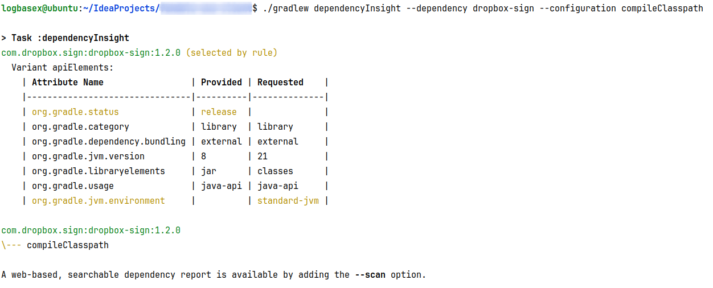
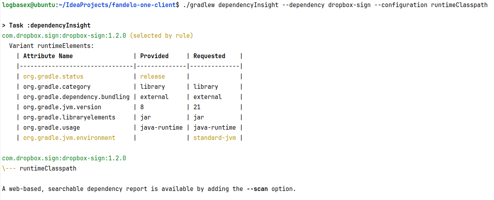

## Dependency Insight

### 1. compile classpath


### 2. runtime classpath



The `gradlew dependencyInsight` command in a Gradle project is used to provide insight into specific dependencies in your project. It shows where a dependency comes from and why it is included in your project. This command is particularly useful for debugging and understanding dependency resolution, especially in complex projects where multiple versions of the same dependency might be included due to various reasons.

Here's how to use the `dependencyInsight` task:

1. **Open a Terminal or Command Prompt:** Navigate to the root directory of your Gradle project where the `gradlew` script is located.

2. **Run the Command:** Use the following syntax to execute the `dependencyInsight` task:

   ```bash
   ./gradlew dependencyInsight --dependency [dependency-name] --configuration [configuration-name]
   ```

    - Replace `[dependency-name]` with the name of the dependency you want to investigate.
    - Replace `[configuration-name]` with the configuration in which you want to look for the dependency (e.g., `compileClasspath`, `runtimeClasspath`).

3. **Analyze the Output:** The output will show you where the dependency is declared and if there are any version conflicts or forced versions.

Example:

```bash
./gradlew dependencyInsight --dependency gson --configuration compileClasspath
```

This command will show information about the `gson` dependency in the `compileClasspath` configuration.

Remember that the `gradlew` script is a wrapper for Gradle, ensuring that everyone working on the project uses the same version of Gradle. If you're using Windows, you might need to use `gradlew.bat` instead of `./gradlew`.