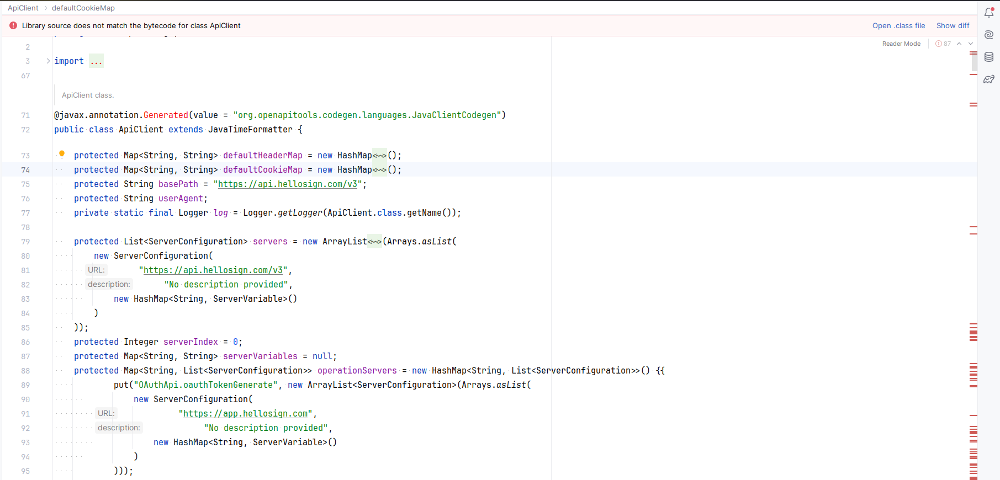
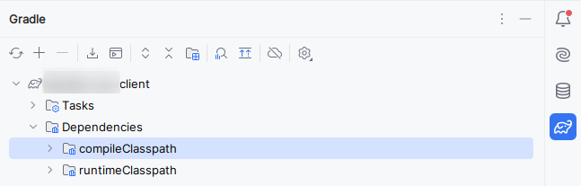
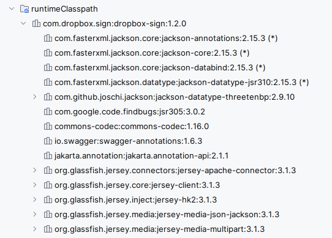

## Problem statement
My project is built using **Spring Boot 3** and **Java 21**. However, when I attempt to import the [Dropbox Sign Java SDK](https://github.com/hellosign/dropbox-sign-java), which is use Java 8, it successfully compiles. Unfortunately, when I use this library at runtime, it throws a **NoClassDefFoundError** error. 

---
---

Vấn đề có thể là library(chứa file .java) dùng dể compile ra file .class khác với library được import vào trong hệ thống (có thể được upgrade thông qua gradle dependency version resolve)




---
---

## [RUNTIME CLASSPATH VS COMPILE-TIME CLASSPATH](https://techblog.bozho.net/runtime-classpath-vs-compile-time-classpath/)



So, what is a classpath? A set of all the classes (and jars with classes) that are required by your application. But there are two, or actually three distinct classpaths:

### compile-time classpath


- **compile-time classpath**. Contains the classes that you’ve added in your IDE (assuming you use an IDE) in order to compile your code. In other words, this is the classpath passed to **`javac`** (though you may be using another compiler).


### runtime classpath


- **runtime classpath**. Contains the classes that are used when your application is running. That’s the classpath passed to the **`java`** executable. In the case of web apps this is your /lib folder, plus any other jars provided by the application server/servlet container


Many people assume that if they successfully compiled the application with a given jar file present, it means that the application will run fine. But it doesn’t – you need the same jars that you used to compile your application to be present on your runtime classpath as well. Well, not necessarily all of them, and not necessarily only them. A few examples:

> You compile the code with a given library on the compile-time classpath, but forget to add it to the runtime classpath. The JVM throws **NoClasDefFoundError**, **which means that a class is missing, which was present when the code was compiled**. This error is a clear sign that you are **missing a jar file on your `runtime classpath` that you have on your `compile-time classpath`**. It is also possible that a jar you depend on in turn depends on a jar that you don’t have anywhere. That’s why libraries (must) have their dependencies declared, so that you know which jars to put on your runtime classpath

---
---

## Why an error NoClassDefFoundError occurred at runtime ( not compiled time) when import new third-party library in Java

The `NoClassDefFoundError` at runtime, particularly after importing a new third-party library in Java, often occurs due to discrepancies between the compile-time environment and the runtime environment. Here's why this might happen:

1. **Classpath Issues at Runtime**: The most common reason is that the new library (or a class from it) is available at compile time but not found in the classpath at runtime. This can happen if the library is not correctly added to the runtime environment's classpath.

2. **Incorrect or Incomplete Dependency Specification**: If the Gradle or Maven configuration does not correctly specify all necessary dependencies, or if there are version conflicts between dependencies, the required classes might not be available at runtime.

3. **Different Build and Execution Environments**: If you're building your project in one environment (like an IDE or a build server) and running it in another, there might be differences in how the classpath is set up in each environment.

4. **Transitive Dependencies**: The new library might depend on other libraries that haven't been included. While the main library is present, the absence of its dependencies can cause this error.

5. **Shadowing or Relocation Issues**: If you are using a build tool that relocates or shadows classes (like with a fat/uber JAR), it might incorrectly handle the new library, leading to missing classes at runtime.

6. **Corrupted JAR Files**: Occasionally, the JAR file of the new library might be corrupted during download or build, leading to missing class definitions.

7. **JVM Caching Issues**: Sometimes, the JVM or build tools like Gradle or Maven might cache an older state and not pick up the new library changes until the cache is cleared.

8. **Environment-Specific Class Loaders**: If your application runs in an environment with custom class loaders (like some application servers), there might be issues with how these class loaders are handling the new library.

To resolve this error, ensure that the library is correctly specified in your build file, included in your deployment package, and that all of its transitive dependencies are resolved. You may also need to check for environment-specific configurations or issues with your build and deployment processes.

----
----

## Show example about point 1 and 4

Certainly! Let's look at examples for both point 1 (Classpath Issues at Runtime) and point 4 (Transitive Dependencies) to understand why a `NoClassDefFoundError` might occur at runtime after importing a new third-party library in Java.

### Example of Point 1: Classpath Issues at Runtime

Suppose you have a Java project and you add a new library, for example, `commons-lang3` from Apache, in your `build.gradle`:

```gradle
dependencies {
    implementation 'org.apache.commons:commons-lang3:3.12.0'
}
```

- **At Compile Time**: When you compile your project, Gradle includes this library in the classpath, and you can use its classes without any issue.

- **At Runtime**: When you run your application, if the `commons-lang3` jar is not on the runtime classpath, you will encounter `NoClassDefFoundError`. This could happen, for instance, if:
    - The application is run in an environment where the classpath is configured manually and the `commons-lang3` jar was not included.
    - The jar was mistakenly excluded from the deployment package.

### Example of Point 4: Transitive Dependencies

Suppose you add a library that itself depends on other libraries, but those dependencies are not properly included. For example:

```gradle
dependencies {
    implementation 'com.some.library:example-lib:1.0.0'
}
```

- **At Compile Time**: This `example-lib` might depend on another library, say `example-dependency`, which is not explicitly declared in your `build.gradle`. Gradle usually resolves these transitive dependencies automatically.

- **At Runtime**: If for some reason (like a misconfiguration in the `example-lib` pom file, or Gradle not being able to resolve the dependency), the `example-dependency` is not included in your build, you will encounter `NoClassDefFoundError` at runtime when trying to use functionality from `example-lib` that depends on `example-dependency`.

In both cases, to resolve these issues, you need to ensure that all required libraries are included in the runtime classpath. For transitive dependencies, you might need to explicitly declare them in your `build.gradle` if they are not being automatically resolved.

---
---

## Direct Dependency vs Transitive Dependency


> direct dependencies (those you explicitly define)

----


> transitive dependencies (dependencies of your direct dependencies)

----
----

### I mean before I add dropbox sign dependency, I check external library, and it does not include `jersey-client` library. But when I add `dropbox.sign` dependency, `jersey-client` automatically upgrade to 3.1.3 version although library using implementation keyword which is non-transitive

Ah, I see where the confusion might be coming from. Let's clarify how the `implementation` keyword works in Gradle and why you are seeing the upgraded `jersey-client` version when you add the `dropbox.sign` dependency to your project.

> **The `implementation` keyword in Gradle indeed makes dependencies non-transitive, but only in terms of the compile classpath. This means that when you compile your project, the dependencies of `dropbox.sign` won't be available on the classpath, and you can't reference them directly in your code. However, they are still part of the runtime classpath, meaning they are needed to run your application.**

Now, when you add `dropbox.sign` to your project, Gradle resolves all of its dependencies, including `jersey-client`. If `dropbox.sign` was built with an older version of `jersey-client` but your project's dependency resolution strategy ends up resolving a newer version of `jersey-client`, then that newer version is what will be included in the final build of your application. This can happen due to several reasons:

1. **Another dependency in your project requires a newer version of `jersey-client`.** Gradle will then resolve to the newer version to avoid conflicts, as per its "newest wins" strategy.

2. **The `dropbox.sign` library itself might have a dynamic version or a range for `jersey-client`** (like `2.+` or `[2.0,3.0]`), which Gradle resolves to the latest available version within that range.

3. **Dependency Overrides:** Your project or one of its plugins might be applying a resolution strategy that forces the use of a specific version of `jersey-client`.

Here's a simplified example:

Before adding `dropbox.sign`:
```
Your Project
├── SomeOtherLibrary:1.0.0
│   └── (No jersey-client dependency)
```

After adding `dropbox.sign`:
```
Your Project
├── com.dropbox.sign:dropbox-sign:1.2.0
│   └── org.glassfish.jersey.core:jersey-client:2.35 (requires upgrade)
├── SomeOtherLibrary:1.0.0
│   └── (Still no direct jersey-client dependency)
```

Gradle resolves `dropbox.sign` dependencies:
```
Your Project (after dependency resolution)
├── com.dropbox.sign:dropbox-sign:1.2.0
├── org.glassfish.jersey.core:jersey-client:3.1.3 (upgraded version)
├── SomeOtherLibrary:1.0.0
```

The `jersey-client:3.1.3` appears because that's the version resolved by Gradle during the build, likely due to one of the reasons mentioned above. To control which version of `jersey-client` is used, you would have to explicitly specify the version you want in your `dependencies` block or configure a resolution strategy that forces the version to the one you require.