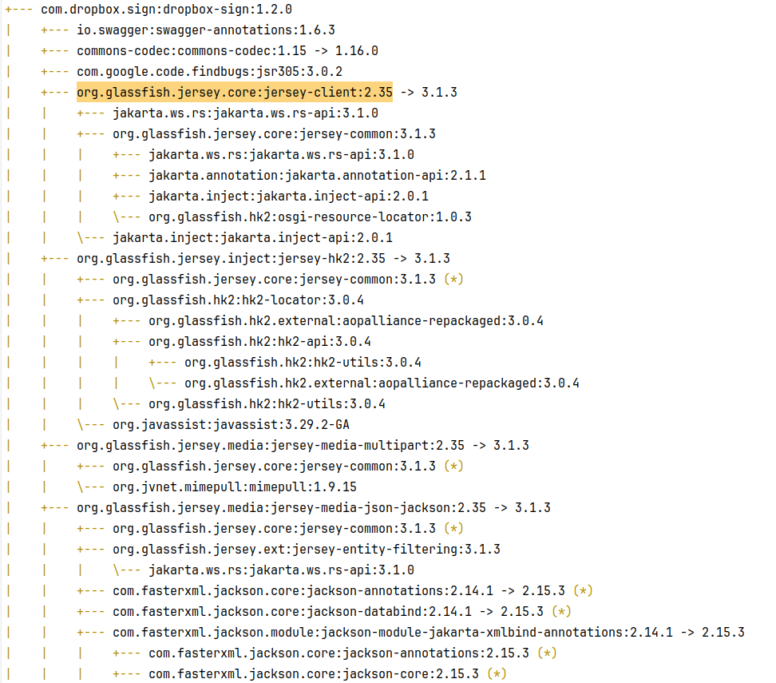

## References
- [Upgrading versions of transitive dependencies](https://docs.gradle.org/current/userguide/dependency_constraints.html)

---
---

## what is transitive dependency? show example

A transitive dependency in the context of Gradle and other build systems (like Maven) is a dependency that is not directly included in your project but is required by one of your direct dependencies. Essentially, if your project depends on Library A, and Library A depends on Library B, then Library B is a transitive dependency of your project.

Here's an example to illustrate this:

1. **Direct Dependency**: Suppose your project directly depends on a library called `LibraryA`.

   In your `build.gradle`, it might look like this:
   ```groovy
   dependencies {
       implementation 'com.example:LibraryA:1.0'
   }
   ```

2. **Transitive Dependency**: Now, let's say `LibraryA` itself depends on another library called `LibraryB`. You don't include `LibraryB` directly in your project's build script, but it's essential for `LibraryA` to function.

   `LibraryA`'s dependency might be declared (in its own build system) as:
   ```groovy
   dependencies {
       implementation 'com.example:LibraryB:2.0'
   }
   ```

3. **Outcome**: When you build your project, Gradle will automatically resolve and download both `LibraryA` and `LibraryB`. Even though you didn't explicitly declare `LibraryB` in your project's `build.gradle`, it's necessary for `LibraryA` to work, so Gradle includes it. This is what's meant by a transitive dependency.

Gradle provides a way to visualize and manage these dependencies through its dependency tree. You can view the dependency tree by running a command like `./gradlew app:dependencies` (for a specific module) or `./gradlew dependencies` (for the entire project). This command prints out a tree showing all the direct and transitive dependencies of your project.

Furthermore, Gradle offers control over these transitive dependencies. For instance, you can exclude a specific transitive dependency if it's causing conflicts or is not needed:

```groovy
dependencies {
    implementation('com.example:LibraryA:1.0') {
        exclude module: 'LibraryB'
    }
}
```

In this modified example, `LibraryB` is explicitly excluded, so Gradle will not download it even though `LibraryA` normally requires it. This feature allows for fine-tuned dependency management in complex projects.

---
---

## How about version of library B. does it as same as declared in library A?

Yes, by default, the version of a transitive dependency (like `LibraryB` in your example) is the one that is specified in the build script of the direct dependency (like `LibraryA`).

When Gradle resolves dependencies, it follows these rules:

1. **Declared Version in Direct Dependency**: If `LibraryA` depends on `LibraryB` version `2.0`, then Gradle will fetch `LibraryB` version `2.0` as a transitive dependency when you include `LibraryA` in your project.

2. **Version Conflict Resolution**: If your project includes multiple libraries that depend on different versions of the same transitive dependency, Gradle has a conflict resolution strategy to decide which version to use. By default, Gradle typically uses the newest version.

3. **Override Transitive Dependency Version**: You can override the version of a transitive dependency in your own project's build script. For example, if you need a specific version of `LibraryB` different from what `LibraryA` specifies, you can explicitly declare it in your dependencies:

   ```groovy
   dependencies {
       implementation 'com.example:LibraryA:1.0'
       implementation 'com.example:LibraryB:3.0' // Overriding the version of LibraryB
   }
   ```

   In this case, Gradle will use `LibraryB` version `3.0` for your project, even though `LibraryA` was originally depending on version `2.0`.

Remember, Gradle's resolution strategy is designed to minimize conflicts and ensure that all dependencies in the project work together smoothly. However, overriding transitive dependency versions should be done with caution, as it can lead to unexpected issues if the version you specify is not compatible with your direct dependencies.

## ./gradlew dependencies



The image you've uploaded appears to show a segment of a Gradle dependency tree. This tree represents the dependencies of a project, including direct and transitive dependencies. In the tree, each line indicates a dependency, and the indentation shows the hierarchy of dependencies—how one dependency is used by another.

Here's a breakdown of what you're seeing:

1. **Arrows (->)**: These indicate that a version of a library has been upgraded due to conflict resolution or a direct dependency declaration in your project. For instance, `org.glassfish.jersey.core:jersey-client:2.35 -> 3.1.3` means that although `jersey-client` version `2.35` was originally required, it has been replaced by version `3.1.3`.

2. **Crossed Version Numbers**: This notation suggests that a particular library was expected in a different version but has been automatically upgraded or downgraded to the version number that appears after the arrow. This happens when Gradle resolves version conflicts to maintain compatibility within the dependency graph.

3. **Plus Signs (+) and Vertical Bars (|)**: These are used to visually represent the hierarchical structure of the dependencies. A vertical bar connects a dependency to its transitive dependencies, while a plus sign indicates that the dependency has its own nested dependencies.

4. **Asterisks (*)**: An asterisk next to a dependency version indicates that this version was selected as part of conflict resolution. It often signifies that multiple modules or libraries required different versions of this dependency, and Gradle chose this particular version after applying its conflict resolution strategy (usually the latest version).

For example, let's look at a single line:
- `org.glassfish.jersey.inject:jersey-hk2:2.35 -> 3.1.3 (*)`
    - `org.glassfish.jersey.inject:jersey-hk2` is the group and artifact ID of the dependency.
    - `2.35` is the original version number requested.
    - `3.1.3` is the version number that Gradle resolved to use after analyzing the version requirements of all dependencies.
    - The asterisk indicates that this version was chosen by Gradle's conflict resolution process.

To understand why a particular version was selected, you would typically investigate the Gradle build files of your project and possibly those of your dependencies to see the declared version constraints and then check how Gradle's resolution strategy applied those constraints.

---
---

## Show me about Version Conflict Resolution

Version conflict resolution is a key feature of Gradle's dependency management system. When multiple versions of the same library are encountered in a dependency graph, Gradle needs to decide which version to use. Gradle's default strategy is to use the latest version of a library that satisfies all the version constraints in the dependency graph. Here's how Gradle resolves version conflicts:

1. **Latest Version Strategy**: By default, when multiple versions of a library are encountered, Gradle will choose the latest version. For example, if your project depends on Library A version 1.0 and Library B version 1.5, and both of these depend on Library C but with different versions (say 2.0 and 2.5), Gradle will typically choose Library C version 2.5.

2. **Forced Versions**: You can override the default strategy by specifying that a certain version of a library should always be used, regardless of what the dependencies declare. This is done using the `force` attribute:

   ```groovy
   configurations.all {
       resolutionStrategy {
           force 'com.example:library:1.0'
       }
   }
   ```

3. **Rich Version Declaration**: Gradle 5.x and above support rich version declaration which allows you to specify a preferred version and a version range. The build would fail if the resolved version falls outside the specified range.

   ```groovy
   dependencies {
       implementation 'com.example:library:1.0.0'
       implementation 'com.example:library:(1.1.0, 2.0.0]'
   }
   ```

4. **Version Conflict in Multi-Module Projects**: If different modules of a multi-module project depend on different versions of the same library, Gradle's default strategy will apply on a global level to select the latest version that satisfies all constraints across modules.

5. **Custom Resolution Strategy**: You can also define a custom strategy if the project requires specific resolution logic. This can be done by implementing a `ResolutionStrategy` within the Gradle build script:

   ```groovy
   configurations.all {
       resolutionStrategy {
           eachDependency { DependencyResolveDetails details ->
               if (details.requested.group == 'com.example') {
                   details.useVersion '1.0'
               }
           }
       }
   }
   ```

6. **Dependency Insight Report**: To understand why Gradle selected a particular version, you can generate a dependency insight report using the `dependencyInsight` task, specifying the dependency to analyze:

   ```bash
   ./gradlew dependencyInsight --dependency library --configuration compileClasspath
   ```

This report will show you why a specific version was chosen, which conflicts were detected, and how they were resolved. It's a useful tool for debugging complex dependency graphs.

Remember that resolving version conflicts automatically is one of the key features of Gradle that makes it powerful, but it's important to understand the implications of the strategy used to ensure that the chosen versions of dependencies are compatible with your project.
