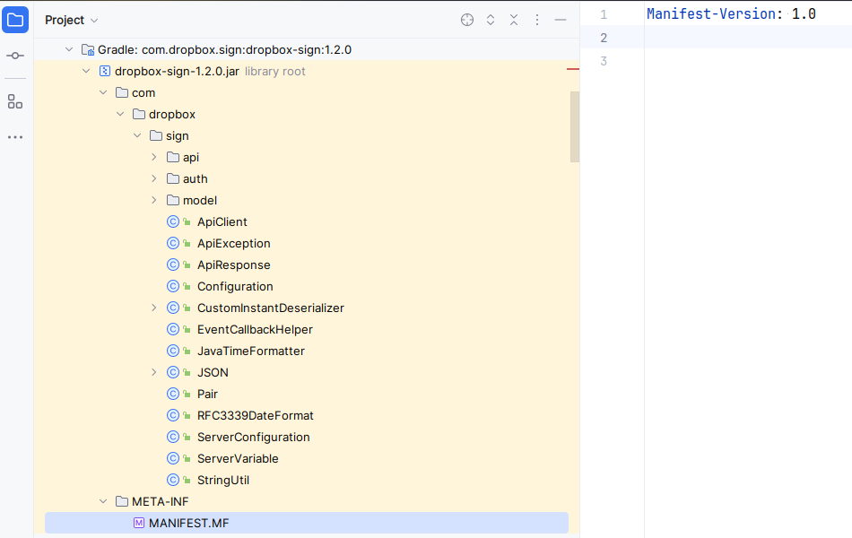
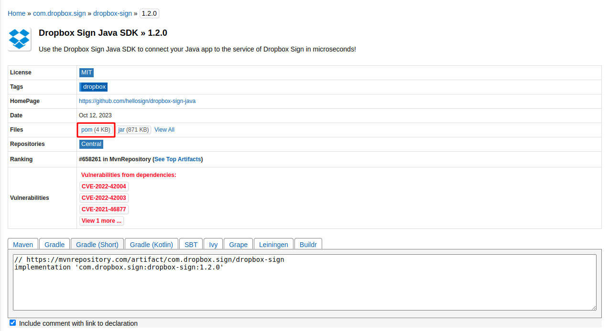

## How does gradle resolve transitive dependency when in JAR file, it does not include build.gradle



Ah, I see! When discussing transitive dependencies in Gradle, we're referring to the dependencies of your declared dependencies. Here's how Gradle handles these:

1. **Dependency Graph**: When Gradle resolves dependencies for your project, it builds a dependency graph. This graph includes not only the dependencies you explicitly declared in your `build.gradle` file but also their dependencies (i.e., transitive dependencies).

2. **Transitive Dependency Resolution**:
    - Each time Gradle encounters a new dependency in your `build.gradle` file, it looks up this dependency in the configured repositories.
    - It retrieves the dependency's metadata, which usually includes a list of its own dependencies (the transitive dependencies).
    - Gradle then automatically adds these transitive dependencies to your project's dependency graph.

3. **Version Conflict Resolution**: In a complex project, different declared dependencies might rely on different versions of the same transitive dependency. Gradle has a conflict resolution mechanism to deal with this:
    - By default, Gradle chooses the highest version of a transitive dependency if multiple versions are encountered.
    - You can customize this behavior using resolution strategies in your `build.gradle` file.

4. **Optional Exclusions**: Sometimes, you might not want all transitive dependencies to be included. Gradle allows you to exclude specific transitive dependencies:
   ```gradle
   dependencies {
       implementation('some.group:some-artifact:1.0') {
           exclude group: 'unwanted.group', module: 'unwanted-artifact'
       }
   }
   ```
   In this example, `unwanted.group:unwanted-artifact` is a transitive dependency of `some.group:some-artifact` that you've chosen to exclude.

5. **Insight into Dependencies**: Gradle provides tasks like `dependencies` or `dependencyInsight` that allow you to see your project's entire dependency tree, including transitive dependencies. This is helpful for understanding and debugging the dependency structure of your project.

6. **Caching and Efficiency**: As with direct dependencies, Gradle caches transitive dependencies to avoid unnecessary downloads in future builds.

In summary, Gradle automatically resolves transitive dependencies based on the metadata of your direct dependencies. It constructs a comprehensive dependency graph, manages version conflicts, and allows for the exclusion of specific transitive dependencies. This process ensures that all necessary components are available for your project to compile and run successfully.


---
---

## What is dependency metadata in JAR library



Dependency metadata in the context of a Java library (packaged as a JAR file) typically refers to information that describes the library's own dependencies. This metadata is crucial for build tools like Gradle or Maven to automatically resolve and manage the dependencies required by the library. Here's a detailed look at what it includes and how it's used:

1. **Manifest File**: Inside a JAR file, there's often a `META-INF/MANIFEST.MF` file. This file can contain various metadata about the JAR, but it's not typically used for dependency information in modern Java projects.

2. **POM File for Maven Dependencies**:
    - When a JAR is published to a Maven repository, it's usually accompanied by a POM (Project Object Model) file. This XML file is not inside the JAR but is stored alongside it in the repository.
    - The POM file contains detailed information about the library, including its dependencies. This includes the group ID, artifact ID, and version of each dependency.
    - When you declare a dependency on this library in your Gradle or Maven project, the build tool reads this POM file to understand what other dependencies need to be downloaded.

3. **Gradle Module Metadata**:
    - Gradle can also use its own module metadata format, which provides rich information about a module's dependencies, variant-specific details, and more.
    - This metadata is designed to offer more capabilities than the Maven POM file, like supporting multiple variants of a library (e.g., different target platforms).
    - Similar to Maven's POM files, Gradle module metadata files are stored in the repository alongside the JAR file and are used by Gradle to resolve dependencies.

4. **Ivy XML**: Some projects may use Apache Ivy for dependency management, which uses its own XML format for specifying dependencies. Like Maven's POM files and Gradle's module metadata, Ivy XML files are stored in the repository.

5. **Use in Dependency Resolution**:
    - When your build tool resolves dependencies, it looks up these metadata files in the repository.
    - The tool then recursively resolves all dependencies (and their transitive dependencies) as specified in the metadata.

6. **Why Not Inside the JAR?**: Keeping dependency metadata outside the JAR file (in repository metadata files like POMs) rather than inside it allows for easier updates and modifications without repackaging the JAR. It also keeps the JAR file size smaller.

In essence, dependency metadata in a JAR library context refers to the information stored in repository metadata files like Maven's POM files or Gradle's module metadata. This metadata is essential for automated dependency management in build systems, as it provides a clear and manageable way to handle complex dependency trees.

----
----

## Does gradle version resolution occurred before compilation process

Yes, Gradle's dependency version resolution occurs before the compilation process begins. Here's the typical order of operations when you build a project with Gradle:

1. **Initialization**: Gradle determines what projects are included in the build and sets up the environment.

2. **Configuration**: Gradle evaluates the build scripts of all projects, which defines the tasks to be executed and the project dependencies. During this phase, Gradle configures the project's dependency graph but does not download the dependencies yet. It figures out what versions should be used if there are multiple versions of the same dependency across the entire project, according to its resolution strategy.

3. **Dependency Resolution**: Once Gradle knows what versions of each dependency it needs, it resolves the dependencies. This involves downloading the required versions of each dependency from the specified repositories if they are not already cached locally. After this step, Gradle knows exactly which artifacts will be included on the compile classpath and runtime classpath.

4. **Execution**: Gradle executes the tasks, which includes compiling the source code using the dependencies that were resolved and downloaded in the previous step.

So, when you trigger a build (e.g., by running `gradlew build`), version resolution is one of the first actions Gradle takes to prepare the project for compilation. Only after resolution completes and all necessary dependencies are available, does the actual compilation process start.

If there are any discrepancies or issues with the resolved dependencies (e.g., a required class is missing), the compilation can still succeed if that class is not directly referenced in the compile-time code paths. However, at runtime, if the application requires that class and it is not found on the classpath, a `NoClassDefFoundError` would occur.

To diagnose such issues, you can use the `dependencies` Gradle task to inspect the dependency tree and the `dependencyInsight` task to investigate specific dependencies:

```sh
gradlew dependencies
gradlew dependencyInsight --dependency jersey-client
```

This will give you insight into which versions of dependencies were selected and why, which can help pinpoint why a certain dependency may be missing at runtime.
