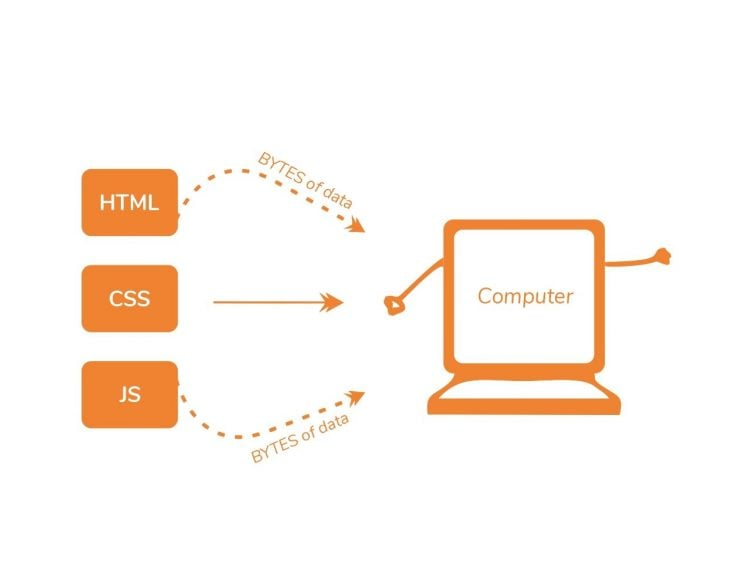
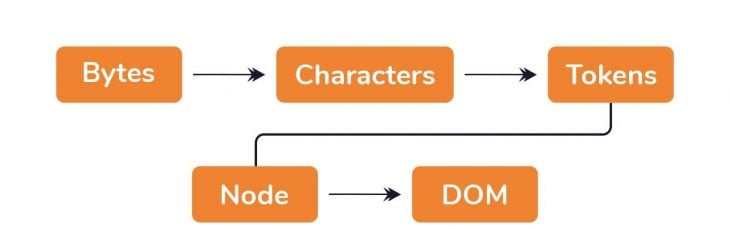
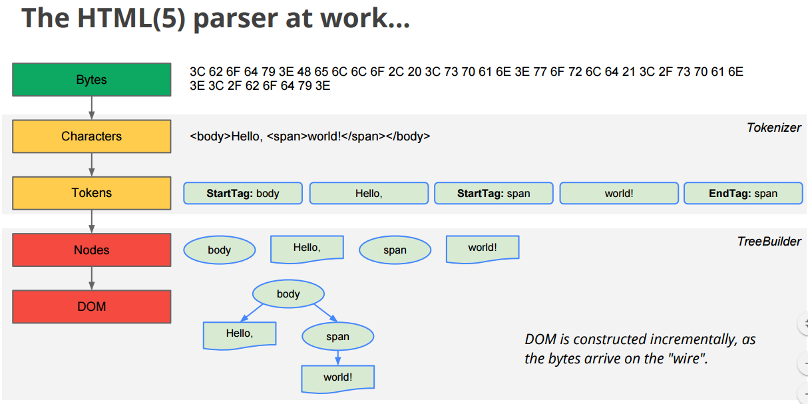
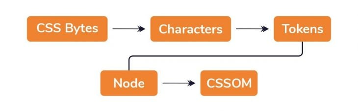
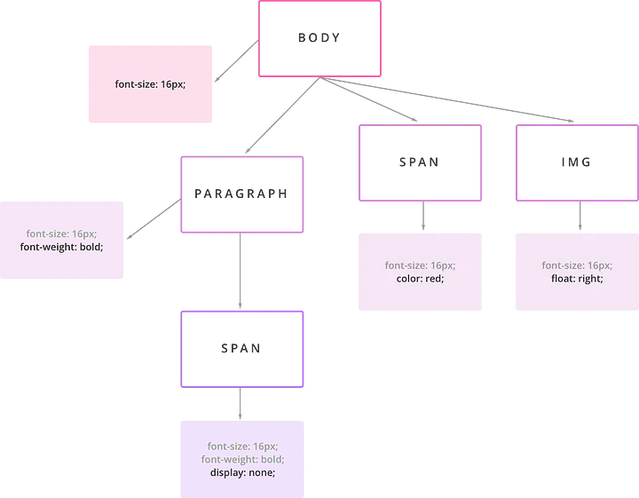

[How browser rendering works — behind the scenes](https://blog.logrocket.com/how-browser-rendering-works-behind-scenes/)

[The Secrets of the CSSOM & Why You Should Care](https://glenelkins.medium.com/the-secrets-of-the-cssom-why-you-should-care-943a1d50307b)

[Let's Understand what is CRP and how it works!](https://vvaibhavdesai.hashnode.dev/stonks-guide-to-critical-rendering-path)

[How the browser renders HTML & CSS](https://medium.com/@mustafa.abdelmogoud/how-the-browser-renders-html-css-27920d8ccaa6)

[How web browsers work - navigation (part 1, with illustrations)](https://dev.to/arikaturika/how-web-browsers-work-part-1-with-illustrations-1nid)

### The Critical Rendering Path (CRP)
This whole time, we have discussed the steps taken between receiving the HTML, CSS, and JS bytes and turning them into rendered pixels on the screen.

This entire process is called the Critical Rendering Path (CRP).

### 1. Browser Engine

### 2. Load data

### 3. HTML to DOM (Document Object Model)

### 4. CSS to CSSOM (CSS Object Model)

### 5. Render Tree

### 6. Layout
The browser then calculates the size and position of every visible element. Whenever the render tree is changed (for example, javascript DOM manipulation or a change in the viewport), the layout is created again.

### 7. Paint
The browser uses the output from the layout and **paints the pixel on the screen**. Some CSS properties impact only paint, only layout or both. **For example, the `opacity` property only triggers a `re-paint`, since it doesn’t change the positioning of the element, the page doesn’t need to be laid out again. This is why using `opacity` is more performant than `display` or `margin` when toggling it’s appearance**.

**Not all CSS properties are created equal; they have different paint times, depending on how much `work` is required by the browser.** Equally important, different combinations of properties can affect the paint time. For instance, combining the border-radius and box-shadow of an element can triple the paint time for an element.

  
