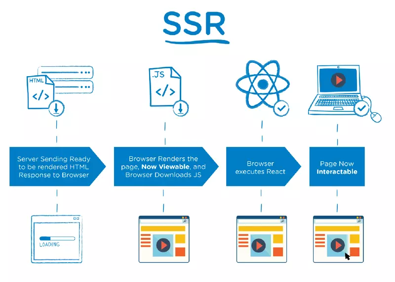
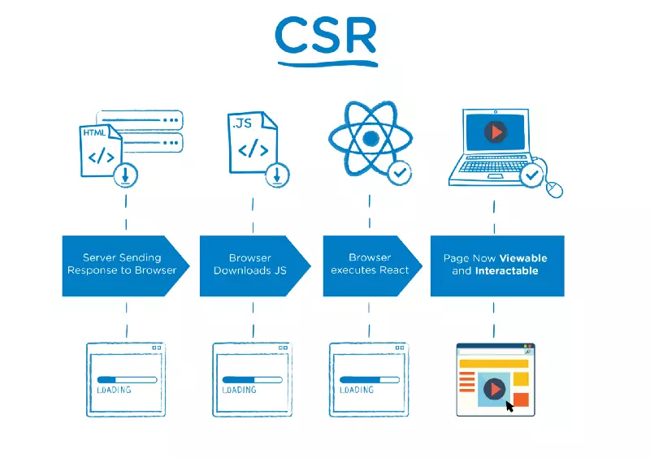

- [SỰ KHÁC BIỆT GIỮA SERVER-SIDE RENDERING VÀ CLIENT-SIDE RENDERING](https://toidicodedao.com/2018/09/11/su-khac-biet-giua-server-side-rendering-va-client-side-rendering/)
- [Render React Ở Phía Server](https://viblo.asia/p/render-react-o-phia-server-924lJOjY5PM)
- [JavaScript SEO: Server Side Rendering vs. Client Side Rendering](https://medium.com/@benjburkholder/javascript-seo-server-side-rendering-vs-client-side-rendering-bc06b8ca2383)

