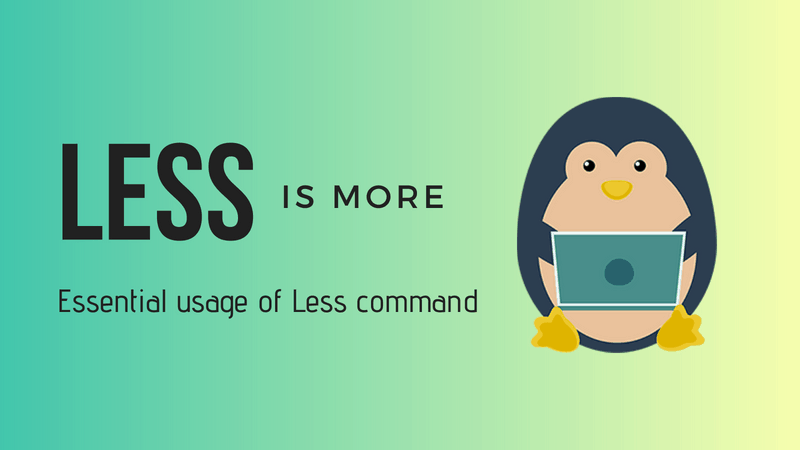

## [less and more and most](https://unix.stackexchange.com/questions/81129/what-are-the-differences-between-most-more-and-less)

`less` is more, but more `more` than `more` is, so `more` is less `less`, so use more `less` if you want less `more`. (...) If `less` is more than `more`, `most` is more than `less`.”

Just use `less` and forget about `more`

- `more` is old utility

- `less` is `more` + more additional features

--------

With less, you can read large text files without cluttering your terminal screen. You can also search for text and monitor files in real time with it.

Some people prefer using Vim for reading large text files. **But `less` is faster than Vim or other such text editors because it doesn’t read the entire file before starting**.

**Since less is `read only`, you don’t have the risk of accidentally editing the files you are viewing.**

