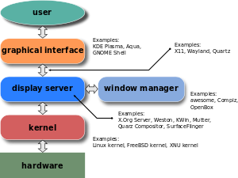

## [switch tty](https://unix.stackexchange.com/questions/167386/how-to-switch-between-tty-and-xorg-session)
- chvt
    ```shell script
    # Change virtual terminal

    chvt <N>      # N is number of virtual terminal
    ```
- deallocvt
- openvt

-----
https://unix.stackexchange.com/questions/60153/why-are-there-so-many-virtual-terminal-devices

These are specifically virtual console devices, in Linux terminolgy. Supporting virtual consoles on the same physical device isn't unique to Linux (for example, BSD calls them “hardware terminal ports”).

Linux doesn't have a mechanism for creating console devices on demand. The 63 consoles are not always active (you need to activate ttyN in order to switch to it with (Ctrl+)Alt+FN), but to activate one requires opening the console device (the openvt command does that, as do getty and the X server). So the device entry must exist all the time, or else it has to be created manually before it can be used.

Modern Linux systems (with udev or devtmpfs) create device entries for every device that is present on the system. All the virtual consoles are always present (whether they're active or not), so all entries are created. Most users don't need nearly that many — in fact most users never see anything but the virtual console that X is running on. But there are a few who do, and need to patch their kernel to allow more than 63 consoles, because they run large machines with many hardware consoles).

1. https://www.reddit.com/r/explainlikeimfive/comments/8yf0ap/eli5_what_exactly_are_bash_and_linux_if_a_mac/
2. [What are the differences between each virtual console (Ctrl+Alt F1 - F6)?](https://superuser.com/questions/717473/what-are-the-differences-between-each-virtual-console-ctrlalt-f1-f6)
    - https://askubuntu.com/questions/14284/why-is-a-virtual-terminal-virtual-and-what-why-where-is-the-real-terminal

3. GUI

    
    
    - https://en.wikipedia.org/wiki/Graphical_user_interface#Components
    - [Difference Desktop Environment and Window Manager](https://askubuntu.com/questions/18078/what-is-the-difference-between-a-desktop-environment-and-a-window-manager)
    - [X windows system basic](https://magcius.github.io/xplain/article/x-basics.html)
    - https://developer.ibm.com/tutorials/l-lpic1-106-1/
    - [X Server-Client!! What the hell?](https://medium.com/mindorks/x-server-client-what-the-hell-305bd0dc857f)
    - [X11](https://unix.stackexchange.com/questions/276168/what-is-x11-exactly)
    - https://en.wikipedia.org/wiki/X_Window_System
    - https://en.wikipedia.org/wiki/Graphical_user_interface#Components
    - Both KDE and GNOME run on top of X Windows. KDE and GNOME are desktop environments whereas X Windows is the
      windowing manager.
    - In 1984, MIT developed a basic graphical user interface (GUI) for UNIX systems called "X" or "the X Window System"
      . Unlike Windows or OS X's GUIs, X was designed around TCP/IP networks with the idea that a graphical application
      would run on a server, but be displayed on a terminal elsewhere on the network.

      In X, there is a "server" which is an application that draws on a screen. Programs that want something drawn (
      called "clients"), send commands to the server, telling it what to draw, and in return receive information about
      mouse movements, and keystrokes. The communication protocol between client and server went through 11 different
      versions, so it's often called X11.

      The user-interfaces on Linux are generally based on X11, KDE, GNOME, and other desktop environments work by
      starting an X11 which controls the display hardware, and then sending instructions to that server about what to
      draw.
    - In computing, xterm is the standard terminal emulator for the X Window System.
    - To say that the X Window System is a GUI is a considerable overstatement. It is a client/server architecture that
      allows a client application to write to a graphical output, most commonly a terminal (and that is now a very loose
      definition), and for the client application to get keystrokes and pointer data from the server. X itself does
      nothing to provide a GUI, other than to define and independently manage unadorned windows on its console. As such,
      it provides much of the underlying framework with which to create GUIs. Levels of software that refine the raw X
      server into a GUI are Window Managers and Desktop environments. Other toolkits such as Qt, GTK, Motif, etc. also
      allow an application to use canned sets of features such as window adornments, user interface widgets, and tools
      to permit rendering of generic graphical elements.
    - By definition xterm is a terminal emulator for the X Window System. Since Ubuntu by default relies on X11
      graphical server for any graphics - that's why xterm comes with Ubuntu.

4. [Network Transparency](https://en.wikipedia.org/wiki/Network_transparency)
The term is often partially correctly applied in the context of the X Window System, which is able to transmit graphical data over the network and integrate it seamlessly with applications running and displaying locally; however, certain extensions of the X Window System are not capable of working over the network.[1]

