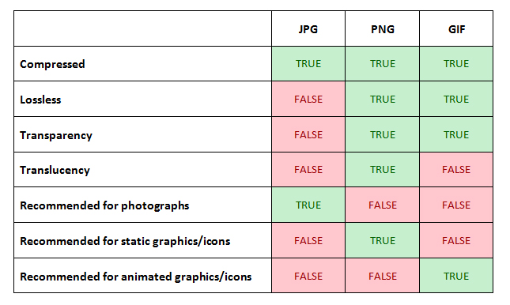

## Caching
- https://viblo.asia/p/toi-uu-performance-website-WEMkBPWgGQK
- https://viblo.asia/p/nhung-dieu-can-biet-ve-web-cache-Qbq5QJLLKD8
- [http caching](https://viblo.asia/p/tim-hieu-ve-http-caching-djeZ1BRJlWz)
- [How Does Medium.com Perfectly Use the HTTP Caching Strategy?
  ](https://bytefish.medium.com/how-does-medium-com-perfectly-use-the-http-caching-strategy-c3e2fb69d250)

- [Caching in Web APIs](https://medium.com/engineering-at-depop/caching-in-web-apis-ff43fd7e893)

## Other
- [Progressive JPEG: What They Are and How They Help Improve Web Performance](https://dev.to/saranshk/progressive-jpeg-what-they-are-and-how-they-help-improve-web-performance-3jl1)
  
  - [Optimize image for web](https://kinsta.com/blog/optimize-images-for-web/)
- [Một số kỹ thuật "tăng tốc" cho website (Lazy Load, Adaptive Image, Gzip, DNS Prefetch)](https://viblo.asia/p/mot-so-ky-thuat-tang-toc-cho-website-lazy-load-adaptive-image-gzip-dns-prefetch-maGK7LdxZj2)
- [The technology behind preview photos](https://engineering.fb.com/2015/08/06/android/the-technology-behind-preview-photos/)
