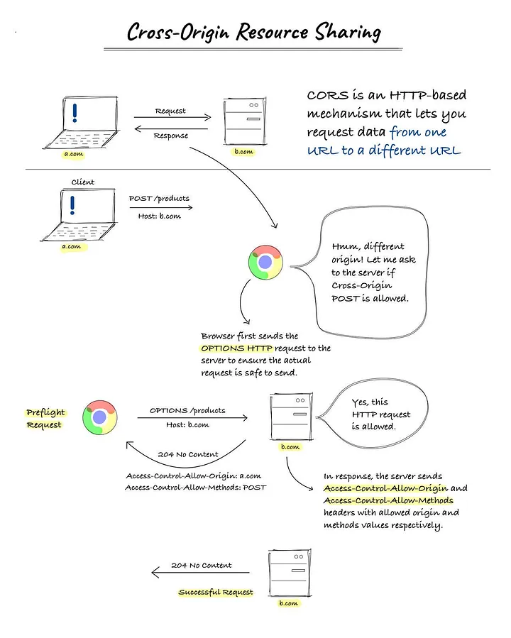

## Why we need CORS (Cross-Origin Resource Sharing)?

Cross-Origin Resource Sharing (CORS) is a security feature implemented by web browsers to prevent potentially malicious interactions between webpages from different origins. Here’s why CORS is important:

1. **Security**: The primary purpose of CORS is to enhance the security of web applications. It does so by allowing servers to specify who can access their resources. Without CORS, websites would be more vulnerable to cross-site request forgery (CSRF) and other cross-site attacks.

2. **Controlled Access**: CORS provides a way for servers to control how their resources are shared with external domains. It allows a server to specify who can access its resources and under what conditions. This is important for services that want to expose APIs to the public but need to control who can access them and how they can be used.

3. **Resource Sharing**: In the modern web, applications often need to access resources from different domains. CORS facilitates these interactions by allowing servers to specify which origins are permitted to access their resources. This cross-origin sharing is essential for many modern web applications, which often integrate services and data from multiple sources.

4. **Flexibility and Functionality**: By relaxing the same-origin policy under controlled conditions, CORS enables more flexible and powerful web applications. Developers can build more integrated and feature-rich applications that can leverage resources from various origins.

In summary, CORS is necessary to balance the open, integrated nature of the web with the need to protect user data and prevent malicious behavior. It allows websites to safely and selectively share resources across different origins, thereby enhancing the functionality and security of web applications.

=====
=====

## CORS is configured at server side?

Yes, CORS (Cross-Origin Resource Sharing) is primarily configured on the server side. The server specifies which cross-origin requests are allowed by setting specific HTTP headers in its responses. These headers inform the browser about the permissions related to cross-origin requests.

Here are the key aspects of how CORS is configured on the server:

1. **Access-Control-Allow-Origin**: This header specifies which origins are allowed to access the resources on the server. It can be set to a specific origin, multiple origins, or `*` (indicating that any origin is allowed).

2. **Access-Control-Allow-Methods**: This header specifies which HTTP methods (e.g., GET, POST, DELETE) are allowed when accessing the resources from the allowed origins.

3. **Access-Control-Allow-Headers**: If the browser request includes custom headers, this header specifies which ones can be used during the actual request.

4. **Access-Control-Allow-Credentials**: This header indicates whether or not the response to the request can be exposed when the credentials flag is true. If true, it allows credentials (like cookies, authorization headers, or TLS client certificates) to be sent in cross-origin requests.

5. **Access-Control-Max-Age**: This header indicates how long the results of a preflight request can be cached. It helps in reducing the number of preflight requests made by the browser.

6. **Access-Control-Expose-Headers**: This header allows the server to whitelist headers that browsers are allowed to access.

The server's CORS configuration must be deliberate and precise to balance between allowing necessary cross-origin interactions and protecting against potential security risks. Typically, web servers have specific modules or configuration files where these CORS policies are defined, and frameworks or backend languages often provide libraries or functions to handle CORS settings.

====
====

## What is the flow of CORS

The flow of Cross-Origin Resource Sharing (CORS) involves several steps, designed to safely manage cross-origin requests between web clients (like browsers) and servers. Here’s how the typical CORS flow works:

### 1. Browser Identifies a Cross-Origin Request
When a web application running in a browser attempts to make a request to a resource that is hosted on a different origin than the site itself, the browser identifies this as a cross-origin request.

### 2. Preflight Request (for non-simple requests)
If the request is "non-simple" (using HTTP methods other than GET or POST, or custom headers, etc.), the browser sends a preflight request to the target server. This is an HTTP OPTIONS request that asks the server if the actual request is acceptable.

### 3. Server Responds to Preflight Request
The server checks its CORS policy and responds to the preflight request with appropriate CORS headers:
- `Access-Control-Allow-Origin`: Specifies which origins are allowed.
- `Access-Control-Allow-Methods`: Specifies which methods are allowed.
- `Access-Control-Allow-Headers`: Specifies which headers are allowed.

### 4. Browser Handles Preflight Response
The browser receives the preflight response and checks the CORS headers. If the server allows the request, the browser proceeds. If not, the browser stops the request and throws an error.

### 5. Actual Request
If the preflight check is successful (or if the request is "simple" and doesn’t need preflight), the browser sends the actual request to the server.

### 6. Server Responds to Actual Request
The server handles the request and responds with the requested data, including CORS headers to confirm that the origin of the request is permitted to access the resource.

### 7. Browser Processes the Response
Finally, the browser receives the server's response. It checks the CORS headers to ensure the response is allowed. If everything checks out, the browser allows the web application to access and use the response data. If not, it denies access to the response data and raises an error.

This flow ensures that cross-origin requests are made securely and only when authorized by the server, preventing malicious interactions and protecting user data.

