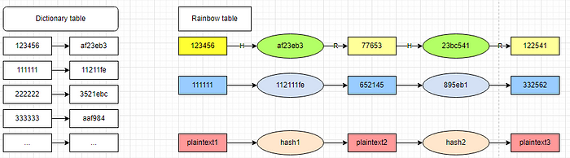
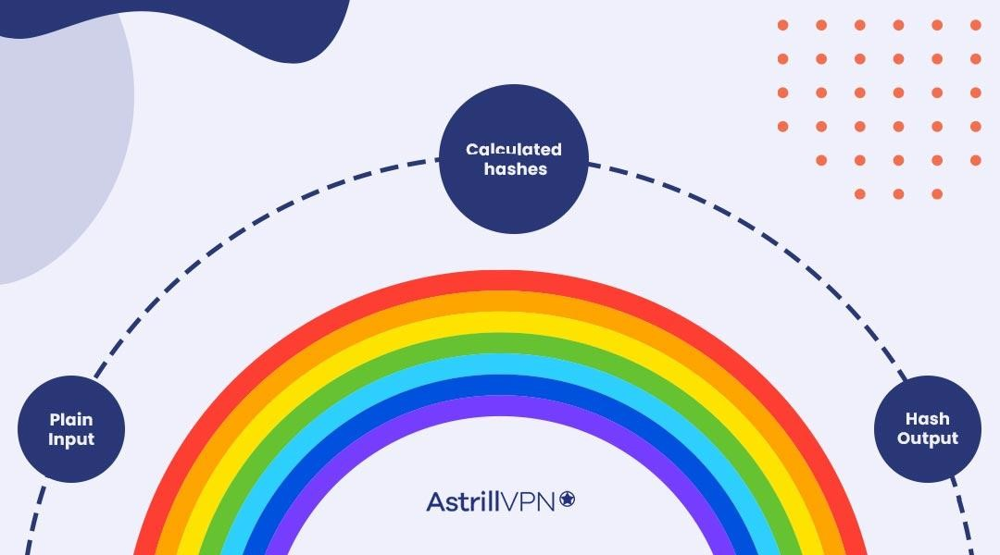
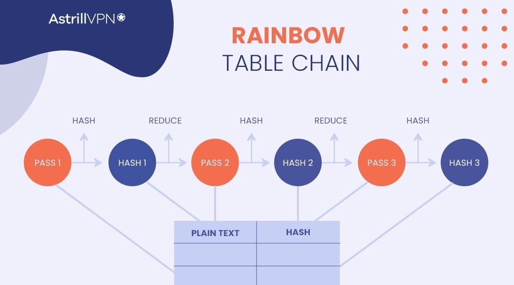
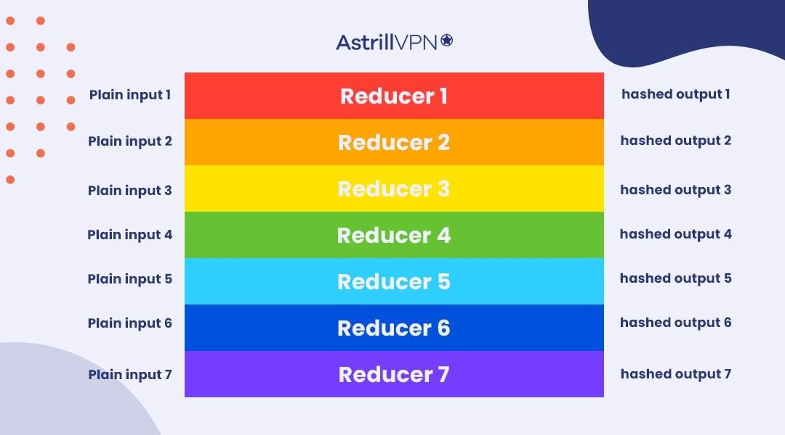
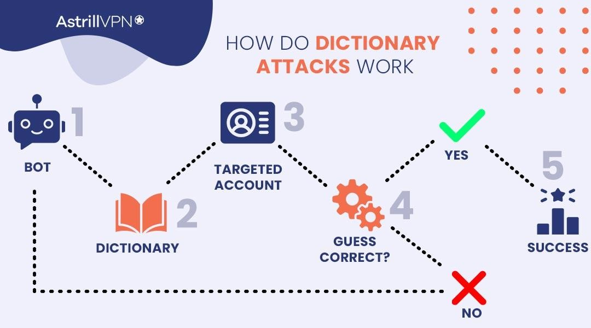
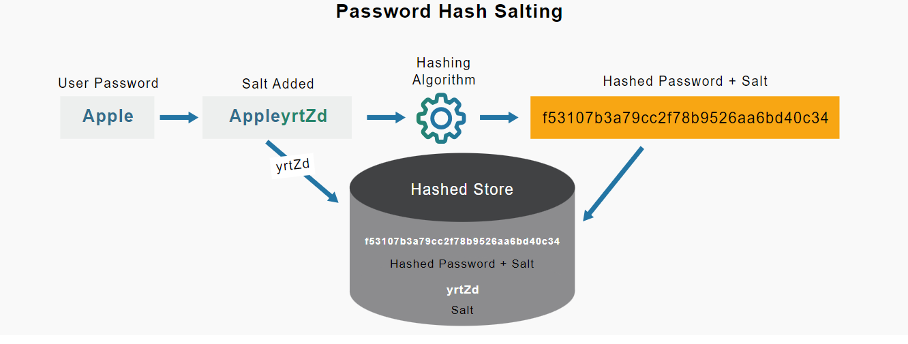

## References
- [A basic question in a security Interview: How do you store passwords in the database?](https://iorilan.medium.com/a-basic-question-in-security-interview-how-do-you-store-passwords-in-the-database-676c125cff64)

======
======

## which is the best practice for password management in modern application?

For modern applications, the best practice is generally to use an external identity provider (IDP) like Keycloak for managing authentication and identity. Here are some reasons why this approach is considered best practice:

### Security

1. **Advanced Security Features**: IDPs provide state-of-the-art security features including multi-factor authentication (MFA), single sign-on (SSO), and secure storage of credentials.
2. **Regular Updates**: IDPs are regularly updated to protect against the latest security threats, ensuring robust protection.
3. **Compliance**: Many IDPs help ensure compliance with standards and regulations (e.g., GDPR, HIPAA) by providing secure authentication mechanisms.

### Scalability

1. **Efficient Scaling**: IDPs are built to handle high volumes of authentication requests and can scale effortlessly as your user base grows.
2. **Resource Optimization**: Offloading authentication to an IDP frees up your infrastructure to focus on core application functions.

### User Experience

1. **Single Sign-On (SSO)**: Enables users to log in once and gain access to multiple applications, improving the user experience.
2. **Social Login**: Integration with social identity providers allows users to log in using their existing social media accounts, simplifying the registration process.

### Maintenance and Development

1. **Reduced Development Effort**: Using an IDP significantly reduces the amount of custom code you need to write and maintain.
2. **Focus on Core Features**: Allows your development team to focus on building core application features rather than handling authentication logic.

### Cost and Efficiency

1. **Cost-Effective**: While there may be costs associated with using an IDP, these are often outweighed by the savings in development time, security, and maintenance.
2. **Operational Efficiency**: Reduces the need for in-house security expertise and infrastructure dedicated to managing authentication.

### Integration and Flexibility

1. **Easy Integration**: Modern IDPs provide extensive documentation and SDKs for easy integration with various platforms and technologies.
2. **Flexibility**: Supports a wide range of authentication protocols (e.g., OAuth2, OpenID Connect, SAML) allowing you to choose the best fit for your needs.

### Example: Keycloak

Keycloak is a popular open-source IDP that offers:
- **Single Sign-On (SSO)**
- **Multi-Factor Authentication (MFA)**
- **User Federation**
- **LDAP and Active Directory Integration**
- **Fine-Grained Authorization**

It supports a variety of protocols and can be integrated with multiple applications seamlessly, making it an excellent choice for modern applications.

### Conclusion

For modern applications, using an external identity provider like Keycloak is considered best practice due to its superior security, scalability, user experience, and ease of maintenance. This approach allows developers to focus on building and enhancing core application features while ensuring robust and compliant user authentication.

=====
=====

## A basic question in a security Interview: How do you store passwords in the database?

**Interviewer:** Let's start the interview.

**Interviewer:** Here you mentioned having a good understanding of data security. Could you please give me some examples of specific areas within data security?

**Candidate:** Sure. For example, when we build a system with a user module and store passwords in the database, we need to encrypt them before storing.

**Interviewer:** Are you sure it is encryption and not hashing?

**Candidate:** Yes.

**Interviewer:** Then where do you store the keys?

**Candidate:** What key?

**Interviewer:** The encryption key used to encrypt the password. Is it asymmetric or symmetric encryption? Also, is it one key per user or a shared key?

**Candidate:** Hmm. We are not using all these. Then it must be hashing.

**Interviewer:** No problem. Could you explain why we need to hash passwords before storing them, instead of storing them in plain text?

**Candidate:** Yes, because we want to achieve safety. When we validate the password, it should not be sent as plaintext from the UI to the server.

**Interviewer:** When you register a user, do you send the password and confirmation password as plaintext?

**Candidate:** Yes, but that’s the only case where we send plaintext.

**Interviewer:** OK, I got your point. So you think storing the hash value in the database minimizes the chance of sending sensitive data as plaintext during API calls?

**Candidate:** Exactly.

**Interviewer:** Then do you think it makes sense to store the hash value when the database gets compromised?

**Candidate:** Oh yes. Then the original password will be shown to hackers. The hashing value can prevent this.

**Interviewer:** Yes, but it's not enough. It's still possible for someone to use a rainbow table to attack the table and get the original value through hash collision. Do you know about salt?

**Candidate:** Heard of it. It’s a random string that makes password storage safer.

**Interviewer:** Good. Do you know how it works?

**Candidate:** Not really.

**Interviewer:** If someone got the database through SQL injection or some other way and used a rainbow table to attack, the hash collision might happen, and they could get the original text. However, the value they get would be the original password blended with a random string (salt). This prevents the original password from being stolen, thus stopping someone from using your password to log into your email, social media, and even bank account.

**Candidate:** I see.

**Interviewer:** So which hashing algorithm are you using in your current system?

**Candidate:** As we know, MD5 is not safe, so we used some other options, like SHA-3.

**Interviewer:** Could you briefly explain why MD5 is not safe? And why choose SHA-3 to hash passwords? Because as far as I know, SHA-3 KDF like HMAC-SHA-3 is not designed for password hashing but for other purposes like JWT token signatures.

**Candidate:** MD5 is proven to be not safe. There is already some news about it. But what is KDF?

**Interviewer:** KDF is a key derivation function, which means the hashing algorithm takes a password as input to generate a hash value. Yes, there is news saying MD5 is not safe. But do you know why?

**Candidate:** Hmm, not really.

**Interviewer:** In short, it is due to weak hash collision resistance, making it susceptible to attacks using rainbow tables.

**Candidate:** What is a rainbow table?

**Interviewer:** A rainbow table is a precomputed table containing chains of hash values derived from plaintext passwords. These chains are generated by iteratively applying a hash function to an initial plaintext password and then reducing the resulting hash value back to a plaintext password through a series of reduction functions. Rainbow tables are typically used in password cracking attacks, where an attacker compares hashed passwords stored in a compromised database against entries in the rainbow table to find matching plaintext passwords.

**Candidate:** I see.

**Interviewer:** And why are you using SHA-3 to generate a password?

**Candidate:** It’s safer than MD5, I think.

**Interviewer:** Yes, it is. However, there are better hashing options for passwords, like Argon2, which won a prize in 2015. Compared to SHA-3, Argon2 requires more iterations and higher RAM, which means higher time complexity and resource consumption to generate a single hash, making it harder for attackers to brute-force. SHA-3 is usually used for other purposes, like digital signatures, to balance security and performance.

---

Let’s address the details one by one from this interview.

## Password hash

We all know that passwords should never be saved as plaintext in the 21st century.

-   However, It is not about reducing the chance of sending password value as plaintext during some API calls.
-   The main concern is when databases fall into the wrong hands. make it impossible to get back the original text.
-   What will happen next is the database will be “Credential-Stuffing”. The same credentials will be tried again and again on different accounts with the same user name: email, bank cards, social media, school, even gov account.

Why not use encryption but hashing?

-   The key difference lies in reversibility. Encryption is a reversible process, meaning that with the right key, the original plaintext password can be recovered. This poses a security risk, even if encryption keys are securely managed.
-   Additionally, managing encryption keys, such as building a key chain, can incur significant costs and complexity.

## And why need salt

-   Salt serves to add randomness to each hashed password, making it computationally expensive for attackers to crack passwords using precomputed tables like rainbow tables (will explain below).
-   Without salt, attackers could efficiently guess passwords by comparing hash values against a large database of precomputed hashes.
-   Additionally, salt must be unique per password, not just per user. This ensures that even if two users have the same password, their hashed values will be different due to the unique salt, preventing attackers from easily identifying duplicate passwords.

## Different purposes for using hash

Sha3 is safer than md5, why not use sha3? Hashing is not just used in password value, there are [different use cases](https://iorilan.medium.com/comparison-of-all-hashing-algorithms-88eda61f064a):

1.  Data integrity (e.g., SHA3): Hashing algorithms like SHA3 are commonly used to fingerprint files, ensuring their integrity remains intact. These algorithms need to strike a balance between speed and hash collision resistance. While SHA3 offers good collision resistance, it also maintains reasonable performance for file fingerprinting tasks.
2.  Checksum (e.g., CRC32): When speed is of utmost importance, as in verifying data integrity during network transfers, algorithms like CRC32 excel. CRC32 is often used to quickly identify if a file has been modified during transmission, prioritizing efficiency over collision resistance.
3.  Key generation (e.g., Argon2, bcrypt, PBKDF2): For securely storing passwords or generating cryptographic keys, specialized key derivation functions (KDFs) like Argon2, bcrypt, or PBKDF2 are preferred. These algorithms intentionally introduce a “slow” hashing process, adding layers of computational complexity to fight against a hash collision brute-force.

While SHA3 is suitable for tasks like [HTTPS connections](https://iorilan.medium.com/how-https-works-and-what-exactly-happened-during-a-tls-handshake-165088edbee) or [JWT token](https://iorilan.medium.com/how-does-jwt-work-is-hs256-the-best-option-6cd9463da7b3) signature generation, it lacks the necessary slowness to provide the heightened security required for password hashing.

## Why KDF matters in hashing password

KDFs play a crucial role in password hashing by intentionally slowing down the hashing process. This deliberate slowdown is achieved through multiple iterations of hash value computations. While the technical details of these iterations can be complex, they essentially involve repetitive operations like shifting, inverting, and XOR-ing the hash values, performed over thousands of rounds.

The primary goals of using KDFs in passwords are:

1.  Slowing down the process: By introducing computational overhead, KDFs make it significantly harder for attackers to brute-force passwords. The increased time and computational resources required to compute hash values act as a deterrent against rapid dictionary or rainbow table attacks.
2.  Resource consumption: KDFs also consume significant CPU and memory resources during the hashing process. This resource-intensive nature further impedes attackers, as they must invest substantial computational power and time to crack hashed passwords.

## What is the rainbow table attack?

A quick explanation.

-   Dictionary table. before the rainbow table, attackers precompute all the hash values and enumerate all the hash values in a table called “dictionary table” Then after getting the target database table, do hash collision and get the linked original password value (again, that is why salt is so important)
-   However, a dictionary table could grow very fast and end up with a huge number of rows made it unusable.
-   The rainbow table could be considered “an efficient version of a dictionary table”
-   In a rainbow table, 2 functions. H: to get hash value from plaintext, R: to get plaintext from hash value
-   Stores multiple rows. each row is a “hashing chain”, every row starts with a plain text and then does H and R multiple times.
-   Doing hash collision with a target database table, once the hash value matches, do the R to get the plaintext.

## Last

why md5 (or sha1) can not be used in password value hash? if yes are there any other use cases for md5?

-   The quick answer: Weak hash collision resistance.
-   md5 has been proven [weak hash collision resistance in 2004](https://eprint.iacr.org/2004/199.pdf)
-   The same [happened to sha1 in 2005](https://www.schneier.com/blog/archives/2005/08/new_cryptanalyt.html) and [announced by Google in 2017](https://security.googleblog.com/2017/02/announcing-first-sha1-collision.html).
-   How about we use md5 for other purposes? like fingerprint or checksum? no. it is proven, that 2 different files can be generated with the same md5; if used for checksum, crc32 has a much faster performance.
-   there are no used cases for md5, you should never use it.

Thanks for reading and see you in the next post.

======
======

## What Is a Rainbow Table Attack and How Does It Work?

A Rainbow Table attack is a cryptographic attack to crack password hashes using a database. Rainbow tables are precomputed tables primarily used for password cracking. They contain precomputed hash values and their plaintext inputs.

The attackers exploit weak hashing algorithms to determine the original plaintext password from its hash value. Applications don’t save passwords in plaintext but encrypt passwords using hashes, so to verify that a password is correct during login, the system takes the entered password and compares the resulting hash value to the hash value stored in the database. If they match, then it means that the password is valid.

Rainbow Table Attack relies on the fact that hash functions are easily determined, meaning that the same input produces the same output. Rainbow tables get generated by applying a hash function to many possible passwords and then storing the pairs in a table. The hash function takes an input (passwords) and produces fixed-sized elements stored in a database.

When a rainbow table attack occurs, the attacker looks at the stolen hash values from the Rainbow table and finds a matching plaintext password. Using Rainbow Tables enables attackers to quickly find passwords without doing much technical work.

## What Is Hashing?

Hashing transforms data (such as files and passwords) into fixed-sized characters, typically a hash value. Hashing is used primarily to verify data and for data integrity purposes. Hashing is deterministic, meaning the same input produces the same hash value.

Hash values are always of a fixed length, regardless of the input data size. A good hash function also ensures that producing the same hash value for different input data is improbable.

## How Does A Rainbow Table Attack Work?

A Rainbow Table Attack is primarily used to crack password hashes. It leverages precomputed tables to determine plaintext passwords and their specific hash values. Here is a step-by-step process of how Rainbow Table Attacks work:

1.  The attacker starts collecting a set of password hashes from the system they’re targeting. These hashes are collected by hacking into the system or gaining unauthorized access to the system’s database.
2.  The attacker then generates a Rainbow table (a large lookup table) that matches hash values to corresponding plaintext passwords.
3.  The attacker generates the table in advance by repeatedly going through a set of passwords, hashing them, and then storing the password-hash pairs on the Rainbow table.
4.  When the Rainbow table gets prepared, the attacker looks for each stolen hash value in the table. If they find a match, the attacker retrieves it alongside the corresponding plaintext password.
5.  If they cannot find a direct match through the table, the attacker implements a reduction function to the hash value and repeats the process. The reduction takes the hash value as input and creates a new password to produce a new hash value when it hashed again. The new hash values then get checked against the table. The process is repeated until a match is found or the attacker has exhausted all his options.
6.  When a matching password plaintext is discovered from the Rainbow table, the attacker has succeeded in finding the hashed password. They use this information to gain authorized access to databases and systems or hack into other users’ accounts.

Rainbow Table Attacks only work against weak passwords and commonly used passwords. Strong passwords with a good length are complex and unpredictable and are less prone to Rainbow Table Attacks. That is why it is recommended to create strong passwords when signing up for a platform.

## Examples of Rainbow Table Attacks

-   A popular online store or service has a security breach, and the attackers get their hands on a database of user passwords. If the passwords get stored as unsalted hashes, the attacker can reverse the hashed passwords to access the user’s accounts.
-   Sometimes users forget the passwords of their accounts and use Password Recovery Tools to get their accounts back. Some Password Recovery Tools use Rainbow Table Attacks to help users uncover their passwords. These tools use precomputed tables to match hash values with corresponding passwords.
-   Companies and organizations sometimes use Rainbow Table Attacks for security audits. Companies perform Rainbow Table Attacks against their password databases to rule out weak or easily crackable passwords. They can use Rainbow Table Attacks to identify how secure their systems are and take measures to strengthen their security and passwords.
-   Suppose an attacker steals the password database of a company. If the company has weak passwords, then the attacker can use Rainbow Tables to crack passwords easily, even if it’s offline. They wouldn’t need to access the system live.

## Famous Rainbow Table Attack Cases

### LinkedIn Breach (2012)

In [2012](https://www.cbsnews.com/news/65-million-linkedin-passwords-reportedly-leaked-on-russian-hacker-site/)[,](https://www.cbsnews.com/news/65-million-linkedin-passwords-reportedly-leaked-on-russian-hacker-site/) LinkedIn’s professional networking platform suffered a significant setback when hackers accessed the company’s database containing hashed passwords of over 6.5 million users. Through this security breach, the hackers were able to use rainbow table attacks to crack a vast number of hashed passwords and get access to users’ accounts. However, it was recently discovered that not 6.5 million, but a [staggering 117 million emails and passwords](https://www.cbsnews.com/news/linkedin-2012-data-breach-hack-much-worse-than-we-thought-passwords-emails/) were stolen.

### Gawker Media Breach (2010)

Gawker Media was running several popular websites and was a media company that faced a [security breach in 2010](https://www.wired.com/2010/12/gawker-hacked/). The attackers got hold of a database with hashed passwords and user account information. The attackers performed rainbow table attacks to get the passwords and gain unauthorized access to users’ accounts.

## Characteristics of Rainbow Table Attacks & Dictionary Attacks

Both Rainbow Table Attacks and Dictionary Attacks are methods used in password cracking. However, the way that they approach it is different. Let’s look at the key characteristics of Rainbow Table Attacks and Dictionary Attacks and what makes them different from one another.

### Rainbow Table Attacks Characteristics

#### Precomputation

Rainbow Table Attacks use pre computing and storing many hash chains that match hashed values to their corresponding plaintext passwords. These tables are generated in advance and involve a lot of resources and storage space.

#### Time-Efficient

Once the table gets generated, then things move quickly. The attacker quickly looks up the hashed passwords from the rainbow table and then uses them to find corresponding plaintext passwords.

#### Limited Passwords

Rainbow tables have limited password space since they’re based on specific hash algorithms and password lengths. If the attacker can’t find the password from the table, then their attempts will fail.

#### Vulnerability to Salting

Rainbow Table Attacks will be unsuccessful against salted passwords. Salting adds a unique value to each password before hashing, making precomputed tables practically useless.

### Dictionary Attack Characteristics

#### Brute Force Approach

Dictionary attacks use many words and phrases from an already generated list (dictionary) as passwords. The dictionary can contain phrases, passwords, and common words from previous breaches.

#### Time-Consuming

Dictionary Attacks are time-consuming, especially if the password is long and complex. The attack has to go through the entire dictionary and hash every entry to compare it to the target hash.

#### Salts & Other Security Measures

Like Rainbow Attacks, Dictionary Attacks are successful against weak passwords and don’t work against strong and salted passwords.

## How Can Rainbow Table Attacks Be Prevented?

There are several security measures that you can implement to safeguard against Rainbow Table Attacks. Let’s go over them in detail.

### Strong Passwords

To thwart Rainbow Table Attacks, you must use strong passwords. It would help to use lengthy and complex passwords that cannot be exploited by brute force or dictionary attacks. It would help if you didn’t use passwords that any hacker can easily guess or are commonly used. Go for a strong password with Uppercase and lowercase letters, characters, and numbers.

### Salting

Another way to protect against rainbow table attacks is to use salted passwords. Salting is a process that involves adding a unique value (known as salt) to each password before hashing it. Salting increases the uniqueness of each hashed password, making precomputed rainbow tables useless.

### Unique Salts

Use Unique salts for users’ passwords. Even if two users have the same passwords, their hashed passwords will differ because they use distinct salts. The salts should be long and completely random to enhance their effectiveness.

### Change Passwords Regularly

Organizations can implement a policy whereby users have to change their passwords regularly. It helps prevent the risk of being a victim of Rainbow Table Attacks. Users should also consider not reusing old passwords or making minor changes to the old passwords.

### Passwordless Authentication

Another secure way of protecting against rainbow table attacks is to use passwordless authentication. Passwordless authentication is more secure than passwords and includes biometric verification (fingerprints, thumbprints, retina scans), or you get sent an OTP (One-time-password) on your phone number or email, which only you can see.

### Two-factor Authentication

Two-factor authentication is also an effective measure to counter rainbow table attacks. It adds an extra protection layer without relying on the user’s username, email, or password. It verifies your identity based on a passcode only you know or biometric data.

## Wrapping Up

Rainbow Table Attacks can put the users’ accounts at risk. If the attackers get the passwords of users’ accounts, the user’s personal and confidential data could be compromised. [Creating strong passwords](https://www.astrill.com/blog/best-mac-password-managers/) and implementing salting can protect you against Rainbow Table Attacks, making them ineffective.

## Frequently Asked Questions (FAQs)

**How does a rainbow table attack differ from other password-cracking methods?**

Unlike dictionary and brute force attacks, where the attacker has to try every word in the dictionary to find a password that matches, the attacker can discover corresponding plaintext passwords from a precomputed table generated in advance.

**Can rainbow table attacks crack any password?**

Even though Rainbow Table Attacks can easily crack passwords if they’re all hashed the same way, they’re ineffective against salted passwords. A salt is a unique number you add to a password before hashing, making it secure and prone to Rainbow Table Attacks.

**How do hackers obtain or generate rainbow tables?**

Hackers get their hands on leaked hashes before carrying out Rainbow Table Attacks. Another way they can do this is by carrying out phishing scams on those who have access to the passwords database.