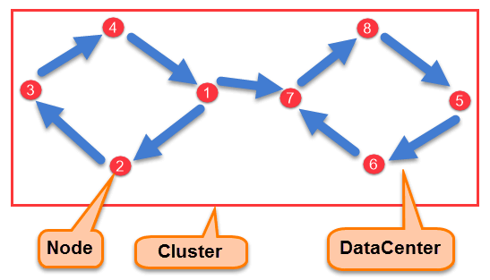
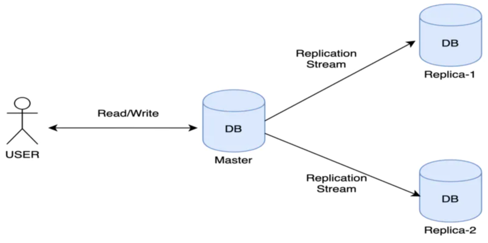
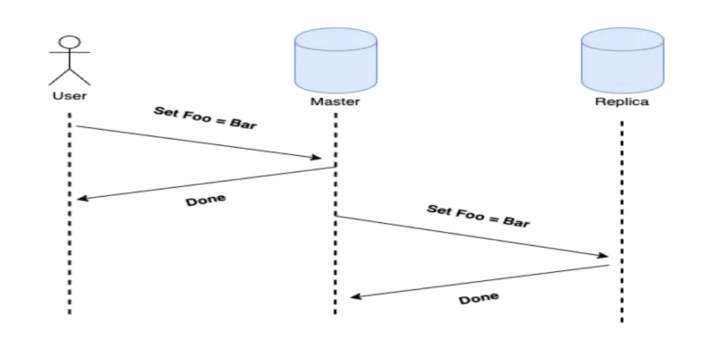
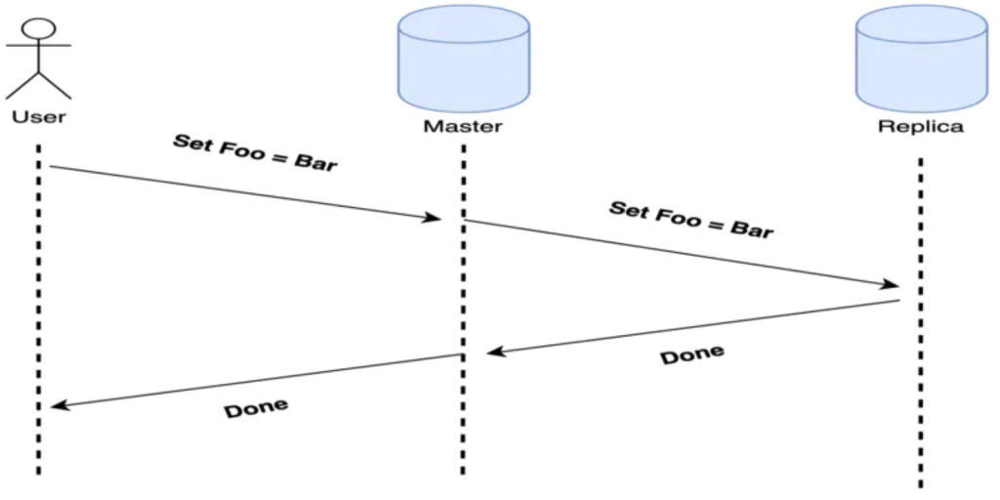
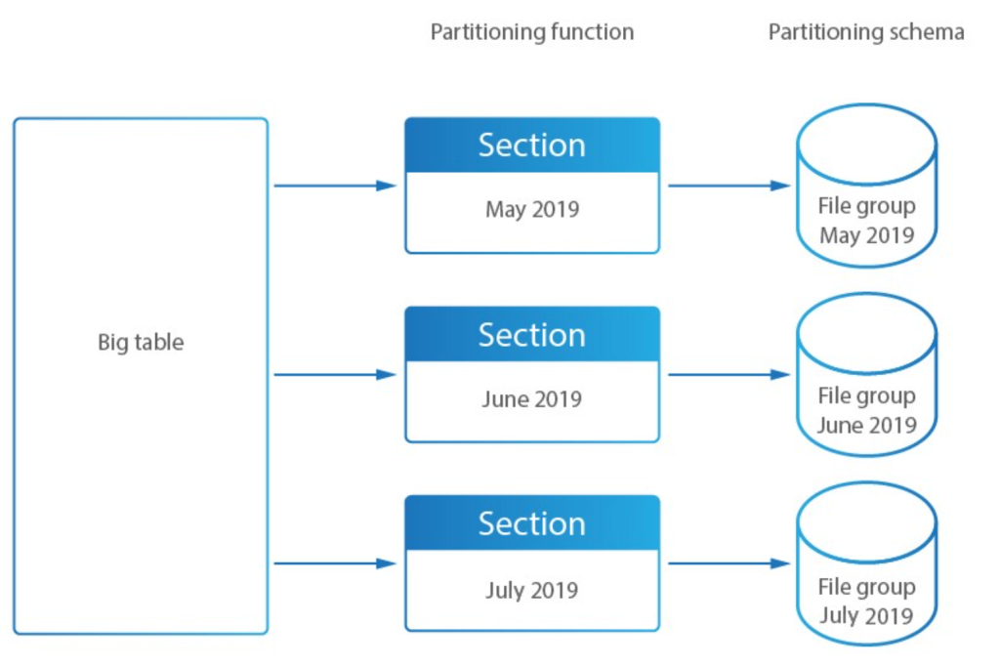
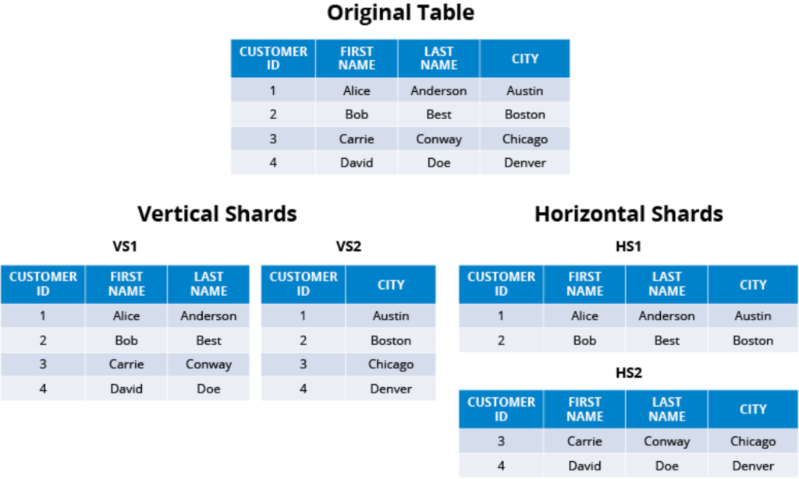

## [Replication, Partitioning, Clustering, Sharding](https://hocdevops.com/database/su-khac-biet-giua-cac-khai-niem-trong-database-replication-partitioning-clustering-va-sharding/#h-c-ch-th-c-ho-t-ng-c-a-t-ng-ki-u-kh-i-ni-m)

Ngày nay khối lượng dữ liệu được lưu giữ, quản lý và truy cập rất lớn. Các doanh nghiệp/ tổ chức mong muốn cơ sở dữ liệu (database) luôn luôn sẵn sàng và có thể truy cập mọi lúc, điều này gây áp lực lớn lên các CSDL. Để đáp ứng nhu cầu đó cần thay thế các kỹ thuật/ công nghệ cũ đã lỗi thời và kém hiệu quả bằng các kỹ thuật/ công nghệ mới nhanh nhẹn hơn.

Trong bài viết này, chúng ta sẽ tìm hiểu các khái niệm về kiến trúc của database mà chúng ta có thể chưa biết tới hoặc bị nhầm lẫn trong quá tìm hiểu cũng như vận hành. Các kiến trúc này được sử dụng cho môi trường production và tùy thuộc vào các bài toán cụ thể mà dự án đang cần để đưa ra kiến trúc phù hợp.

### Contents

1.  Khái niệm cơ bản
2.  Cách thức hoạt động của từng kiểu khái niệm
    1.  Clustering concept
    2.  Cách hoạt động của Replication
        1.  Kỹ thuật Replica
        2.  Ưu điểm và nhược điểm
        3.  Cách hoạt động của Partitioning
        4.  Cùng nói về 1 số lợi ích cửa việc partitioning
    3.  Cách hoạt động của Sharding
        1.  Tại sao Sharding được sử dụng?
        2.  Sự khác biệt giữa Sharding và Partitioning là gì?

## Khái niệm cơ bản

Đầu tiên chúng ra sẽ đến với khái niệm ngắn gọn các khái niệm để có một cái nhìn tổng quan về sự khác biệt.

****Replication****: – Sao chép toàn bộ table hoặc database vào nhiều server khác nhau. Có thể dễ hiểu hơn là các node server có data giống hệt nhau và được đồng bộ liên tục để đảm bảo dữ liệu luôn luôn giống nhau giữa các node. Được sử dụng để cải thiện tốc độ truy cập vào các bản ghi tham chiếu như dữ liệu chính.

****Partitioning****: – Chia nhỏ một cơ sở dữ liệu nguyên khối lớn thành nhiều cơ sở dữ liệu nhỏ hơn dựa trên sự gắn kết dữ liệu. Ví dụ – Chia nhỏ một table lớn theo ngày, tháng hoặc năm, theo category …

**Clustering**: – Từ góc độ cơ sở dữ liệu, phân cụm là khi bạn có một nhóm node (server) lưu trữ cùng một database schema trên cùng một phần mềm CSDL với một số hình thức trao đổi dữ liệu giữa các server này. Từ bên ngoài cụm, các server này được xem như một đơn vị duy nhất chứa một liên minh dữ liệu được trải rộng trên các node trong cụm. Khi ứng dụng của bạn truy cập vào một cụm, yêu cầu cuối cùng được chuyển đến một node duy nhất trong cụm để đọc hoặc ghi hoạt động.

**Sharding**: – Chia nhỏ một bảng dữ liệu lớn theo chiều ngang . Một bảng chứa 100 triệu hàng có thể được chia thành nhiều bảng chứa 1 triệu hàng mỗi bảng. Mỗi bảng do sự phân chia sẽ được đặt vào một cơ sở dữ liệu / server riêng biệt. Sharding được thực hiện để phân tán tải và cải thiện tốc độ truy cập. Facebook /Twitter đang sử dụng kiến trúc này.

> Một câu hỏi đặt ra: Replication có phải là clustering?
>
> Theo quan điểm cá nhân mình, **Replication**, ****Partitioning****, **Sharding** là một hình thức của clustering trong đó tất cả các node trong cluster có schema và data giống nhau / giống hệt nhau/ được chia nhỏ và phân tán.: 

## Cách thức hoạt động của từng kiểu khái niệm

### ******Clustering****** concept

Khi hệ thống của bạn cần một lượng resource rất lớn để có thể đáp ứng được hệ thống với lượng traffic khổng lồ hoặc các tác vụ to. Đôi khi một server duy nhất không đủ resource để xử lý lượng dữ liệu hoặc số lượng yêu cầu. Khi đó, bạn cần một cụm cơ sở dữ liệu.

Một cụm cơ sở dữ liệu về cơ bản có nghĩa là nhiều hơn một cơ sở dữ liệu làm việc cùng nhau. Họ tập hợp lại với nhau để cung cấp một dịch vụ. Có một vài kiến trúc dựa trên nhu cầu của bạn:

**Master/slave** **replication**

Như đã đề cập bên trên mô hình này sẽ gồm có master và slave node. Đây là một thiết lập tốt cho lưu lượng truy cập đọc nặng. kiến trúc này có thể trùng lặp với kiến trúc **replication** vì như câu hỏi đã trả lời bên trên, replication là một kiểu của clustering

**Master/master** **replication**

Đôi khi phân cụm (cluster) là nhiều hơn về bảo mật dữ liệu. Điều đó có nghĩa là dữ liệu cần phải tồn tại trên nhiều máy chủ, để chắc chắn một cách hợp lý rằng nó sẽ không biến mất do sự cố máy chủ.

**Dữ liệu phân tán**

Đôi khi chỉ đơn giản là có quá nhiều dữ liệu để nó phù hợp với một máy chủ. Sau đó, bạn phải chia nhỏ dữ liệu và phân phối dữ liệu đến nhiều máy chủ khác nhau, mỗi máy chủ chứa một phần dữ liệu và bản đồ về nơi tìm dữ liệu khác. Đây là mô hình mà nhiều cơ sở dữ liệu NoSQL sử dụng. Sẽ có 2 kiến trúc về dữ liệu phân tán bao gồm: **Sharding** và ****Partitioning****.

### Cách hoạt động của Replication

Database **Replication** là quá trình sao chép dữ liệu từ cơ sở dữ liệu trung tâm sang một hoặc nhiều cơ sở dữ liệu.

Cơ sở dữ liệu trung tâm được gọi là **master node** vì nó cung cấp dữ liệu cho người dùng tại các trang web khác. Dữ liệu trong cơ sở dữ liệu được sao chép (sao chép) vào cơ sở dữ liệu **slave node** tại các địa điểm khác. Tất cả người dùng cho dù được kết nối với **master node** hoặc đến **slave node** đều thấy cùng một dữ liệu và làm việc trên cùng một bản ghi. Đây là một quá trình liên tục và bạn không nhận thức được nó xảy ra, đồng bộ hóa thường xảy ra trong vài giây. Hiệu quả là tất cả data trên các node gần như giống hệt nhau về dữ liệu mặc dù họ đang làm việc trên các cơ sở dữ liệu khác nhau.

Nhìn chung, các hệ thống quản lý cơ sở dữ liệu phân tán ( distributed database management systems: – DDBMS) hoạt động để đảm bảo rằng các thay đổi, bổ sung và xóa được thực hiện trên dữ liệu tại bất kỳ vị trí nào được tự động phản ánh trong dữ liệu được lưu trữ tại tất cả các vị trí khác. DDBMS về cơ bản là tên của cơ sở hạ tầng cho phép hoặc thực hiện sao chép cơ sở dữ liệu – hệ thống quản lý cơ sở dữ liệu phân tán, là sản phẩm của việc sao chép cơ sở dữ liệu.

Bản sao cơ sở dữ liệu sao chép dữ liệu từ một Node chính.

#### Kỹ thuật Replica

Có một số cách để sao chép cơ sở dữ liệu. Các kỹ thuật khác nhau mang lại những lợi thế khác nhau, vì chúng khác nhau về sự kỹ lưỡng, đơn giản và tốc độ. Sự lựa chọn lý tưởng về kỹ thuật phụ thuộc vào cách các công ty lưu trữ dữ liệu và mục đích của thông tin được sao chép sẽ phục vụ.

Về thời gian truyền dữ liệu, có hai loại sao chép dữ liệu:

-   **Sao chép không đồng bộ** – Dữ liệu được sao chép đến **slave node** cùng lúc với dữ liệu mới đang được tạo ra hoặc cập nhật trong **master node**. Điều này làm cho việc sao chép gần như ngay lập tức, cho phép bạn cập nhật các bản sao dữ liệu của mình chỉ trễ hơn 1 chút với dữ liệu **master node**.

-   **Sao chép đồng bộ** - Trong phương pháp sao chép này, một khi **master node** được yêu cầu thay đổi data từ ứng dụng. đầu tiên, ghi dữ liệu vào cơ sở dữ liệu sau đó gửi những thay đổi này đến tất cả các **slave node**. Sau đó, master đợi cho đến khi tất cả các **slave node** update các thay đổi vào cơ sở dữ liệu của nó và xác nhận lại và cuối cùng master trả lại message thành công cho request của ứng dụng.

Sao chép cơ sở dữ liệu không đồng bộ cung cấp tính linh hoạt và dễ sử dụng, vì việc sao chép xảy ra trong nền. Tuy nhiên, có nguy cơ lớn hơn là dữ liệu sẽ bị mất mà khách hàng không biết vì xác nhận đến trước quá trình sao chép chính. Việc sao chép đồng bộ cứng nhắc và tốn thời gian hơn, nhưng có nhiều khả năng đảm bảo rằng dữ liệu sẽ được sao chép thành công. Khách hàng sẽ được cảnh báo nếu không, vì xác nhận đến sau khi toàn bộ quá trình kết thúc.

Ngoài ra còn có một số loại sao chép cơ sở dữ liệu dựa trên loại kiến trúc máy chủ. Thuật ngữ: _master_ sẽ được sử dụng trong các loại này có nghĩa là tương tự như: _mô hình_: trong các ví dụ không đồng bộ so với đồng bộ trước đó:

-   **Kiến trúc một master** (một **master** và nhiều **slave**): là một máy chủ nhận được ghi từ khách hàng và các bản sao rút ra dữ liệu từ đó. Đây là phương pháp phổ biến và cổ điển nhất. Đó là một phương pháp đồng bộ hóa, nhưng hơi không linh hoạt.
-   **Kiến trúc multi-master** (nhiều **master** và nhiều **slave**): là nhiều máy chủ có thể nhận được ghi và phục vụ như một mô hình cho các bản sao. Nó có lợi cho khi các bản sao được trải ra và master ở gần nhất được sao chép để ngăn chặn độ trễ.

#### Ưu điểm và nhược điểm

Việc sao chép cơ sở dữ liệu thường được giám sát bởi một cơ sở dữ liệu hoặc quản trị viên sao chép. Một hệ thống sao chép được thực hiện đúng cách có thể cung cấp một số lợi thế, bao gồm:

-   **Giảm tải.**: Bởi vì dữ liệu sao chép có thể được trải rộng trên một số máy chủ, nó loại bỏ khả năng bất kỳ một máy chủ nào sẽ bị choáng ngợp với các truy vấn của người dùng cho dữ liệu.
-   **Hiệu quả.**: Các máy chủ ít gánh nặng hơn với các truy vấn có thể cung cấp hiệu suất được cải thiện cho ít người dùng hơn.
-   **Tính khả dụng cao.**: Sử dụng nhiều máy chủ với cùng một dữ liệu đảm bảo tính khả dụng cao, có nghĩa là nếu một máy chủ bị sập, toàn bộ hệ thống vẫn có thể cung cấp hiệu suất chấp nhận được.

Nhiều nhược điểm của việc sao chép cơ sở dữ liệu xuất phát từ thực tiễn quản trị dữ liệu chung kém. Những nhược điểm này bao gồm:

-   **Mất dữ liệu.**: Mất dữ liệu có thể xảy ra trong quá trình sao chép khi dữ liệu không chính xác hoặc lặp lại hoặc cập nhật cơ sở dữ liệu được sao chép và do đó, dữ liệu quan trọng bị xóa hoặc không được tính đến. Điều này có thể xảy ra nếu khóa chính được sử dụng để xác minh chất lượng dữ liệu trong bản sao bị trục trặc hoặc không chính xác. Nó cũng có thể xảy ra nếu các đối tượng cơ sở dữ liệu được cấu hình không chính xác trong cơ sở dữ liệu nguồn.
-   **Dữ liệu không nhất quán.**: Tương tự như vậy, các bản sao không chính xác hoặc lỗi thời có thể khiến các nguồn khác nhau không đồng bộ với nhau. Điều này có thể dẫn đến lãng phí chi phí kho dữ liệu được chi tiêu không cần thiết để phân tích và lưu trữ dữ liệu không liên quan.
-   **Nhiều máy chủ.**: Chạy nhiều máy chủ có một bảo trì vốn có và chi phí năng lượng liên quan. Nó đòi hỏi tổ chức hoặc bên thứ ba phải giải quyết các chi phí này. Nếu một bên thứ ba xử lý chúng, tổ chức có nguy cơ bị khóa nhà cung cấp hoặc các vấn đề dịch vụ ngoài tầm kiểm soát của tổ chức.

#### Cách hoạt động của ****Partitioning****

Đầu tiên chúng ta phải hiểu partitioning chính là quá trình phân chia tables, indexes, views ở cấp độ thấp, bạn cứ hình dung mỗi table của ta nhưng 1 cái kho chứa hàng, thì partition chính là các ngăn nhỏ hơn bên trong cái kho đó. Điều đó cũng có nghĩa khi bạn tìm kiếm dữ liệu, database chỉ cần search trong phạm vi 1 hoặc vài partition nào đó, giúp giảm thời gian truy vấn dữ liệu. Thực hiện hiện partition trong một số trường hợp giúp ta optimizing database.

#### **Cùng nói về 1 số lợi ích cửa việc partitioning:**

-   Storage: Có thể lưu nhiều dữ liệu hơn trong một bảng hơn là lưu trữ trên single disk hay file system partition.
-   Deletion: drop cả một partiton nào đó đi sẽ rất nhanh, nhất là với những bảng có nhiều dữ liệu thì việc delete dữ liệu trở lên đơn giản hơn rất nhiều.
-   Query: truy vấn dữ liệu sẽ nhanh hơn nếu trong câu query của bạn có chỉ định rõ partition.

### Cách hoạt động của ********Sharding********

**Sharding**: là thực hành tối ưu hóa các hệ thống quản lý cơ sở dữ liệu bằng cách tách các hàng hoặc cột của bảng cơ sở dữ liệu lớn hơn thành nhiều bảng nhỏ hơn. Các bảng mới được gọi là “shard” (hoặc phân vùng), và mỗi bảng mới có cùng lược đồ nhưng các hàng duy nhất (như trường hợp “phân mảnh ngang”) hoặc có lược đồ là một tập hợp con thích hợp của lược đồ của bảng gốc (như trường hợp “phân mảnh dọc”).

#### Tại sao Sharding được sử dụng?

Sharding là một khái niệm phổ biến trong các kiến trúc cơ sở dữ liệu có thể mở rộng. Bằng cách phân chia một bảng lớn hơn, bạn có thể lưu trữ các khối dữ liệu mới, được gọi là các mảnh logic, trên nhiều node để đạt được khả năng mở rộng ngang và cải thiện hiệu suất. Một khi mảnh logic được lưu trữ trên một node khác, nó được gọi là một mảnh vật lý.

Khi chạy cơ sở dữ liệu trên một máy duy nhất, cuối cùng bạn sẽ đạt đến giới hạn về số lượng tài nguyên máy tính bạn có thể áp dụng cho bất kỳ truy vấn nào và rõ ràng bạn sẽ đạt được lượng dữ liệu tối đa mà bạn có thể làm việc hiệu quả. Bằng cách mở rộng theo chiều ngang, bạn có thể bật thiết kế cơ sở dữ liệu linh hoạt giúp tăng hiệu suất theo hai cách chính:

-   Với việc xử lý song song ồ ạt, bạn có thể tận dụng tất cả các tài nguyên tính toán trên cụm của mình cho mọi truy vấn.
-   Bởi vì các mảnh riêng lẻ nhỏ hơn toàn bộ bảng logic, mỗi máy phải quét ít hàng hơn khi trả lời truy vấn.

****Horizontal sharding****: có hiệu quả khi các truy vấn có xu hướng trả về một tập hợp con của các hàng thường được nhóm lại với nhau. Ví dụ: các truy vấn lọc dữ liệu dựa trên phạm vi ngày ngắn là lý tưởng cho ****horizontal sharding**** vì phạm vi ngày nhất thiết sẽ giới hạn truy vấn chỉ ở một tập hợp con của máy chủ.

****Vertical sharding****: có hiệu quả khi các truy vấn có xu hướng chỉ trả về một tập hợp con các cột của dữ liệu. Ví dụ: nếu một số truy vấn chỉ yêu cầu tên và những truy vấn khác chỉ yêu cầu địa chỉ, thì tên và địa chỉ có thể được chia nhỏ vào các máy chủ riêng biệt.

Ngoài ra, sharded database có thể cung cấp mức độ sẵn sàng cao hơn. Trong trường hợp gặp sự cố trên cơ sở dữ liệu không shard, toàn bộ ứng dụng không thể sử dụng được. Với một cơ sở dữ liệu được shard, chỉ có các phần của ứng dụng dựa trên các khối dữ liệu bị thiếu là không thể sử dụng được. Trong thực tế, các cơ sở dữ liệu được shard thường giảm thiểu hơn nữa tác động của sự cố mất điện như vậy bằng cách sao chép các shard sao lưu trên các node bổ sung.

#### Sự khác biệt giữa Sharding và Partitioning là gì?

**Sharding** và **Partitioning** đều là về việc chia nhỏ một tập dữ liệu lớn thành các tập con nhỏ hơn. Sự khác biệt là **sharding** ngụ ý dữ liệu được trải rộng trên nhiều máy tính trong khi Partitioning thì không. **Partitioning** là về việc nhóm các tập hợp con của dữ liệu trong một server duy nhất. Trong nhiều trường hợp, các thuật ngữ **Sharding** và **Partitioning** thậm chí còn được sử dụng đồng nghĩa, đặc biệt là khi đi trước các thuật ngữ “horizontal” và “vertical”. Do đó, “horizontal sharding” và “horizontal partitioning” có thể có nghĩa là cùng một kiến trúc hoặc ý nghĩa.

## Tổng kết

Như vậy chúng ta đã tìm hiểu qua các khái niệm có thể gây nhầm lẫn trong quá trình cài đặt và vận hành cơ sở dữ liệu (database). Nếu bạn có ý kiến hoặc câu hỏi gì, vui lòng để lại comment bên dưới.