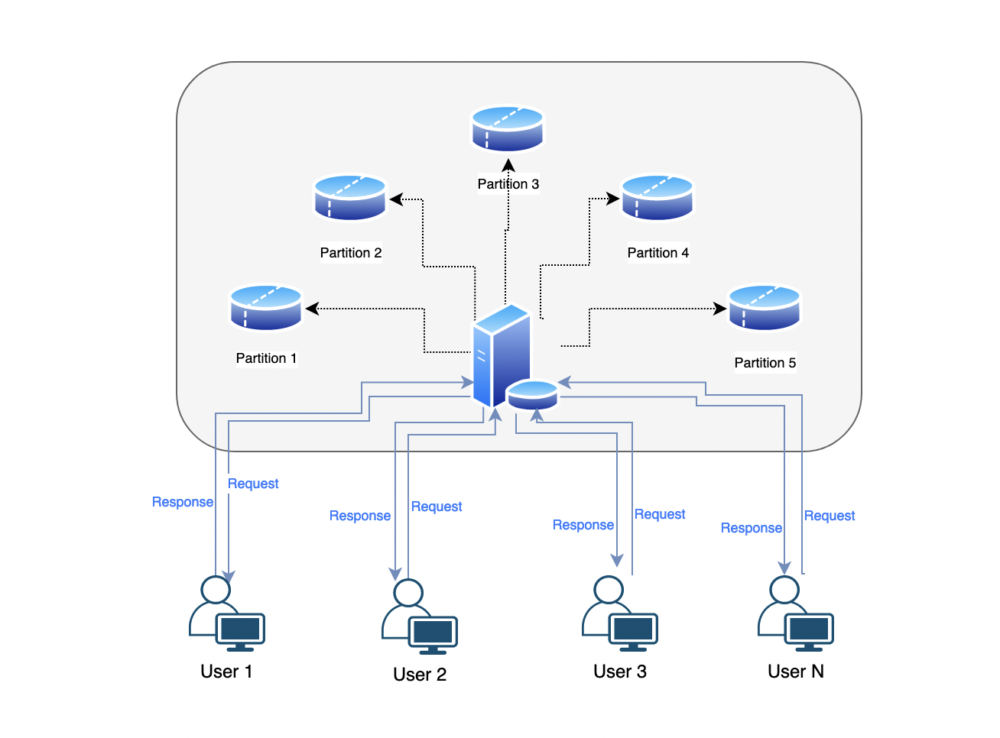

## References
- [What is a Distributed Database?](https://www.mongodb.com/basics/distributed-database)
- [A Thorough Introduction to Distributed Systems](https://www.freecodecamp.org/news/a-thorough-introduction-to-distributed-systems-3b91562c9b3c/)
- [Distributed Databases: A brief introduction and a high level walk through](https://www.linkedin.com/pulse/distributed-databases-brief-introduction-high-level-walk-chakrabarti/)
---
---

## Centralized Database vs Distributed Database

### Introduction

Centralized databases or traditional databases rely on a single server to store and manage all the data, which potentially becomes a bottleneck as the amount of data and number of users grow. Also since there is only one instance of the data available, its susceptible to data loss and other availability issues if the server becomes unavailable. To address these issues of scalability, availability, fault tolerance etc. distributed databases come into the picture. Distributed databases are designed to handle large amounts of data across multiple nodes or servers. They provide high availability, scalability, and fault tolerance by distributing data across multiple nodes.

In the subsequent sections, I will touch upon the basics of distributed databases, their advantages, at a very high level how do they work, how does querying, indexing and concurrency control works in distributed databases

### What is a Distributed Database?

A distributed database is a database that is distributed across multiple nodes or servers. Each node or server stores a subset of the data, and the nodes communicate with each other to ensure that the data is consistent across all nodes. The distribution of data across multiple nodes enables distributed databases to handle large amounts of data and provide high availability and fault tolerance.

Typical Distributed Database Architecture

### Different types of distributed database:

There are several types of distributed databases, each with its own characteristics and use cases. At a high level, based on how data is distributed across multiple nodes, distributed databases can be categorized as below:

1.  **Replicated databases:** In a replicated database, data is replicated across multiple nodes, so that each node has a copy of the data. Replication can be synchronous or asynchronous, and the data can be replicated across all nodes or a subset of nodes. Replication can improve data availability and reduce latency, but it can also increase data inconsistency and storage overhead. Common distributed databases that fall into this category are **Hadoop, Apache Spark, Cassandra etc**.
2.  **Partitioned databases:** In a partitioned database, data is divided into partitions, and each partition is stored on a separate node. Partitioning can improve query performance and scalability, but it can also increase data inconsistency and complexity. **MongoDb, Apache HBase, Amazon DynamoDB** are examples of such databases.
3.  **Federated databases:** In a federated database, data is distributed across multiple autonomous databases, which can be managed by different organizations or systems. A federated database provides a unified view of the data, but it can also introduce data inconsistency and security risks. **Google Bigtable, Amazon Aurora, Apache Geode** are some examples of federated distributed databases
4.  **Shared-nothing databases:** In a shared-nothing database, each node has its own processor, memory, and disk storage, and there is no shared memory or disk between nodes. Shared-nothing architectures can provide high scalability and availability, but they can also increase complexity and cost. Databases like **Google Spanner, Teradata, VoltDB** are some examples of Shared-nothing distributed databases
5.  **Hybrid databases:** Hybrid databases combine two or more of the above architectures, such as partitioning and replication. Hybrid databases can provide a balance between performance, scalability, and consistency, but they can also increase complexity and cost.

Also depending upon the internal data structure and data storage mechanism of different nodes, distributed databases can be categorized into two major categories:

1.  **Homogeneous distributed database:** A homogeneous distributed database is a database where all nodes have the same database management system (DBMS) and schema. In other words, all nodes use the same software and have the same data structure. Homogeneous distributed databases are easier to manage and provide better consistency, but they can be less flexible and scalable.
2.  **Heterogeneous distributed database:** A heterogeneous distributed database is a database where nodes have different DBMS and/or schema. In other words, nodes use different software and may have different data structures. Heterogeneous distributed databases are more flexible and scalable, but they can be more complex to manage and can lead to data inconsistencies. Hadoop, Apache Ignite, Couchbase, Apache Spark can be configured as heterogeneous distributed databases.

### Advantages of Distributed Databases over Centralized Databases:

Distributed databases offer several advantages over traditional centralized databases:

1.  **Scalability:** Distributed databases can handle large amounts of data by distributing the data across multiple nodes. This enables them to scale horizontally by adding more nodes to the database.
2.  **High availability:** Distributed databases are designed to be highly available, which means that they can continue to operate even if one or more nodes fail. The data is distributed across multiple nodes, so if one node fails, the data is still available on other nodes.
3.  **Fault tolerance:** Distributed databases are fault-tolerant, which means that they can continue to operate even if there are network failures, hardware failures, or other types of failures. The data is replicated across multiple nodes, so if one node fails, the data is still available on other nodes.
4.  **Reduced latency:** By distributing the data across multiple nodes, distributed databases can reduce the latency of queries. Queries can be executed on the node that is closest to the data, which can improve query performance.

### How do distributed databases work?

Distributed databases work by distributing data across multiple nodes or servers. The data is partitioned into subsets, and each subset is stored on a separate node. The nodes communicate with each other to ensure that the data is consistent across all nodes. There are two approaches to data partitioning:

1.  **Horizontal partitioning:** In horizontal partitioning, the data is partitioned based on the rows of the table. For example, if a table contains customer data, the data may be partitioned based on the customer’s location. Each node stores a subset of the customer data based on the customer’s location.
2.  **Vertical partitioning:** In vertical partitioning, the data is partitioned based on the columns of the table. For example, if a table contains customer data, the data may be partitioned based on the customer’s name, address, and phone number. Each node stores a subset of the customer data based on the column.

Once the data is partitioned, each node or server stores a subset of the data. The nodes communicate with each other to ensure that the data is consistent across all nodes. There are several approaches to ensuring data consistency:

1.  **Replication:** In replication, each node stores a copy of the data. When a node updates the data, the update is propagated to all other nodes.
2.  **Consensus algorithms:** Consensus algorithms, such as the [Paxos algorithm](https://martinfowler.com/articles/patterns-of-distributed-systems/paxos.html) or [Raft algorithm](https://en.wikipedia.org/wiki/Raft_%28algorithm%29), are used to ensure that all nodes agree on the state of the data.
3.  **Quorum-based techniques:** Quorum-based techniques, such as the quorum-based replication, are used to ensure that a majority of nodes must agree on the state of the data.

## Querying in a Distributed Database

In a distributed database, querying works differently than in a traditional centralized database. Since the data is distributed across multiple nodes, a query has to be executed on multiple nodes to retrieve the required data. There are several ways in which this can be achieved, and the specific approach may depend on the particular distributed database system being used. Below are some general steps that may be involved in querying a distributed database:

1.  **Query routing:** The first step is to determine which nodes contain the required data for the query. This is achieved through query routing, which is the process of identifying the relevant nodes based on the query conditions and metadata stored in a distributed directory.
2.  **Parallel processing:** Once the relevant nodes have been identified, the query is executed in parallel on each of the nodes that contain the required data. This enables the system to retrieve data quickly and efficiently, since the work is divided among multiple nodes.
3.  **Result merging:** After the query has been executed on all the relevant nodes, the results are merged into a single result set. This step involves eliminating duplicates and sorting the data, if necessary.

### Indexing in a Distributed Database

Indexing in a distributed database is similar to indexing in a centralized database. Each node maintains its own index, which is used to improve query performance. However, managing indexes in a distributed database can be challenging, especially when the data is partitioned across multiple nodes.

To improve indexing performance in a distributed database, it is recommended to use a distributed indexing system. A distributed indexing system can distribute the index across multiple nodes and ensure that the index is consistent across all nodes.

### Concurrency Control in a Distributed Database

Concurrency control is an important aspect of distributed databases. In a distributed database, this is the process of ensuring that multiple transactions can execute concurrently on different nodes without interfering with each other. Concurrency control is important in a distributed database because multiple users may be accessing the data simultaneously, and data consistency must be maintained across all nodes.

There are several approaches to concurrency control in a distributed database. Few commonly used mechanisms include:

1.  **Two-phase commit protocol:** The two-phase commit protocol is a commonly used approach to ensure that transactions are either committed or rolled back consistently across all nodes. This protocol involves a coordinator node that coordinates the commit or rollback of transactions across multiple nodes.
2.  **Multi-version concurrency control (MVCC):** MVCC is an approach that allows multiple versions of a data item to coexist in the database. Each transaction sees a snapshot of the database as it existed at the start of the transaction, and writes to the database do not affect other transactions that are running concurrently.
3.  **Distributed locking:** Distributed locking is a technique that allows multiple transactions to lock the same data item on different nodes. This approach ensures that only one transaction can update the data item at a time, preventing conflicts between transactions.
4.  **Optimistic concurrency control:** Optimistic concurrency control is an approach that allows transactions to execute without acquiring locks on the data. When a transaction attempts to commit, the system checks if any other transaction has modified the same data item. If there are no conflicts, the transaction is committed. Otherwise, the transaction is rolled back and retried.
5.  **Timestamp ordering:** Timestamp ordering is a technique that assigns a timestamp to each transaction and uses this timestamp to determine the order in which transactions should execute. This approach ensures that transactions execute in a consistent order, preventing conflicts and ensuring data consistency.

The specific approach used may depend on the distributed database system being used and the specific requirements based on which, a distributed database is selected.

### Disadvantages of distributed databases:

However, they also have some technical disadvantages that need to be considered. Here are some of the technical disadvantages of distributed databases:

1.  **Network latency:** In a distributed database, data is spread across multiple nodes, which can be geographically dispersed. This can lead to network latency, which is the delay in data transfer between nodes. Network latency can increase query response times and affect overall system performance. _**Right partitioning, proper data replication strategies and caching of data**_ _can minimize the impact of increased network latency._
2.  **Data consistency:** Maintaining data consistency across multiple nodes is challenging in distributed databases. Data inconsistencies can occur due to network delays, conflicts in updates, or multiple other issues, leading to data integrity problems. _By using techniques such as_ _**distributed transactions**_ _and_ _**consensus algorithms**__, it can be ensured that updates to the database are atomic and consistent across nodes._
3.  **Complexity:** Distributed databases are complex systems, requiring specialized knowledge and skills in areas such as network architecture, database design, and distributed systems. As a result, they can be challenging to deploy and manage, requiring a high level of expertise. _However, there are tools and technologies that simplify the deployment and management of distributed databases. These can be introduced to reduce the complexity of maintenance of such databases to some extent._
4.  **Security**: Distributed databases can be more vulnerable to security threats than centralized databases, as there are more points of entry for attackers. Ensuring data security and access control in a distributed database can be challenging. _Security can be enhanced and also the impact of a security breach can be minimized by implementing techniques such as data encryption, access control, and data masking._
5.  **Node Availability:** In a distributed database, nodes can fail or become unavailable leading to availability issues. _To ensure system availability, fault tolerance mechanisms such as_ _**redundancy**_ _and_ _**fail-over**_ _need to be implemented._ However, implementing these mechanisms adds more complexity to the system.
6.  **Cost:** Implementing and managing a distributed database can be more expensive than a centralized database. The cost of hardware, software, and network infrastructure can be higher, and specialized expertise is often required. _Using cost-effective hardware and software solutions, optimizing network infrastructure and also minimizing the amount of data being transferred across systems can help optimize the overall cost._
7.  **Performance overhead:** Distributed databases require additional software layers and communication protocols to manage data across nodes, which can introduce performance overhead. This overhead can affect query response times and system performance.

### **Conclusion**

This is the very first article of the series, where I have tried to discuss about distributed databases. I have tried to keep it very basic and mostly covered along the breadth of the things. There are multiple sections in this article like indexing, querying, multiple ways of concurrency control, which in itself is equally worthy of being the topic for a separate blog. In the days to come will try to elaborate on these elements.

