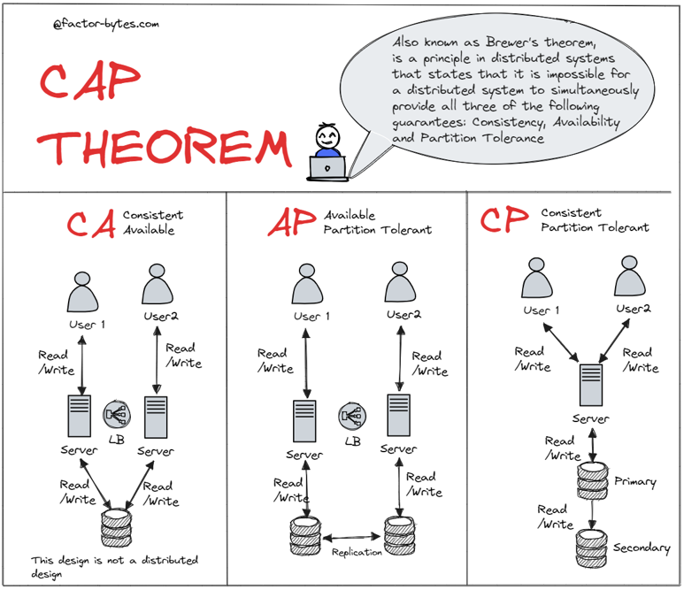
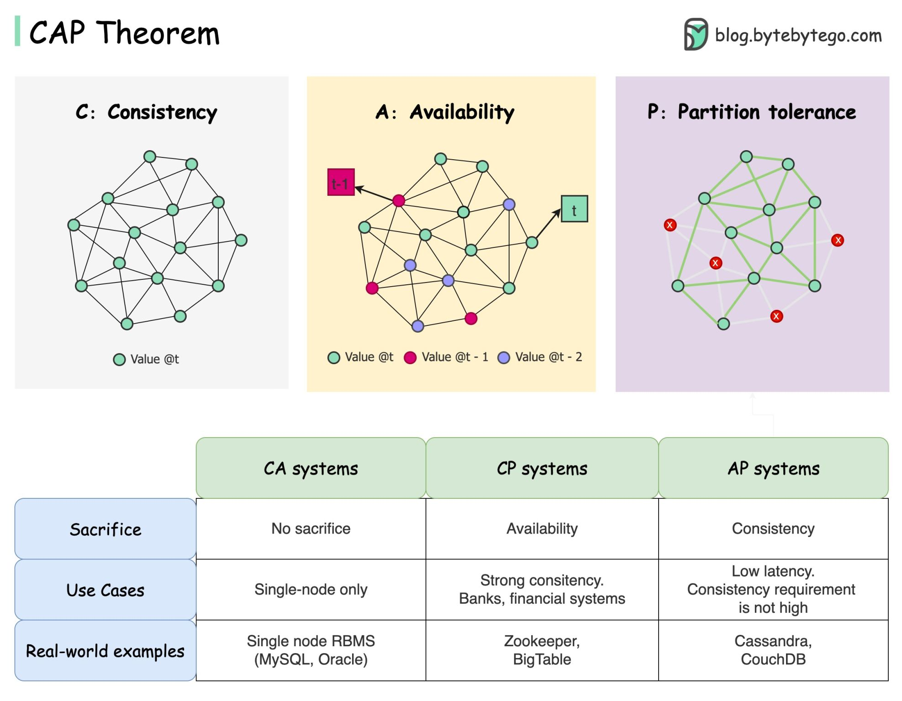
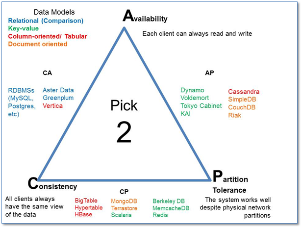

## References
- [CAP theorem](https://factor-bytes.com/2023/07/22/understanding-cap-theorem-balancing-consistency-availability-and-partition-tolerance-in-distributed-systems/)

---
---

## CAP Theorem

> **Consistency** means that data is the same across the cluster, so you can read or write from/to any node and get the same data.

> **Availability** means the ability to access the cluster even if a node in the cluster goes down.

> **Partition Tolerance** means that the cluster continues to function even if there is a "partition" (communication break) between two nodes (both nodes are up, but can't communicate).

