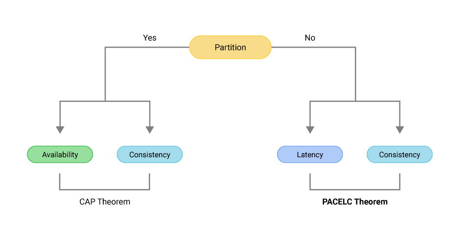

## References
- [PACELC theorem](https://www.scylladb.com/glossary/pacelc-theorem/)

----
----

## PACELC 

The PACELC theorem, an extension of the CAP theorem proposed by Daniel Abadi in 2012, adds more nuance to the trade-offs presented by CAP. It states:

- **If there is a Partition (P)**, a system must choose between **Availability (A)** and **Consistency (C)**, similar to CAP.
- **Else (E)**, when the system is running normally without partitions, it must choose between **Latency (L)** and **Consistency (C)**.

This theorem provides a more comprehensive framework for understanding the trade-offs in distributed systems. It not only considers what happens during network partitions (as CAP does) but also the trade-offs that must be made under normal operating conditions. Essentially, it suggests that even when there's no partition, there's a trade-off between providing low latency responses and maintaining consistency across the distributed system.