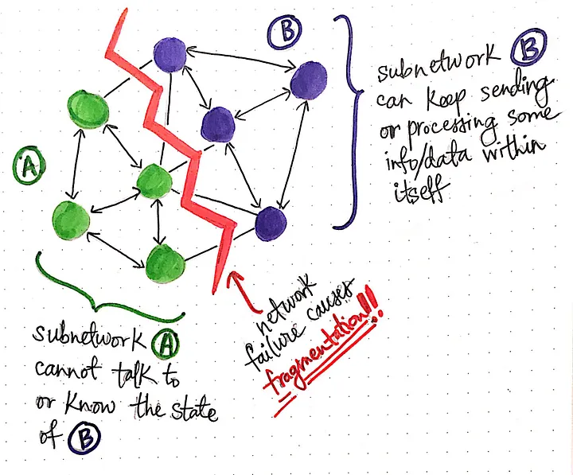

## Reference
- [Parsing Through Partitions in a Distributed System](https://medium.com/baseds/parsing-through-partitions-in-a-distributed-system-3c1723fecc4e)

----
----

## Network Partition (Network Failure) vs Data Partition

Network partition and data partition are two distinct concepts often discussed in the context of distributed systems, but they relate to different aspects of system design and operation.

### Network Partition

A **network partition** refers to a situation where a network failure divides a distributed system into two or more groups that cannot communicate with each other. This failure can be caused by problems in the network infrastructure, such as broken links, misconfigured routers, or issues that prevent nodes in different segments from communicating. Network partitions are significant because they directly impact the availability and consistency of a distributed system. During a network partition, a system may have to choose between maintaining consistency across partitions by sacrificing availability or maintaining availability at the risk of temporary inconsistencies, as described by the CAP theorem.

### Data Partition

**Data partition**, on the other hand, is a design strategy used to distribute data across multiple nodes or locations to improve scalability, performance, and manageability. It involves dividing the data into distinct segments that can be stored, accessed, and managed independently. Data partitioning can be done in several ways, including:

- **Horizontal partitioning (sharding):** Each partition stores a subset of the rows from a database table, with different partitions holding different rows based on certain criteria (e.g., user ID ranges, geographic locations).
- **Vertical partitioning:** Different columns of a table are stored in separate databases or tables, which can be useful when certain columns are accessed more frequently than others.
- **Functional partitioning:** Data is divided based on functionality or service requirements, with different partitions serving different application components or services.

### Key Differences and Relations

- **Purpose:** Network partition handling is about ensuring the system continues to operate effectively in the face of network failures, focusing on aspects like fault tolerance, consistency, and availability. Data partitioning is a data management strategy aimed at improving system performance, scalability, and maintenance by distributing data across multiple servers or locations.
- **Scope:** Network partitions are a failure mode that systems must be designed to tolerate or recover from. Data partitions are a deliberate architectural choice made to optimize system design and operation.
- **Impact on System Design:** Handling network partitions often involves implementing strategies to manage consistency and availability trade-offs, such as using consensus algorithms or designing for eventual consistency. Data partitioning requires designing data storage, access patterns, and possibly data replication strategies to ensure efficient operation and high performance across the distributed system.

In summary, network partitioning is a challenge to be managed in distributed systems, while data partitioning is a technique used to enhance system scalability, performance, and manageability.

---
---

## Why we need Network Partition Handling, show example

Network partitions are not something that are deliberately introduced or desired in distributed systems; rather, they are a type of failure scenario that systems need to be designed to handle. The necessity to deal with network partitions arises from the need to ensure that distributed systems are robust and can continue to operate under various types of failures, including network failures.

To understand why handling network partitions is essential, consider the example of a distributed database that stores user account information across multiple data centers for a global application:

### Example Scenario: Global E-Commerce Platform

Let's say you have an e-commerce platform that operates globally, with data centers located in North America, Europe, and Asia to provide low-latency access to user data such as account information, order history, and payment details. The database is replicated across these regions to ensure that users can access their data quickly and that the system can withstand regional outages.

#### Before a Network Partition
- Users can make purchases, update their account details, and check their order histories with low latency because their requests are served by the nearest data center.
- The distributed database ensures all changes are replicated across the data centers, keeping the user data consistent globally.

#### During a Network Partition
- Suppose a network partition occurs between the data centers in North America and Asia. This partition prevents these regions from communicating with each other directly.
- Users in North America and Asia continue to make purchases and update their accounts, but these changes cannot be immediately replicated to the other side of the partition.

#### Handling the Partition
> - **Option 1 (Prioritize Consistency):** The system could block all write operations that cannot be replicated to ensure consistency, making the system partially unavailable in some regions.
> 
> 
> - **Option 2 (Prioritize Availability):** The system allows write operations to continue locally, aiming to synchronize the changes across the network once the partition is resolved. This approach prioritizes user experience and system availability, even though it may lead to temporary inconsistencies.

#### After the Network Partition is Resolved
- The system must reconcile any divergences in data that occurred during the partition, which might involve resolving conflicts where different changes were made to the same data in different regions.

### Why It's Needed
Handling network partitions is crucial in distributed systems like the above to ensure that the system remains as available as possible while managing data consistency according to the application's requirements. Designing systems to be resilient to network partitions enables them to provide continuous service even in the face of network failures, which is essential for maintaining a good user experience and ensuring data integrity across a globally distributed infrastructure.