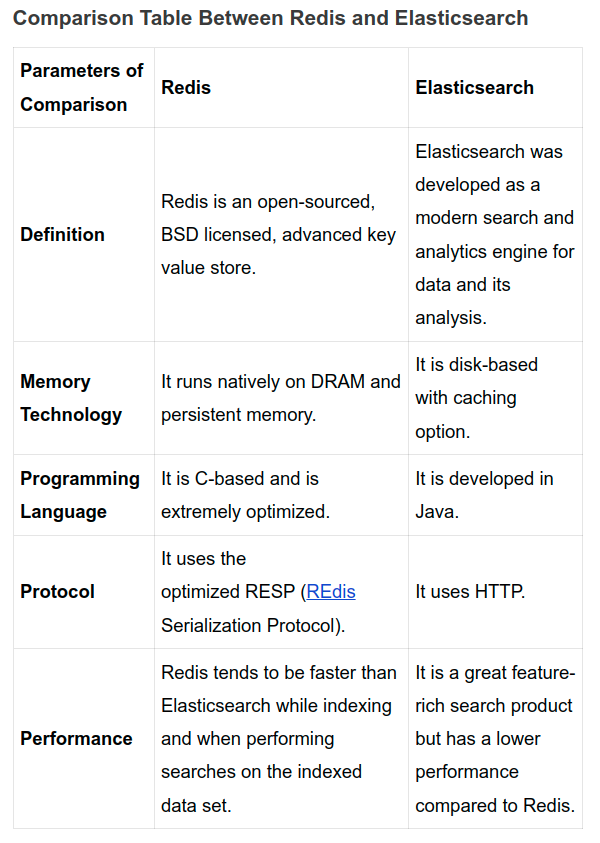

## RedisSearch vs ElasticSearch
https://redis.com/blog/search-benchmarking-redisearch-vs-elasticsearch/

## Redis vs ElasticSearch
https://askanydifference.com/difference-between-redis-and-elasticsearch-with-table/

##

[How to add a Redis caching layer to your Elasticsearch queries](https://medium.com/trackit/how-to-add-a-redis-caching-layer-to-your-elasticsearch-queries-ca56e5e84d9b)